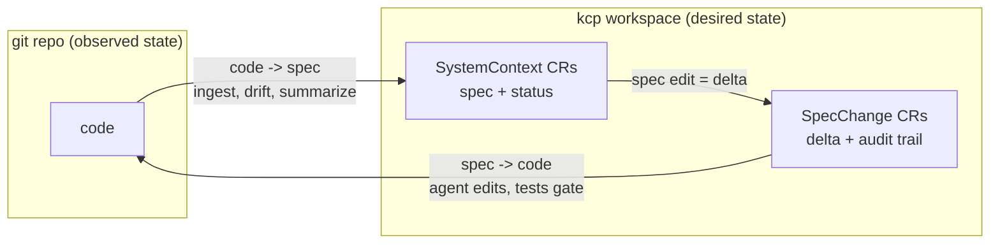
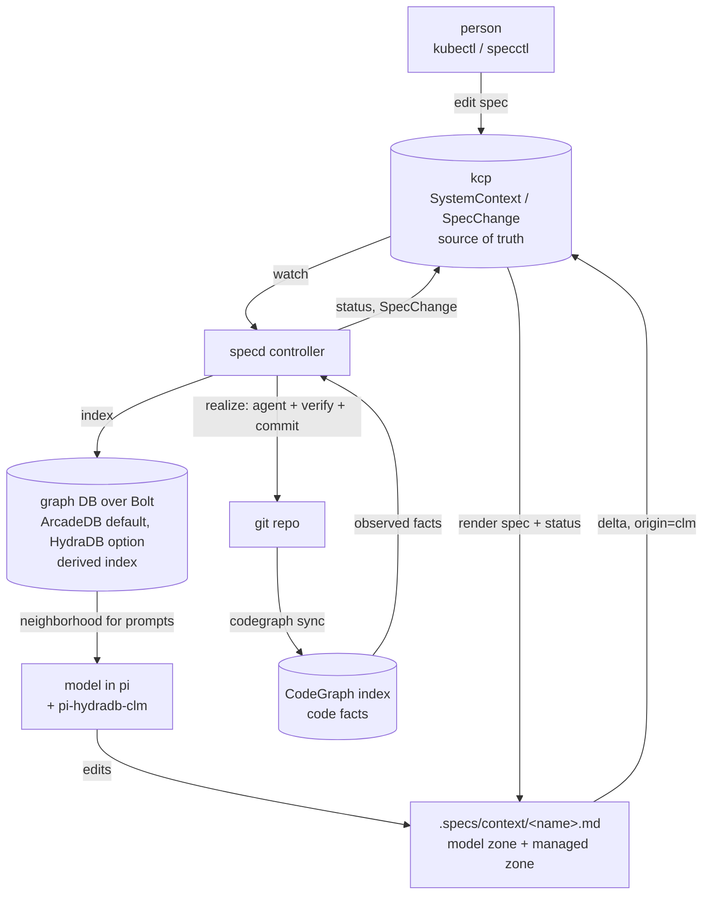
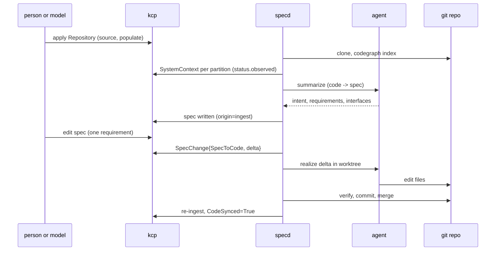

# graph-clm-kcp-spec

Two way state sync for spec driven development.

kcp (a Kubernetes control plane, no nodes) holds the specs. A spec is a custom
resource: `spec` is the desired state of a part of a system, `status` is what
the code is observed to be. A reconciler drives the code to the spec, exactly
like a Deployment drives pods. A graph database indexes specs, requirements and
code references so a language model gets a small, relevant neighborhood instead
of a 3000 line document.

```
            code -> spec  (ingest, summarize, drift)
  git repo  ------------------------------------------>  kcp (CRs = specs)
  (code)    <------------------------------------------  (desired state)
            spec -> code  (realize: agent edits code, tests gate)
```

The design lives in [`docs/plans/0001-kcp.md`](docs/plans/0001-kcp.md). That
plan is the source of truth; this file says how to run what is built.

## Why

**The problem: specs rot.** Code changes faster than anyone documents it. The
open architecture document of the sibling `deno-kcp` repo
(`.tools/open-architecture/arch.yaml`) shows it: 84 hand-written commits, over
3000 lines, and a separate 674-citation truth sweep just to find where the
document had drifted from the code. A hand-kept spec is stale soon after it is
written, and without a true spec neither people nor AI agents can reason about
a codebase or change it safely.

**The idea: spec is desired state, code is observed state.** That is the
Kubernetes model. kcp is a Kubernetes control plane with no nodes: pure state
management, with reconcile loops, `status`, conditions, generations and
multi-tenant workspaces. So kcp holds specs as custom resources, and
controllers keep specs and code converged. Drift stops being something a
manual audit finds; it is a reconcile signal.



**Two way sync.**

- **code -> spec:** code changes, the controller sees drift, and a model
  updates the spec (intent, requirements, interfaces). Every claim is anchored
  to real CodeGraph ids.
- **spec -> code:** a person or a model edits a spec, the controller computes a
  structured delta, an agent changes the code to match, and tests gate the
  commit.

**Why a graph database.** A model cannot read 3000 lines for every task.
A graph database indexes specs, requirements, interfaces and code references,
so each task gets a small, relevant neighborhood: the context, its upstream, overlay
and orchestrator, and the code it points at. The graph is a derived index; kcp
stays the only source of truth, and the graph can be rebuilt from kcp and
CodeGraph at any time.

The engine is not the point: CLM + graph DB is. Any Bolt/openCypher engine
that runs the portable Cypher subset works. ArcadeDB is the default because it
is the more Cypher compliant of the two tested engines (38 of 40 probe cases
against HydraDB's 26 of 40, `pi-hydradb-clm/docs/cypher-conformance.md`).

**Why a context language model (CLM).** The model edits its own context
document, which becomes its working memory. The `pi-hydradb-clm` extension
syncs that document to kcp, so what the model learns or decides while it works
becomes a spec change automatically.



**The end goal.** Spec driven development in which the spec is never stale:

1. Point at an unknown repository, apply one `Repository` manifest, and get a
   full set of specs.
2. Develop by editing specs (by hand or by a model); deltas drive the code
   changes.
3. Specs are machine-checkable and current, in the open architecture shape
   (`upstream`, `overlay`, `orchestrator`), across the publicdomainrelay repos,
   so people and agents work from one shared, true model of the system.



## Status

Phases 1 to 5 of 8 are done: **kcp holds specs, code becomes facts in `status`
and in the graph, a hand written `arch.yaml` round trips through kcp, `specd`
keeps the facts, the conditions and the work queue true to the code, and an
agent turns the code back into a spec.**

- API group `specs.publicdomainrelay.dev/v1alpha1`, kinds `Repository`,
  `SystemContext`, `SpecChange`, namespaced, with a status subresource and
  printer columns.
- `specctl apply -f | get | delete` against a kcp workspace.
- `specd` watches the three kinds, re-ingests a `Repository` when its git HEAD
  moves, keeps `SpecValid`, `CodeSynced` and `Drifted` true to the code, and
  opens exactly one `SpecChange` per direction of work.
- `specctl ingest --repo <path>` runs CodeGraph over a working tree, partitions
  it into one `SystemContext` per directory that holds source files, and fills
  `status.observed` (`files`, `interfaces` with signature, file, line and
  CodeGraph id, and a `fingerprint` over both) plus the conditions `SpecValid`,
  `CodeSynced` and `Drifted`. Ingest is idempotent: a second run changes no spec
  and writes no status.
- `specctl import-arch <arch.yaml>` turns every node of an open architecture
  document into a `SystemContext`, and `specctl export --format arch` writes it
  back; the ids, the refs and the preserved node bodies survive the trip.
- `specctl graph neighbors|rebuild` read and write the spec graph in HydraDB or
  ArcadeDB over Bolt, using only the Cypher core subset both engines run.
- `specd --agent claude|scripted:<file>` works a `CodeToSpec` change off: it
  builds the context bundle, asks the agent, validates the answer, writes
  `intent`, `requirements` and `interfaces` with the `origin: ingest`
  annotation, moves the synced baseline so `Drifted` goes False, and writes the
  context document. The write never looks like a human edit, so it raises no
  `SpecToCode` change; the loop is proved in a unit test and in a live run.
- `specctl ingest --summarize --agent <kind>` fills the spec of every context
  whose intent is still empty, without a controller running.
- Each context gets a CLM document at `<repo>/.specs/context/<name>.md`: the
  model's prose above `<!-- SPECD_MANAGED_BEGIN -->`, and the code refs the
  index resolved below it, regenerated on every summarize.
- Live tests that round trip a `SystemContext` through a real kcp, that ingest a
  real git working tree twice and check the graph on both backends, that take
  the open architecture document through kcp and diff the two models, that drive
  the controller through drift and both directions of `SpecChange`, that ingest
  a Deno/TypeScript module, not only Go, and that run `deepseek-claude` over
  `fixtures/calc` and hold its answer to the same contract the scripted agent is
  held to.

## Requirements

`go` (1.26 or newer), `kcp` v0.33, `kine`, `kubectl`, `codegraph` on `PATH` for
ingest, and `git` for a `Repository` and for `specd`. The graph needs a Bolt endpoint: HydraDB on
`bolt://127.0.0.1:7687` (password in `/tmp/hdb/token` by default) or ArcadeDB
on `bolt://127.0.0.1:7688` (database `clm`). The graph commands need one;
`apply`, `get`, `delete`, `import-arch` and `export` work without one (pass
`--no-graph` to `ingest` and `import-arch`).

`--agent claude` needs a model command on `PATH`: `deepseek-claude` by default,
or whatever `--agent-command` and `--agent-args` name. Only
`SPECD_REQUIRE_LIVE_MODEL=1` runs it; everything else, the whole `specd` loop
included, runs `--agent scripted:<file>` and needs no model. `deno` is needed
for the TypeScript live test, which runs `fixtures/greet`'s own tests before it
indexes the module, so the fixture is known to be a real working tree and not
only something `codegraph` can parse.

## Quick start

```bash
make kcp-up          # kcp on 6447, kine on 23797, state in .kcp-specd/
make example-phase1  # apply examples/calc/specs.yaml and read it back
make example-phase2  # ingest fixtures/calc, fill status.observed, write the graph
make example-phase3  # import testdata/open-architecture/arch.yaml and export it back
make example-phase4  # run specd, commit a change, watch drift and the SpecChange
make example-phase5  # run specd with an agent, watch the spec fill itself in
make kcp-down        # stop the cluster this repo started
```

`make example-phase1` prints a table of the contexts it applied, the same
objects through `kubectl`, and one `SystemContext` as YAML.
`make example-phase2` applies the same example, indexes `fixtures/calc` with
CodeGraph, ingests it, prints the observed facts and the conditions, and shows
one hop of the graph around `calc` in HydraDB and in ArcadeDB.
`make example-phase3` imports the archived open architecture document, prints
one hop of the graph around `sc.deno-kcp` (by arch id), exports the document
back out of kcp, and runs the live round trip test. All three targets are
idempotent except that the phase 3 live test cleans up after itself, so run the
target again to put the imported contexts back.
`make example-phase4` copies `fixtures/calc` to a temporary working tree, starts
`specd`, commits a `Subtract` function, prints the `Drifted` condition and the
`CodeToSpec` change it raised, patches the spec of the same context, prints the
`SpecToCode` change, shows that no other resourceVersion moves for four
seconds, and stops `specd` with SIGTERM. It owns the `calc` and `cmd-calc`
names, so it deletes the `calc` Repository and those two contexts first and
last; run `make example-phase2` afterwards to put that example state back. The
controller watches every `Repository` in the workspace, so two Repositories
that name the same context would otherwise take turns writing its status.
`make example-phase5` copies `fixtures/calc` to a temporary working tree, starts
`specd` with the scripted agent, commits `Subtract`, and prints the spec the
agent wrote: the intent, the requirements and the interfaces, the `origin:
ingest` annotation, `Drifted=False` and zero `SpecToCode` changes. It prints the
context document the summarize left in the tree, then runs
`specctl ingest --summarize` over the same tree to show the CLI entry point,
and stops `specd` with SIGTERM. It owns the same `calc` and `cmd-calc` names, so
run `make example-phase2` afterwards to put that example state back.

The same steps by hand:

```bash
make build

# the graph endpoint; the Makefile exports these two for you
export SPECD_BOLT_URL=bolt://127.0.0.1:7687
export SPECD_BOLT_PASSWORD_FILE=/tmp/hdb/token

bin/specctl apply -f examples/calc/specs.yaml
bin/specctl ingest --repo fixtures/calc
bin/specctl get systemcontext calc -o yaml
bin/specctl graph neighbors calc
bin/specctl graph rebuild --bolt-url bolt://127.0.0.1:7688 \
  --bolt-user root --bolt-password clm-arcadedb-root --bolt-database clm

bin/specctl delete systemcontext calc

bin/specctl import-arch testdata/open-architecture/arch.yaml --repository deno-kcp
bin/specctl graph neighbors sc.deno-kcp
bin/specctl get systemcontext -o name | head
bin/specctl export --format arch --repository deno-kcp -o /tmp/arch-export.yaml

KUBECONFIG=.kcp-specd/specs.kubeconfig kubectl get systemcontexts

# the controller manages a git working tree, and fixtures/calc is a plain
# directory, so give it a copy of its own; then commit something to that copy
WORK=$(mktemp -d) && cp -r fixtures/calc/. "$WORK/" && rm -rf "$WORK/.codegraph"
git -C "$WORK" init -q -b main && git -C "$WORK" add -A
git -C "$WORK" -c user.email=you@example.com -c user.name=you commit -qm fixture
bin/specctl apply -f - <<YAML
apiVersion: specs.publicdomainrelay.dev/v1alpha1
kind: Repository
metadata: {name: calc, namespace: default}
spec: {path: $WORK, branch: main, verify: ["go", "test", "./..."]}
YAML

# in its own terminal
bin/specd --workspace root:specs --resync 2s
KUBECONFIG=.kcp-specd/specs.kubeconfig kubectl get specchanges
```

`ingest` reads the Bolt endpoint from the flags or the environment
(`SPECD_BOLT_URL`, `SPECD_BOLT_USER`, `SPECD_BOLT_PASSWORD`,
`SPECD_BOLT_PASSWORD_FILE`, `SPECD_BOLT_DATABASE`); with no `--bolt-url` and no
`SPECD_BOLT_URL` it only updates kcp. The `Makefile` exports the HydraDB
defaults, so plain `make example-phase2` needs no extra flags. A relative
`Repository.spec.path` resolves against the working directory of whichever
process reads it, so run the commands from the repository root, and note that
`specd` needs that path to be a git working tree: `fixtures/calc` is a plain
directory in this repository (the tests copy it to a temporary git repository),
so a `Repository` that points straight at it gets `Indexed=False` with
`HeadUnavailable` instead of an ingest.

`specctl` talks to the workspace `root:specs` on the admin kubeconfig; pass
`--workspace`, `--namespace`, `--kubeconfig` or `--context` to change that.
`deploy/install-specs.sh` also writes `.kcp-specd/specs.kubeconfig`, a
kubeconfig whose server already points at the workspace, so plain `kubectl`
works against it without extra flags.

## The API

| Kind | Purpose | Key fields |
| --- | --- | --- |
| `Repository` | a git working tree under management | `spec.path`, `spec.branch`, `spec.verify`, `status.headCommit`, `status.indexedCommit`, the `Indexed` condition |
| `SystemContext` | one spec node (one system context) | `spec.repository`, `spec.upstream`, `spec.overlay`, `spec.orchestrator`, `spec.dependsOn[]`, `spec.introduces[]`, `spec.intent`, `spec.requirements[]`, `spec.interfaces[]`, `spec.codeRefs[]`, `spec.arch` |
| `SpecChange` | one direction-tagged change, the unit of work | `spec.systemContext`, `spec.direction`, `spec.toSpecHash` / `spec.toCommit`, `status.phase` |

`SystemContext.status` carries the code facts (`observed.files`,
`observed.interfaces` with `signature`, `file`, `line` and `codegraphId`, and
`observed.fingerprint` over both), `observedCommit`, the synced baseline
(`syncedCommit` and `syncedFingerprint`), `observedGeneration`,
`realizedSpecHash`, and the conditions `SpecValid`, `CodeSynced` and `Drifted`.

Requirements carry `id` (unique in the context), `level` (`MUST`, `SHOULD` or
`MAY`) and `text`. Every `codeRefs` entry is a CodeGraph id: `file:`, `function:`,
`method:`, `type:` or `package:`. Context-to-context references are `self`,
`sc.<name>`, `up.<name>`, `ov.<name>` or `orch.<name>`, and an open architecture
id such as `sc.kind.denopod` is a reference too; it names the context
`sc-kind-denopod`, because the dots are part of the id.

`specctl apply` validates before it writes: duplicate requirement ids, an
unknown level, a malformed reference, a missing required field or a malformed
spec hash are rejected locally with the field path, and nothing is sent. A
field whose type is wrong is reported with its path too, for example
`spec.requirements.codeRefs`.

## Ingest: code becomes facts

`specctl ingest --repo <path>`:

1. runs `codegraph init` (or `sync` when the index exists) on the working tree;
2. reads `.codegraph/codegraph.db` back through a pure Go sqlite driver. Ids are
   read, never computed;
3. partitions the tree into one context per directory that holds a source file
   (`calc/` becomes `calc`, `cmd/calc/` becomes `cmd-calc`, root files take the
   repository name). Test files stay in `observed.files` but contribute no
   interfaces;
4. writes `Repository.status.headCommit` and `indexedCommit`, and for each
   context fills `status.observed` and the three conditions. The fingerprint is
   sha256 over the canonical JSON of the sorted files and interfaces, so the
   same tree always produces the same digest;
5. sets `spec.codeRefs` to the observed `file:` refs plus any non-file refs the
   author wrote, and leaves `intent`, `requirements`, `interfaces`, `upstream`,
   `overlay` and `orchestrator` alone. A spec written this way carries the
   `specs.publicdomainrelay.dev/origin: ingest` annotation and a
   `status.realizedSpecHash`, so it never looks like a human edit;
6. when a Bolt endpoint is configured, rewrites the graph from kcp and
   CodeGraph.

## The controller: conditions and drift

`bin/specd` watches `Repository`, `SystemContext` and `SpecChange` in the
workspace and reconciles each one on a workqueue. It watches with dynamic
informer watches by default; `--watch poll` lists the workspace on a timer
instead, for an API server whose watch a client cannot hold open. Only
`cmd/specd` installs signal handlers: SIGINT and SIGTERM drain the workers and
stop the watches, and nothing in the libraries does I/O on its own.

`Repository` reconcile asks the working tree for its git HEAD. When the HEAD
differs from `status.indexedCommit` it runs the phase 2 ingest, so the observed
facts, the fingerprint and the graph follow the code. The HEAD is invisible to
the API server, so each `Repository` requeues itself every `--resync` (5s by
default). A tree whose HEAD cannot be read, or whose path is empty, gets
`Indexed=False` with `HeadUnavailable` or `PathMissing` instead of an error
loop.

`SystemContext` reconcile indexes nothing. It turns the stored facts into the
three conditions through the same pure deciders ingest uses, so the two can
never write over each other, and it records `observedGeneration`:

| Condition | True when |
| --- | --- |
| `SpecValid` | the validator accepts the spec: refs resolve, levels are known, ids are unique |
| `CodeSynced` | every declared interface is observed, nothing undeclared is exported, and every requirement `codeRefs` entry resolves to an observed file or interface |
| `Drifted` | the observed fingerprint differs from `status.syncedFingerprint` |

`syncedFingerprint` and `syncedCommit` are the baseline the spec was last
brought into agreement with. Ingest establishes them on the first ingest of a
context and never moves them afterwards, so a context that drifted stays
`Drifted=True` even when a later commit elsewhere re-ingests the same tree; the
baseline moves when the drift is worked off (phase 6). `status.observedCommit`
and `status.observed` are always the current code.

Two kinds of work are raised, both `Pending` in this phase because the agents
arrive in phases 5 and 6:

- **CodeToSpec**, while the context is drifted and `syncedCommit` and
  `observedCommit` are a usable pair. The name is
  `<context>-c2s-<from8>-<to8>`, so two reconciles of the same drift land on the
  same object.
- **SpecToCode**, when the spec no longer hashes to `status.realizedSpecHash`,
  which is what a human edit looks like: ingest writes the spec with the
  `origin: ingest` annotation and moves `realizedSpecHash` with it, but it only
  moves the hash when no spec write was already pending, so a human edit is
  never absorbed by an ingest that runs afterwards. The name is
  `<context>-s2c-<to8>`.

A change of a direction is only created when nothing of that direction is still
`Pending` or `Running` for the context, so a tree that stays drifted queues one
unit of work, not one per reconcile, and a controller restart does not queue
another. `SpecChange` reconcile keeps a change `Pending` and enforces the
admission rule from the plan: at most one change may be `Running` per
`SystemContext`, and the lowest name wins, so a second one is marked `Failed`
instead of racing.

```bash
bin/specd --workspace root:specs --resync 5s --watch informer
bin/specd --watch poll --poll-interval 2s      # list instead of watch
```

`--codegraph`, `--log-level`, `--workers`, `--qps` and `--burst` are the rest of
the flags; `--bolt-url` and its four siblings (see the graph section) make every
ingest rewrite the graph as well. Every reconcile that writes nothing is a
no-op: `status` is compared before it is patched, which is what keeps the
controller from looping against itself.

## The CLM loop: code becomes a spec

Without an agent, a `CodeToSpec` change stays `Pending` and waits for a human;
that is what `make example-phase4` shows. With `--agent`, the same change is
worked off, and this is what the controller does with it:

1. It takes the change from `Pending` to `Running`, after checking that no other
   change of the same context is running.
2. It builds the **context bundle**: the spec, `status.observed`, the model zone
   of the context document, one hop of the spec graph in both directions, and
   the `codegraph context` and `codegraph node` excerpts behind the context's
   code refs. `Fit` keeps whole sections in priority order until the token
   budget (`--bundle-budget`, 8000 by default) is spent and names what it
   dropped, so the ask is never silently truncated.
3. It asks the agent. `--agent claude` runs `deepseek-claude -p --output-format
   text` with the prompt on **standard input** (the launcher word splits its
   argv, so a prompt passed as an argument would arrive as a handful of words),
   in the repository under management, with a timeout. `--agent
   scripted:<file>` answers from a YAML scenario instead, and every test uses
   it.
4. It parses the answer strictly. A fenced or prose-wrapped JSON object is
   tolerated; an unknown level, a duplicate id, an empty requirement or a
   missing intent is not. A code ref the observed facts do not answer to is
   dropped and reported rather than written; a bare name (`Add`) is read as the
   interface of that name and stored as its canonical CodeGraph id, so a model
   ref and a human ref that mean the same symbol land on the same vertex.
5. It validates the draft with the same validator a human edit passes, writes
   `intent`, `requirements` and `interfaces` with the `origin: ingest`
   annotation, sets `status.realizedSpecHash` to the hash of what it wrote, and
   moves `status.syncedFingerprint` and `syncedCommit` onto the observed facts
   so `Drifted` goes False.
6. It writes `<repo>/.specs/context/<name>.md`: the agent's prose in the model
   zone, the resolved code refs between the `SPECD_MANAGED_BEGIN` and
   `SPECD_MANAGED_END` markers, regenerated from the facts. The model owns
   everything above the markers and nothing below them.

The last two steps are what keep the two directions from fighting. A spec write
is not a human edit, so it raises no `SpecToCode` change — and because a spec
update and the status update that acknowledges it are two API calls, the object
carries `specs.publicdomainrelay.dev/origin-hash`, the hash of the spec the tool
wrote, so a reconcile that runs between the two reads sees the tool's own write
and not an edit. A spec edit that makes the hash differ from both the realized
hash and the origin hash is a human edit, and raises a `SpecToCode` change for
phase 6 to realize.

An episode that keeps failing is retried as a new `SpecChange`
(`<base>-a2`, `<base>-a3`, ...) after a backoff that doubles from
`--retry-backoff`, and stops for good after `--max-attempts` (3 by default), so
a broken agent cannot fill the workspace with retries. The failed records stay
as the audit trail.

Two agent options:

```bash
bin/specd --agent claude --resync 5s                 # the real model
bin/specd --agent scripted:examples/phase5/scenario.yaml --resync 5s
```

and the same summarize without a controller at all:

```bash
bin/specctl ingest --repo fixtures/calc --summarize --agent scripted:examples/phase5/scenario.yaml
```

`ingest --summarize` runs the summarize directly rather than creating
`CodeToSpec` changes, so it works with no controller running; both entry points
call the same `impl/summarize`, so the spec that lands is identical.

## The open architecture document

`deno-kcp/.tools/open-architecture/arch.yaml` is a hand written spec of a whole
system: a header, then sections of nodes, where a node nests inside its parent
through `upstream`, `overlay`, `orchestrator` or `children` and an id is shared
by reference. `specctl import-arch` turns it into `SystemContext` objects and
`specctl export --format arch` writes it back. The three revisions used as
fixtures live in `testdata/open-architecture/`.

```
$ specctl import-arch testdata/open-architecture/arch.yaml --repository deno-kcp
repository   deno-kcp
document     arch-document-deno-kcp
contexts     166
pruned       0
graph        true
```

- Every node with an id becomes one `SystemContext`, named after the id:
  `sc.kind.denopod` becomes `sc-kind-denopod`. The id itself stays in
  `spec.arch.id`, with `spec.arch.kind` (`node` or `document`), the section and
  the position, the parent id and the slot it sat in, the derived `upstream`,
  `overlay`, `orchestrator`, `dependsOn` and `introduces` refs, the code paths
  as `spec.codeRefs`, and `spec.arch.node`, the node body with its inline
  children replaced by their id refs. The id and the kind are labels too
  (`specs.publicdomainrelay.dev/arch-id`, `specs.publicdomainrelay.dev/arch-kind`).
- One more `SystemContext` (`spec.arch.kind: document`) carries the top-level
  header and the section skeleton, so an empty section survives the trip too.
- Import is idempotent, and it prunes the objects under that repository that the
  document no longer holds (`--no-prune` keeps them). The `Repository` is
  created or updated so the graph commands can resolve code refs against it.
- A node whose `upstream` is an inline manifest rather than a ref is its own
  upstream, exactly as the arch layout describes; the manifest stays in the
  preserved node body.
- Export is the inverse: the nodes are grouped by the recorded section, ordered
  by the recorded position, and each node is rebuilt by re-inlining its children
  at the slots they recorded. The top-level keys come out sorted, and a YAML
  date such as `generated: 2026-09-28` comes out quoted, which is the same JSON
  value and the form the schema asks for.

## The graph

```
(SpecRepo {id,name,path}) -[:HAS_CONTEXT]-> (SpecContext {id,name,repo,intent,specHash})
(SpecContext) -[:REQUIRES]-> (SpecRequirement {id,context,reqId,level,text})
(SpecContext) -[:DECLARES]-> (SpecInterface {id,context,name,kind,signature})
(SpecContext|SpecRequirement) -[:REFERENCES]-> (CodeRef {id,codegraphId,kind,name,filePath})
(SpecContext) -[:UPSTREAM|OVERLAY|ORCHESTRATOR|DEPENDS_ON|INTRODUCES]-> (SpecContext)
```

Vertex ids are FNV-1a of a content key, masked to 53 bits, so re-ingest lands on
the same vertex (`common/ids`, the same scheme as `pi-hydradb-clm`). Every write
stays inside the Cypher core subset that HydraDB 0.2.0 and ArcadeDB both run:
`UNWIND $rows AS row MERGE (n {id: row.id}) SET ...` for vertices, a one-hop
typed `MATCH ... CREATE` for edges, `DETACH DELETE` for removal, and reads that
project properties with a label or an id predicate.

The graph is a derived index, so a write is a rebuild: delete the five managed
labels, then write every repository, context, requirement, interface and code
ref again from kcp plus CodeGraph. `specctl graph rebuild` does that on demand
and prints the resulting vertex counts.

### CRDs in a workspace

kcp v0.33 accepts `CustomResourceDefinition` objects inside a workspace. A CRD
applied to `root:specs` makes the group served in that logical cluster, with the
status subresource, printer columns and namespaced scope all honoured
(`deploy/install-specs.sh` depends on this). Phase 7 moves to
`APIResourceSchema` + `APIExport` + `APIBinding` so tenant workspaces can bind
the same API; phase 1 keeps the CRDs in the single workspace that owns the spec
state.

## Layout

```
common/specapi       group, version, kinds, resources, conditions, hashing
common/ids           FNV-1a vertex ids and Cypher literal helpers
abc/spec             typed Repository/SystemContext/SpecChange, arch ids, pure validator
abc/archyaml         pure: read arch.yaml into a flat node model, write it back
abc/sync             pure: partition a tree into contexts, observed facts, fingerprint, conditions
abc/graph            pure: the graph model, row builders, Cypher builders, GraphWriter
abc/agent            pure: the context bundle, the token budget, the strict draft parser, the context document
impl/kcpclient       dynamic client for a kcp workspace: CRUD, status, manifests
impl/codegraphsqlite run codegraph, read .codegraph/codegraph.db, resolve code refs
impl/codegraphcli    run codegraph context|node, the only place the code itself is rendered
impl/ingest          the code -> facts -> kcp status pipeline and the graph rebuild
impl/bundle          build what one context looks like to a model; read and write its CLM document
impl/summarize       one code -> spec unit of work: bundle, agent, validate, write, move the baseline
impl/agentfactory    one --agent option string into an agent, shared by specd and specctl
impl/claudecli       the model agent: a configurable command, the prompt on stdin, a timeout
impl/scriptedagent   the deterministic agent: drafts and realize steps from a scenario file
impl/archkcp         arch.yaml <-> SystemContext objects on a kcp workspace
impl/gitrepo         reading the working tree (head commit, branch)
impl/boltgraph       Bolt client for HydraDB and ArcadeDB
abc/watch            the watch contract: resources in, Added/Updated/Deleted out
impl/watchinformer   dynamic informer watches against the workspace
impl/watchpoll       the list-and-diff fallback for a watch that cannot be held
factory/specd        wires the watch, the workqueue, the three reconcilers and the agent
cmd/specctl          apply -f, get, delete, ingest [--summarize], import-arch, export, graph neighbors|rebuild
cmd/specd            the controller binary; the only place that handles signals
cmd/hydradb-bins     extracts the HydraDB binaries from their OCI image
deploy/start-kcp.sh  start kcp + kine, then install the workspace and CRDs
deploy/stop-kcp.sh   stop only the kcp and kine this repository started
deploy/install-specs.sh  create root:specs, apply the CRDs, write a kubeconfig
deploy/crds/         the three CustomResourceDefinitions
examples/calc/       a repository and two system contexts that reference each other
examples/phase5/     the scripted agent the phase 5 example drives specd with
fixtures/calc/       a tiny Go working tree: the calc package and its CLI
fixtures/greet/      a tiny Deno/TypeScript module: a root module and format/
testdata/open-architecture/  three revisions of arch.yaml and its schema
test/fixture         copies a fixture into a temp dir and commits it as a real git repo
test/e2e             the live round trip, ingest + graph, arch.yaml and the two CLM directions
```

Dependencies point one way: `common` <- `abc` <- `impl` <- `cmd`. `abc` does no
I/O, so the validator, the partitioner and the graph row builders run in unit
tests with no cluster, no index and no database.

## Tests

```bash
make check      # gofmt and go vet
make test       # unit tests; live tests skip (-short)
make test-live  # SPECD_REQUIRE_LIVE=1; starts kcp, needs codegraph and a Bolt backend

# the one test that spends a real model call
SPECD_REQUIRE_LIVE_MODEL=1 go test ./test/e2e/ -run TestPhase5LiveModel -count=1 -v
```

The live tests start the cluster with `deploy/start-kcp.sh` if needed and leave
it running; `make kcp-down` stops it. Without `SPECD_REQUIRE_LIVE=1` a missing
`kcp`, `kine`, `kubectl`, `codegraph`, `deno`, `git` or Bolt endpoint skips the
test instead of failing. `impl/boltgraph` has its own live test that writes, reads and deletes
its own vertices, so it never disturbs the example graph; `impl/gitrepo` builds
a temporary git repository. The phase 2 test takes over the `calc` names in the
workspace and deletes them when it finishes, and the phase 3 test owns
everything under the `deno-kcp` repository, so run `make example-phase2` or
`make example-phase3` afterwards to put the example state back. The phase 4
tests start a real `specd` in the test process and stop it before they clean up,
so no controller is left watching the workspace afterwards; the phase 5 ones run
it with `--agent scripted:<file>`, so the loop is tested without a model, and
only `SPECD_REQUIRE_LIVE_MODEL=1` runs `deepseek-claude` (that test needs no
cluster, only `codegraph`). The ArcadeDB
checks read
`SPECD_TEST_ARCADE_URL`, `SPECD_TEST_ARCADE_USER`, `SPECD_TEST_ARCADE_PASSWORD`
and `SPECD_TEST_ARCADE_DATABASE`; the HydraDB ones read
`SPECD_TEST_HYDRA_URL`, `SPECD_TEST_HYDRA_USER`,
`SPECD_TEST_HYDRA_PASSWORD` and `SPECD_TEST_HYDRA_PASSWORD_FILE`.

## Ports and state

kcp listens on 6447 with kine on 23797 and keeps state in `.kcp-specd/`
(gitignored). `deploy/stop-kcp.sh` only ever signals processes whose command
line names that root directory, so it cannot disturb another kcp on the
machine. The graph defaults to HydraDB on `bolt://127.0.0.1:7687` and ArcadeDB
on `bolt://127.0.0.1:7688`; neither is started by this repository.

## What is next

Phase 6 does the other direction with the same pieces: a git worktree on branch
`spec/<context>/<hash8>` per `SpecToCode` change, `impl/claudecli.Realize` (or
the scripted agent's steps) editing it, `spec.verify` gating the commit, and the
result fast-forwarded, re-ingested and marked `CodeSynced`. The pieces it needs
are already here: `abc/agent.RealizeRequest` and `RealizeResult`, the scripted
agent's write/patch/delete steps, and the `SpecToCode` change that the phase 5
loop is careful never to raise for its own write.

Phase 7 makes the same API available to a second workspace and mirrors
`.specs/*.yaml` in the managed repository; phase 8 builds the fixture set and
`specctl eval`.
