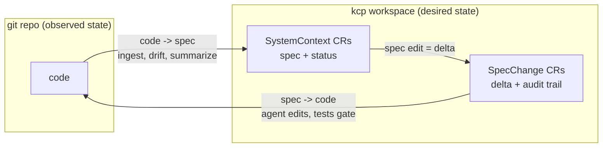
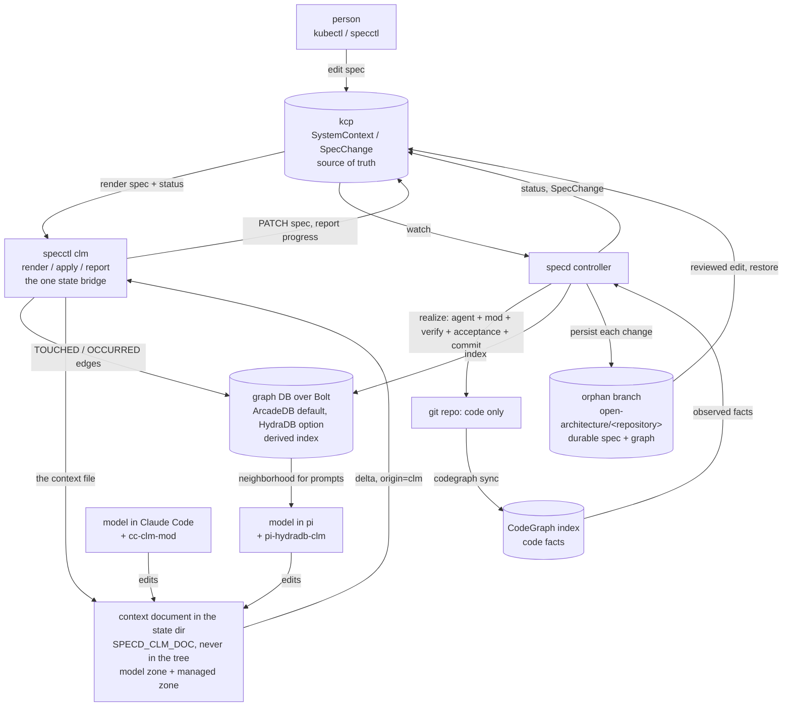
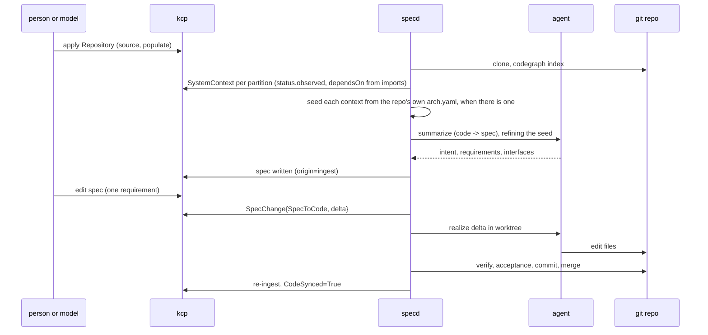
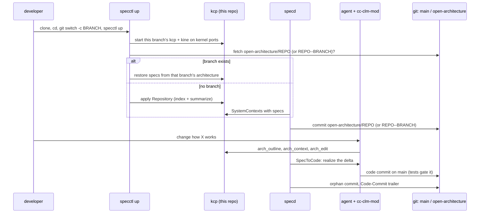
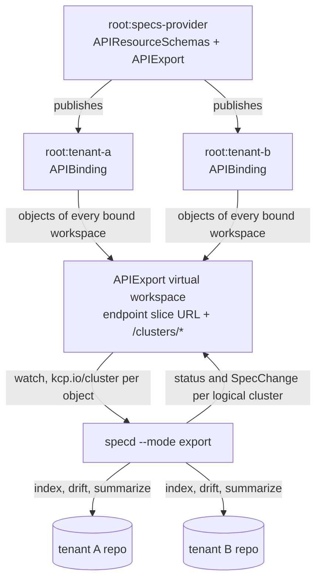

# graph-clm-kcp-spec

Two way state sync for spec driven development.

kcp (a Kubernetes control plane, no nodes) holds the specs. A spec is a custom
resource: `spec` is the desired state of a part of a system, `status` is what
the code is observed to be. A reconciler drives the code to the spec, exactly
like a Deployment drives pods. A graph database indexes specs, requirements and
code references so a language model gets a small, relevant neighborhood instead
of a 3000 line document.

```
            code -> spec  (ingest, summarize, drift)
  git repo  ------------------------------------------>  kcp (CRs = specs)
  (code)    <------------------------------------------  (desired state)
            spec -> code  (realize: agent edits code, tests gate)
```

The design lives in [`docs/plans/0001-kcp.md`](docs/plans/0001-kcp.md). That
plan is the source of truth; this file says how to run what is built.

## Why

**The problem: specs rot.** Code changes faster than anyone documents it. The
open architecture document of the sibling `deno-kcp` repo
(`.tools/open-architecture/arch.yaml`) shows it: 84 hand-written commits, over
3000 lines, and a separate 674-citation truth sweep just to find where the
document had drifted from the code. A hand-kept spec is stale soon after it is
written, and without a true spec neither people nor AI agents can reason about
a codebase or change it safely.

**The idea: spec is desired state, code is observed state.** That is the
Kubernetes model. kcp is a Kubernetes control plane with no nodes: pure state
management, with reconcile loops, `status`, conditions, generations and
multi-tenant workspaces. So kcp holds specs as custom resources, and
controllers keep specs and code converged. Drift stops being something a
manual audit finds; it is a reconcile signal.



**Two way sync.**

- **code -> spec:** code changes, the controller sees drift, and a model
  updates the spec (intent, requirements, interfaces). Every claim is anchored
  to real CodeGraph ids.
- **spec -> code:** a person or a model edits a spec, the controller computes a
  structured delta, an agent changes the code to match, tests gate the commit,
  and the repository's acceptance steps prove the result where it has to run.

**Why a graph database.** A model cannot read 3000 lines for every task.
A graph database indexes specs, requirements, interfaces and code references,
so each task gets a small, relevant neighborhood: the context, its upstream, overlay
and orchestrator, and the code it points at. The graph is a derived index; kcp
stays the only source of truth, and the graph can be rebuilt from kcp and
CodeGraph at any time.

The engine is not the point: CLM + graph DB is. Any Bolt/openCypher engine
that runs the portable Cypher subset works. ArcadeDB is the default because it
is the more Cypher compliant of the two tested engines (38 of 40 probe cases
against HydraDB's 26 of 40, `pi-hydradb-clm/docs/cypher-conformance.md`).

**Why a context language model (CLM).** The model edits its own context
document, which becomes its working memory. The `pi-hydradb-clm` extension
syncs that document to kcp, so what the model learns or decides while it works
becomes a spec change automatically.



**The end goal.** Spec driven development in which the spec is never stale:

1. Point at an unknown repository, apply one `Repository` manifest, and get a
   full set of specs.
2. Develop by editing specs (by hand or by a model); deltas drive the code
   changes.
3. Specs are machine-checkable and current, in the open architecture shape
   (`upstream`, `overlay`, `orchestrator`), across the publicdomainrelay repos,
   so people and agents work from one shared, true model of the system.



## Clone and go

The everyday flow: clone a repository you do not own, start from its root, let
the system build the architecture, then work by changing the architecture.

```bash
git clone https://example.com/someone/project.git && cd project
specctl up                       # this checkout's branch: its own kcp + specd; index, summarize, persist
specctl status                   # populate progress, contexts, open-architecture/project
specctl ls                       # every instance on this machine, one per (checkout, branch)
specctl arch outline             # the architecture kcp holds
claude --plugin-dir /path/to/cc-clm-mod   # the agent reads and edits it through kcp
git log --oneline open-architecture/project   # every change of kcp, outside the tree
specctl down                     # stop specd and this branch's kcp
```

- **Nothing lands in the project tree.** kcp, kine, logs and context documents
  live under `$SPECD_STATE_DIR` (default `$XDG_STATE_HOME/specd`, else
  `~/.local/state/specd`). The codegraph index is hidden through
  `.git/info/exclude`. The spec and the context graph persist to an orphan
  branch, written with git plumbing, never checked out:
  `open-architecture/<repository>` for the default branch, and
  `open-architecture/<repository>--<branch>` for any other code branch, so a
  pull request's spec never lands in the architecture of `main`.
- **A repository that has no branch yet** (the usual case for someone else's
  `main`) is indexed and summarized from scratch, and the first commit of the
  branch is made. A clone whose `origin` already carries
  `open-architecture/<repository>` is restored from it instead, so a team shares
  one architecture. `--push` pushes the branch after every change; nothing is
  pushed unless asked.
- **One instance per (checkout, branch).** kcp, kine and the session record are
  keyed on the checkout path *and* the checked-out branch, so `git switch` plus
  `specctl up` starts or adopts that branch's own instance and restores from
  that branch's architecture (`open-architecture/<repository>--<branch>`,
  falling back to the default branch's). Only one specd runs per checkout
  because a specd indexes the checkout's HEAD: `up` on another branch stops the
  specd of the branch the checkout left and leaves its kcp running
  (`--stop-others` stops that too). A stale specd can never misattribute code —
  when the checkout's HEAD is not the Repository's branch it sets
  `BranchMismatch=True` on the Repository and does not index, realize or persist
  for it, and clears the condition when they match again. Work on two branches
  at the same time = two `git worktree`s, each with its own path, instance and
  specd; `specctl ls` lists them all.
- **Many repositories at once.** Each `specctl up` starts its own kcp and kine.
  kine binds port 0; kcp cannot, so it gets a port the kernel assigned, retries
  if it loses that port, and the port it really serves is read back from its own
  kubeconfig and `/readyz`. `specctl env -o json` (or `specctl up --out
  session.json`) reports the kcp url, both ports, the kubeconfig, the workspace
  and the pids, so an agent can be pointed at each instance.
- **The agent harness.** In an up'd clone, `claude --plugin-dir cc-clm-mod`
  registers `arch_outline`, `arch_context`, `arch_edit` and `arch_changes`. An
  `arch_edit` lands in kcp as a delta, specd opens a `SpecToCode` change, the
  realize agent (the same mod, contained to its worktree) edits the code, the
  repository's tests gate the commit, and the orphan branch records both.



## Worked example: one sentence to a pull request on deno-kcp

The flow above, run for real on a repository this tool did not write:
[publicdomainrelay/deno-kcp](https://github.com/publicdomainrelay/deno-kcp), a
Go kcp provider. The only human input was one sentence:

> add a running bidder instance to the example and a PDS for bob under his own namespace

It became **[publicdomainrelay/deno-kcp#1](https://github.com/publicdomainrelay/deno-kcp/pull/1)**:
workspace `root:bob` with its OpenBao authority, a PDS for bob, a running market
bidder, `apply.sh` and the README updated, and deno-kcp's offline tests extended
to cover every market manifest. 9 files, +359 / -40, `go test ./...` green. The
spec it realizes is on
[`open-architecture/deno-kcp--spec-bidder-and-bob-pds`](https://github.com/publicdomainrelay/deno-kcp/tree/open-architecture/deno-kcp--spec-bidder-and-bob-pds).

Try it (full copy-paste walkthrough, prerequisites and the step-by-step version:
[`docs/examples/deno-kcp-pr.md`](docs/examples/deno-kcp-pr.md)):

```bash
git clone https://github.com/publicdomainrelay/graph-clm-kcp-spec && cd graph-clm-kcp-spec
make build && export PATH=$PWD/bin:$PATH SPECD_SPECCTL=$PWD/bin/specctl
PUSH=0 scripts/example-deno-kcp-pr.sh      # PUSH=1 opens the pull request
```

How it was done:

1. **Clone** deno-kcp into a temp dir, with `kcp-libs` beside it (its `go.mod`
   replaces `../kcp-libs`), on a new branch.
2. **`specctl up`**: the clone's own kcp on kernel-assigned ports, CodeGraph
   index, 17 SystemContexts, each summarized by DeepSeek, persisted to the
   orphan branch `open-architecture/deno-kcp`. About 2.5 minutes.
3. **The harness**: headless Claude Code (DeepSeek) with `cc-clm-mod`, given the
   sentence and told to change the spec only. Through `arch_outline` /
   `arch_context` it found the `deploy-examples-atproto-market` and
   `test-integration` contexts, read the org's `hono-bidder` and `hono-pds` for
   their flags, and wrote ten requirement changes with `arch_edit`
   (`r.bob-pds-pod`, `r.bidder-pod`, `r.bidder-supervisor-script`, ...). Three to
   five minutes.
4. **specd** turned each spec delta into a `SpecToCode` change; the realize agent,
   contained to its worktree and seeing only the repository and the spec, edited
   the files; deno-kcp's `go test ./...` gated each commit.
5. **Publish**: the branch, both architecture branches, `gh pr create`.

Results across two runs (the PR, and a second run from a fresh clone with the
script):

| | run 1 (PR #1) | run 2 (script) |
| --- | --- | --- |
| architecture built | 2 min 45 s | 2 min 18 s |
| harness | 4 min 37 s | about 3 min 25 s |
| example realized | 1st attempt (after the fixes below) | 1st attempt, 1 min 36 s |
| registry realized | 3rd attempt | 2nd attempt |
| diff | 9 files, +359 / -40 | 8 files, +359 / -38 |
| deno-kcp tests | green | green |
| project tree | clean | clean |

**Analysis.** The loop works on real code: the harness did the research a
human would (the bidder's entry, `--serve-port`, a compute provider that needs
no cloud credential, free ports) and wrote it into requirements, so a code agent
that could see nothing outside the repository still produced a correct bidder
manifest, and the change left deno-kcp better tested than before (no test
covered the market manifests until now). Two runs converged on the same design.
The run also found six defects in this repository, each fixed with a test:
realize worktrees now keep the repository's siblings (relative `go.mod`
replaces), the model timeout is 15 minutes, `specctl up` adopts a still-running
kcp, realize rebases onto a branch that moved instead of failing, `specctl retry`
exists, and the architecture branch follows the code branch
(`open-architecture/<repo>--<branch>`), so a pull request's spec never lands in
the architecture of `main`. Since then one spec edit is realized as one change
— one realization per Repository at a time, every pending change of it in the
same batch and the same commit — so the registry change no longer races the
example change that its files depend on. The offline-only weak point is closed
and the answer is not the one that was hoped for. The example now carries its own
live acceptance, `deploy/examples/atproto/market/accept.sh`, written as one
`MUST` requirement and realized through the same flow on the PR branch, and the
`deno-kcp` Repository's `spec.acceptance` runs it as a gating step; `specctl
accept` brings the whole market up on its own kcp, kine and OpenBao and reads
every workload back. Its first run was **red**, and not because of anything in
deno-kcp: no workload was ever applied, because `apply.sh` stopped at its OpenBao
gate. kcp-libs read OpenBao's HTTP 400 `no default issuer currently configured`
on a fresh `pki` mount as a failure instead of as "no authority yet", so no
namespace was provisioned an intermediate and no DenoPod was issued a
certificate; deno-kcp's own live test
`TestOpenBaoAuthorityIssuesTheCertificateADenoPodServesWith` failed with the same
message against the OpenBao pinned in `third_party/openbao`, on `main`. It was
exactly the failure the offline gate could not see, which is what part C was for.
The finding then went back through kcp-libs's **own** spec flow: a fresh clone,
`specctl up` (44 contexts, 44 summarized), a `MUST` requirement
(`r.no-default-issuer-is-no-authority`) and its test requirement written into the
`impl-openbaoclient` context with `specctl clm apply`, and a realize agent that
made `ResponseError.Is` read that 400 as `pki.ErrNoAuthority` with `go test
./...` as the gate ([publicdomainrelay/kcp-libs#1](https://github.com/publicdomainrelay/kcp-libs/pull/1)).
deno-kcp's own live test now passes in 25.52 s, and the acceptance gets past
OpenBao: `apply.sh` exits 0, all four OpenBao authorities report ready with
distinct serials, `plc`, `relay` and bob's PDS run and answer. It is red further
in, on three defects that are in the example or the provider and not in kcp-libs.
Details, both pass/fail tables and the root cause:
[`docs/examples/deno-kcp-pr.md`](docs/examples/deno-kcp-pr.md#live-acceptance).

Plan 0004 D then worked those defects through the same flow. Two of the four red
items turned out to be one provider defect: the wildcard informer's store keys
objects by namespace and name with no workspace, so the `default/pds` this branch
adds to `root:bob` evicted `root:alice`'s from the cache -- alice's PDS ran and
served but was never re-probed, never became `ready`, and was missing from every
pod's virtual DNS table, which is exactly the verifier's
`pds.default.alice.svc.kcp.local is not in the table` error. A `MUST`
requirement (`r.watch-cache-keys-every-workspace`) and its test requirement went
into the `internal-provider` context through `specctl clm apply`, and specd's
realize agent landed `3749680`, keying the cache by workspace as well as
namespace and name. The fixed `sleep 10` before the verifier and the provider's
intermittent "reconciles nothing" start went in as two more `MUST` requirements
and landed as `89cee50`: `apply.sh` waits on the provider's own verdict that
alice's PDS is ready, and `accept.sh` detects a provider that reconciled nothing
and restarts it while no workload exists. The acceptance is much closer and
still red: `apply.sh` exits 0 on its first attempt and every ready-and-serving
check is green, including alice's PDS and all four long-running pods. What is
left is outside this repository -- the bidder's PLC registration `POST` comes
back 404 only inside the cluster (the client, the PLC and the shim all pass
standalone), and the verifier's `subscribeRepos` WebSocket receives no frame, so
`relaySawCommit` times out on the PDS-to-relay path. Both want the running
topology's own logs. The full table, each requirement's commit and the two open
items: [`docs/examples/deno-kcp-pr.md`](docs/examples/deno-kcp-pr.md#plan-0004-d-the-same-acceptance-three-fixes-in-and-the-two-that-are-left).

## Status

All ten phases are done: **kcp holds specs, code becomes facts in `status`
and in the graph, a hand written `arch.yaml` round trips through kcp, `specd`
keeps the facts, the conditions and the work queue true to the code, an agent
turns the code back into a spec, a spec edit becomes a structured delta that
drives an agent to change the code under a test gate, one `Repository` manifest
populates a codebase kcp has never seen, the CLM loop is a library with two
hosts — the `pi-hydradb-clm` extension and a Claude Code mod — so the model that
realizes a change reports into the same state the controllers watch, the API
is multi-tenant: an APIExport in a provider workspace, tenant workspaces that
bind it, one `specd --mode export` that reconciles it all; the spec and the
context graph persist to an orphan `open-architecture/<repository>` branch,
never into the project tree, and `specctl up` turns any clone into a running,
isolated instance an agent harness can drive; and the whole
loop is measured: `specctl eval` runs five fixtures and an unknown real
codebase through it — including what the spec makes an agent able to rebuild,
what a human's code edit makes the spec say, and whether the model's answer
beats the scripted baseline at all — and reports what actually happened.**
The development and test setup is parallel-safe: kcp and kine take kernel
ports and report them in `endpoint.json`, `go test ./test/e2e` starts a
private kcp per run, and every run namespaces what it writes to the shared
graph.

- API group `specs.publicdomainrelay.dev/v1alpha1`, kinds `Repository`,
  `SystemContext`, `SpecChange`, namespaced, with a status subresource and
  printer columns.
- `specctl apply -f | get | delete` against a kcp workspace.
- `specd` watches the three kinds, re-ingests a `Repository` when its git HEAD
  moves, keeps `SpecValid`, `CodeSynced` and `Drifted` true to the code, and
  opens exactly one `SpecChange` per direction of work.
- `Repository.spec.source` is a local `path` or a `git: {url, ref}`; specd
  clones a git source into `--cache-dir` and follows it, and
  `Repository.spec.populate` says how to split the tree (`directory` or
  `package`), what to skip (`include`/`exclude` globs) and whether to send an
  agent over every new context (`summarize`, `agent`). `status.phase` runs
  `Cloning -> Indexing -> Populating -> Populated`, or `Failed`, and
  `status.contexts` counts total, summarized and failed.
- `specctl ingest --repo <path>` applies a `Repository` manifest and waits for
  `Populated`, so the CLI and the controller are one code path.
- Ingest runs CodeGraph over a working tree, partitions it, and fills
  `status.observed` (`files`, `treeFiles` the index does not cover,
  `interfaces` with signature, file, line and CodeGraph id, and a
  `fingerprint` over the files and the interfaces) plus the conditions `SpecValid`,
  `CodeSynced` and `Drifted`. Ingest is idempotent: a second run changes no spec
  and writes no status.
- `specctl import-arch <arch.yaml>` turns every node of an open architecture
  document into a `SystemContext`, and `specctl export --format arch` writes it
  back; the ids, the refs and the preserved node bodies survive the trip.
- `specctl graph neighbors|rebuild` read and write the spec graph in ArcadeDB
  (the default backend) or HydraDB over Bolt, using only the Cypher core subset
  both engines run; `--bolt-backend hydradb` switches the defaults.
- `specd --agent claude|scripted:<file>` works a `CodeToSpec` change off: it
  builds the context bundle, asks the agent, validates the answer, writes
  `intent`, `requirements` and `interfaces` with the `origin: ingest`
  annotation, moves the synced baseline so `Drifted` goes False, and writes the
  context document. The write never looks like a human edit, so it raises no
  `SpecToCode` change; the loop is proved in a unit test and in a live run.
- The model's answer is held to a bar, in the prompt and in the parser: a
  requirement that names an absolute machine path (`/home/...`) is rejected and
  the change is retried, an interface the observed facts do not name is dropped
  instead of declared, a requirement that is only a comma-separated list of
  names is reported back for a rewrite, and a command entrypoint (a context
  whose files are under `cmd/`) whose architecture knows its flags must state
  its configuration surface — each flag, the environment variable behind it and
  the default. The prompt renders the seeded arch node too, so the flags the
  document carries are visible to the model that has to name them.
- `specctl ingest --summarize --agent <kind>` fills the spec of every context
  whose intent is still empty, without a controller running.
- Each context gets a CLM document at `$SPECD_CLM_DOC_DIR/<repository>/<name>.md`
  (in the state dir, never in the tree): the
  model's prose and a fenced `yaml spec` block above
  `<!-- SPECD_MANAGED_BEGIN -->`, and the code refs the index resolved below it,
  regenerated on every summarize. One format for both directions: the file the
  code -> spec path writes and the file a host inside a model renders parse each
  other.
- Every list in every CRD is a keyed list: `requirements` by `id`, `interfaces`
  and the observed interfaces by `name` and `conditions` by `type` are
  `x-kubernetes-list-type: map`, and `codeRefs`, `overlay`, `dependsOn` and
  `introduces` are sets. A server side apply that names one entry therefore
  edits that entry and leaves the rest of the list, and every other field,
  exactly as it was.
- `status.realizedSpec` and `status.syncedObserved` snapshot the last realized
  spec and the last synced fact set, so a delta is computable from kcp alone in
  both directions. `abc/delta` is the pure `Diff`/`Apply` algebra
  (`DiffObserved`/`ApplyObserved` for facts) and its stable JSON is pinned by
  golden files in `testdata/delta/`; `SpecChange.spec.delta` carries it and
  `specctl get specchange` prints the `+2 ~1 -1` summary.
- `SpecToCode` is one worktree: branch `spec/<context>/<hash8>` off the managed
  branch, the agent edits files only, `Repository.spec.verify` gates the commit,
  then `Repository.spec.acceptance` runs the repository's own steps in the same
  worktree — a gating step blocks the commit like verify, a report-only step
  records its result — and a clean run lands the commit as
  `specd <specd@localhost>` on the managed branch with a re-ingest that adopts
  it in one status write, so the tool's own work raises no opposite change. A
  failing gate keeps the branch, leaves the spec and the managed branch
  untouched and hands the output to the next attempt; the results are on
  `status.acceptance` and the commit trailers.
- `Repository.spec.agent.kind` selects the agent per repository (`claude`,
  `claude-mod`, `pi` or `scripted:<file>`) and wins over the controller's
  `--agent`.
- `clm/core` is the CLM logic that is the same in every host, as pure TypeScript
  with no `node:` import and no I/O: the context document (a prose intent plus a
  fenced spec block above a managed zone of resolved refs), the token budget,
  FNV-1a ids, the Cypher row builders, a mirror of `abc/delta` validated against
  the same golden files, and the ports `StateBridge`, `FileStore` and `Runner`.
  `clm/adapters-node` is the Node side of those ports, including the state
  bridge over `specctl clm`.
- `cc-clm-mod` is the Claude Code host: a plugin of function hooks that renders
  the context at session start, injects it before every model request, reports
  every file a tool touched, and applies the model zone at the end of a turn.
  `clm/core` is vendored into it by `npm run build:mod`, with a test that fails
  when the vendored copy is stale.
- `specctl clm render|apply|report` is the one state bridge, so kcp access, the
  delta authority and the graph writes have one implementation (Go) that both
  hosts and every language reach the same way. `apply` writes with
  `origin: clm` and folds its edit into the context's running `SpecToCode`
  change instead of moving the target that change is working to, so a realizing
  agent can never spawn a change for itself.
- `SpecChange.status.progress` is a bounded list of what the host reported while
  the change ran (turn, tool, files, note, time), and `report` writes the
  matching `TOUCHED` and `OCCURRED` edges into the graph, so
  `kubectl get specchange -w` shows the work while it happens.
- `deploy/apiresourceschemas/` is generated from `deploy/crds/` by
  `impl/schemagen`, and a test fails when the two grow apart, so the API a
  tenant binds and the API the single workspace serves cannot diverge.
  `deploy/install-specs-provider.sh` creates `root:specs-provider`, applies the
  schemas and the APIExport `specs.publicdomainrelay.dev`;
  `deploy/bind-workspace.sh <ws>` creates a tenant workspace, binds that export
  and writes its kubeconfig.
- `specd --mode export` watches every workspace bound to the export through the
  APIExport virtual workspace (one dynamic informer per kind at
  `<endpoint>/clusters/*`). Each object carries its `kcp.io/cluster` annotation,
  so the controller writes every status and every `SpecChange` back to the
  logical cluster the object came from: the specs stay per workspace, the API is
  shared. Plain workspace mode is the default and is unchanged.
- Every change of a repository's kcp state is a commit on the orphan branch
  `open-architecture/<repository>` (arch.yaml, repository.yaml, specs/, status/,
  context/, changes/, CHANGES.md on a feature branch, graph/*.jsonl), written
  with git plumbing so the tree, index and HEAD are never touched; commit
  subjects name the context and the change and spec commits carry `Spec-Change:`
  trailers. See "Specs on an orphan branch". `specctl sync --repo <path>` merges
  a reviewed edit on that branch back into kcp by delta key (writing with
  `origin: git`, so specd realizes it); the same key moved on both sides is
  reported and kept from kcp. A realize commit carries code only, with
  `Spec-Change` and `Open-Architecture` trailers.
- `impl/piagent` is the pi host over the same agent contract, with the npm
  package as its default command, and the pi extension writes
  `(PiMemory)-[:SPECIFIES]->(SpecRequirement)` for the requirements a remembered
  code reference anchors to.
- `fixtures/` holds five repositories with tests — `calc` (a Go library),
  `greet` (a Deno/TypeScript module), `todo` (a Go JSON service over
  `net/http`), `shared` (two Go types that share a method name) and `ledger`
  (a Go double-entry service with 12 source files over four contexts) — and
  each carries `scenarios/*.yaml`: a spec patch to apply, the hidden
  acceptance tests that grade it, the interfaces the change should make
  observable, and the deterministic realize steps. The ledger scenarios are
  the hard ones: a delta that spans two contexts, a requirement-only
  behaviour change, a removal and a rename, and one driven through the CLM
  path (`via: clm`) where the model, not the harness, changes the spec. A
  removal is spelled `{"$patch": "delete"}`, because a patch merged by key
  can add and change an entry but cannot take one away. The harness files are
  named in the fixture's `.gitignore`, which the index honours as well as git,
  so a fixture stays a working tree and a scenario file can never become a
  context of its own.
- Each fixture also carries `expected.yaml`, the behavioural facts a correct
  spec must state ("Balance returns the sum of the entries of one account"),
  and `drift/*.yaml`, a code change committed the way a person commits one:
  the drift raises a `CodeToSpec` change and the spec it writes is graded on
  the interfaces it gained and lost, the facts its prose states, and the
  interface entries of its diff. That is goal 5 — human code edit, drift,
  code -> spec, graded spec — measured rather than described.
- `specctl eval --fixtures fixtures [--agent claude|claude-mod|pi]
  [--scenarios <glob>] [--out docs/eval/run-<date>.md]
  [--baseline <a previous report.json>]` measures the loop, one fixture at a
  time: it copies the tree into a fresh git repository, applies one
  `Repository` manifest and lets the controller populate it, then applies
  each scenario's spec edit, waits for the `SpecToCode` change, and grades
  the result with the verification command and the hidden acceptance tests,
  which are copied in only for grading. It resets the tree and the spec
  between scenarios and defaults to the workspace `root:specs-eval`, so a run
  never disturbs the objects another suite owns. `--baseline` puts a live run
  beside the scripted one and flags a run that is equal on every measure as
  **not discriminating**. Both live hosts run the same hosted provider
  (`--agent claude-mod` runs `deepseek-claude` with the mod, `--agent pi` runs
  the pi package with the extension and takes `DEEPSEEK_API_KEY` from the
  `deepseek-claude` launcher when the environment has not exported one); no
  local provider is used anywhere in this repository, because a number taken
  from one measures the model rather than the loop and cannot be compared with
  the runs in `docs/eval/`.
- The measures are pure and unit tested in `abc/eval`. Every measure carries
  the sample count behind it: with no samples it prints `not measured`, never
  0% or 100%, and a context with an empty surface (or a scenario the run
  could not take) is excluded from the mean and counted by name. The code ->
  spec score is the share of the fixture's expected facts the spec states,
  graded per fact by a model judge with a fixed rubric (`impl/judge`) and,
  under the scripted baseline, by a deterministic keyword fallback. Spec
  sufficiency is the strongest test: `impl/stripbodies` removes every
  implementation body (Go through `go/ast` to `panic("unimplemented")`,
  TypeScript to a throw), the tests are hidden, the agent rebuilds the code
  from the spec alone, and the original tests run again. Alongside those are
  interface recall, precision and F1, requirement anchoring, validator pass,
  round trip Jaccard, delta precision, the files a realize touched outside
  its context, attempts, wall time, and the code -> spec facts a drift
  produced. The report is a markdown table and the same numbers as JSON
  beside it, and a `--baseline` run adds a side by side table saying whether
  the eval discriminated at all.
- `fixtures/external/kcp-libs` is a fixture that is not in this repository: one
  `Repository` manifest with a `git` source clones a read-only checkout of the
  sibling `kcp-libs` into the controller's cache and populates it, so the
  measures are also taken on a real codebase nobody wrote for the harness.
- A Go method is exported when its name is capitalised, which the index does
  not say, so the reader applies Go's own rule; without it a package whose API
  is mostly methods is observed as an almost empty surface.
- Live tests that round trip a `SystemContext` through a real kcp, that ingest a
  real git working tree twice and check the graph on both backends, that take
  the open architecture document through kcp and diff the two models, that drive
  the controller through drift and both directions of `SpecChange`, that patch
  one requirement of a keyed list without rewriting its list, that realize a
  spec edit through a worktree, a verify gate and a re-ingest on both the
  passing and the failing path, that ingest
  a Deno/TypeScript module, not only Go, and that run `deepseek-claude` over
  `fixtures/calc` and hold its answer to the same contract the scripted agent is
  held to.

## Requirements

`go` (1.26 or newer), `kcp` v0.33, `kine`, `kubectl`, `codegraph` on `PATH` for
ingest, and `git` for a `Repository` and for `specd`. The graph needs a Bolt
endpoint and defaults to ArcadeDB on `bolt://127.0.0.1:7688` (user `root`,
password `clm-arcadedb-root`, database `clm`); HydraDB on
`bolt://127.0.0.1:7687` (password in `/tmp/hdb/token`) is an option, selected
with `--bolt-backend hydradb` or `SPECD_BOLT_BACKEND=hydradb`. The graph
commands need one;
`apply`, `get`, `delete`, `import-arch` and `export` work without one (pass
`--no-graph` to `ingest` and `import-arch`).

`--agent claude` needs a model command on `PATH`: `deepseek-claude` by default,
or whatever `--agent-command` and `--agent-args` name. Only
`SPECD_REQUIRE_LIVE_MODEL=1` runs it; everything else, the whole `specd` loop
included, runs `--agent scripted:<file>` and needs no model. `deno` is needed
for the TypeScript live test, which runs `fixtures/greet`'s own tests before it
indexes the module, so the fixture is known to be a real working tree and not
only something `codegraph` can parse.

## Models: DeepSeek only

Every test, every example and every eval in this repository uses DeepSeek. The
`claude` and `claude-mod` agent kinds run `deepseek-claude`, and the `pi` kind
runs the pi package over the same hosted provider, `deepseek` with
`deepseek-flash`, taking `DEEPSEEK_API_KEY` from the `deepseek-claude` launcher
when the environment has not exported one. No local model is used anywhere in
this repository, and no report in `docs/eval/` was taken from one: a number
measured against a local model describes the model rather than the loop and
cannot be compared with the runs recorded beside it. The subsection below tells
an operator how to point an agent at a local server anyway; nothing in the
repository does it for them, and no test run does it.

### Running with a local model

Both hosts reach their model through a command and a list of arguments, so a
local server is a change of command and arguments, never a code change.

`pi` takes `--provider` and `--model`, so a local OpenAI-compatible server is
one pair of arguments. The arguments come from `--agent-args` on `specd` and
`specctl eval`, or per repository from `Repository.spec.agent.args`, which wins
over the flag; `--agent-command` names the pi binary when it is not the default
`npx` package. There is no `SPECD_PI_ARGS` variable in this repository: the flag
and the `Repository` field are the only two places those arguments are set.

```bash
bin/specd --agent pi --agent-command pi \
  --agent-args "--provider llama-cpp --model <name>"
```

Claude Code reaches a local server through `ANTHROPIC_BASE_URL`, because
`llama-server` serves the Anthropic Messages API. Start the server and point the
client at it:

```bash
llama-server -hf <a-model-with-tool-support>-GGUF   # POST /v1/messages on :8080
ANTHROPIC_BASE_URL=http://127.0.0.1:8080 claude
```

What that requires, from llama.cpp's own documentation:

- A llama.cpp build with the Anthropic Messages API: the `POST /v1/messages`
  route, contributed as ggml-org/llama.cpp PR #17570 and present in current
  builds. An older server answers 404 on the route. It also serves
  `POST /v1/messages/count_tokens`, streaming SSE, tool use (`tool_use` and
  `tool_result` blocks), vision and extended thinking; the request is converted
  to the OpenAI chat endpoint inside llama.cpp.
- A model that supports tool use, because the loop's agents edit files and run
  commands through tools. llama.cpp recommends an agentic coding model.
- `ANTHROPIC_BASE_URL` without a `/v1` suffix, and a non-empty
  `ANTHROPIC_API_KEY` (llama.cpp does not check it; Claude Code may still ask
  for credentials without one).
- Nothing that the Anthropic-to-OpenAI translation drops. `id_slot` is one such
  field: a client that pins a conversation to one slot's prompt cache loses that
  cache on this route.

For `specd`, name the command with `--agent-command claude` (or
`Repository.spec.agent.command`) with `ANTHROPIC_BASE_URL` in the environment;
the mod path needs `--clm-mod` as usual, and the local server must support tool
use for the scope guard and the report hooks to run.

## Quick start

```bash
make kcp-up          # kcp and kine on kernel-assigned ports, state in .kcp-specd/
make generate-schemas # rewrite deploy/apiresourceschemas/ after a CRD change
make example-phase1  # apply examples/calc/specs.yaml and read it back
make example-phase2  # ingest a copy of fixtures/calc, fill status.observed, write the graph
make example-phase3  # import testdata/open-architecture/arch.yaml and export it back
make example-phase4  # run specd, commit a change, watch drift and the SpecChange
make example-phase5  # run specd with an agent, watch the spec fill itself in
make example-phase6  # edit the spec, watch the agent land the code and the tests pass
make example-phase7  # one manifest populates a codebase kcp has never seen
make example-phase8  # the mod path: render, apply, fold, report
make example-phase9  # two tenants, one export, the orphan branch, a branch edit and a conflict
make example-phase13 # clone and go twice through one remote, two kcp instances on kernel ports
scripts/example-deno-kcp-pr.sh # one sentence to a pull request on publicdomainrelay/deno-kcp (PUSH=0 by default)
make demo            # the whole loop once, then the eval table and one CLM scenario
make demo-phases     # every phase example, in order, against one cluster
make test-live-model # the six DeepSeek tests (real model calls)
make kcp-down        # stop the cluster this repo started
```

`make example-phase1` prints a table of the contexts it applied, the same
objects through `kubectl`, and one `SystemContext` as YAML.
`make example-phase2` applies the same example, indexes `fixtures/calc` with
CodeGraph, ingests it, prints the observed facts and the conditions, and shows
one hop of the graph around `calc` in ArcadeDB, the default backend, and in
HydraDB, the option.
`make example-phase3` imports the archived open architecture document, prints
one hop of the graph around `sc.deno-kcp` (by arch id), exports the document
back out of kcp, and runs the live round trip test. All three targets are
idempotent except that the phase 3 live test cleans up after itself, so run the
target again to put the imported contexts back.
`make example-phase4` copies `fixtures/calc` to a temporary working tree, starts
`specd`, commits a `Subtract` function, prints the `Drifted` condition and the
`CodeToSpec` change it raised, patches the spec of the same context, prints the
`SpecToCode` change, shows that no other resourceVersion moves for four
seconds, and stops `specd` with SIGTERM. It owns the `calc` and `cmd-calc`
names, so it deletes the `calc` Repository and those two contexts first and
last; run `make example-phase2` afterwards to put that example state back. The
controller watches every `Repository` in the workspace, so two Repositories
that name the same context would otherwise take turns writing its status.
`make example-phase5` copies `fixtures/calc` to a temporary working tree, starts
`specd` with the scripted agent, commits `Subtract`, and prints the spec the
agent wrote: the intent, the requirements and the interfaces, the `origin:
ingest` annotation, `Drifted=False` and zero `SpecToCode` changes. It prints the
context document the summarize left in the tree, then runs
`specctl ingest --summarize` over the same tree to show the CLI entry point,
and stops `specd` with SIGTERM. It owns the same `calc` and `cmd-calc` names, so
run `make example-phase2` afterwards to put that example state back.
`make example-phase7` builds a bare git repository out of `fixtures/greet` (a
tree kcp has never seen) and `fixtures/calc`, applies only
`examples/populate/repository.yaml`, and prints the phase, the context counts,
every summarized spec and the context document the agent left in the clone; the
controller clones, indexes, raises one `CodeToSpec` change per context and works
them all off with the scripted agent, with no other command.
`make example-phase2` and `make example-phase5` start `specd` around their
`specctl ingest`, because the CLI waits for the controller now.
`make example-phase6` copies `fixtures/calc` to a temporary working tree, applies
a `Repository` that names its own scripted agent, starts `specd` with no
`--agent` at all, adds one interface and one requirement to the `calc` context
with a server side apply, and prints the two entry delta the controller raised,
the worktree branch, the commit the agent made under `specd
<specd@localhost>`, the files it touched, the verify exit code, `CodeSynced=True`
and `Drifted=False`. `make example-phase6-failing` runs the same example with a
scenario whose `Subtract` cannot pass, so the change ends `Failed` with its
branch kept and the managed branch untouched. Both own the `calc` and `cmd-calc`
names.

The same steps by hand:

```bash
make build
make kcp-up

# the graph endpoint defaults to ArcadeDB on bolt://127.0.0.1:7688 (root /
# clm-arcadedb-root, database clm); for HydraDB instead:
#   export SPECD_BOLT_BACKEND=hydradb   # 7687, neo4j, token in /tmp/hdb/token

# specctl ingest applies a Repository and waits for Populated, so the controller
# has to be watching the workspace; start it in its own terminal
bin/specd --workspace root:specs --resync 2s
```

```bash
# ... and run the rest in another terminal. One ingest: apply the example
# contexts, then one Repository manifest, and read the observations back.
bin/specctl apply -f examples/calc/specs.yaml
bin/specctl ingest --repo fixtures/calc
bin/specctl get systemcontext calc -o yaml
bin/specctl graph neighbors calc

# the same neighborhood in HydraDB, rebuilt from kcp and codegraph
bin/specctl graph rebuild --bolt-backend hydradb
bin/specctl graph neighbors calc --bolt-backend hydradb

bin/specctl delete systemcontext calc

bin/specctl import-arch testdata/open-architecture/arch.yaml --repository deno-kcp
bin/specctl graph neighbors sc.deno-kcp
bin/specctl get systemcontext -o name | head
bin/specctl export --format arch --repository deno-kcp -o /tmp/arch-export.yaml

KUBECONFIG=.kcp-specd/specs.kubeconfig kubectl get systemcontexts
KUBECONFIG=.kcp-specd/specs.kubeconfig kubectl get specchanges

# one manifest populates a codebase kcp has never seen (make example-phase7
# builds the bare repository this url names)
KUBECONFIG=.kcp-specd/specs.kubeconfig kubectl apply -f examples/populate/repository.yaml
KUBECONFIG=.kcp-specd/specs.kubeconfig kubectl get repositories -o wide

# multi workspace: publish the API from a provider workspace, then bind tenants
make install-specs-provider
./deploy/bind-workspace.sh tenant-a
KUBECONFIG=.kcp-specd/tenant-a.kubeconfig kubectl get systemcontexts
# one controller reconciles every tenant bound to the export
bin/specd --mode export --provider-workspace root:specs-provider

# kcp <-> the orphan branch open-architecture/<repository>; never the tree
bin/specctl sync --repo /path/to/repo
git -C /path/to/repo log --oneline open-architecture/<repository>
```

`ingest` reads the Bolt endpoint from the flags or the environment
(`SPECD_BOLT_BACKEND`, `SPECD_BOLT_URL`, `SPECD_BOLT_USER`,
`SPECD_BOLT_PASSWORD`, `SPECD_BOLT_PASSWORD_FILE`, `SPECD_BOLT_DATABASE`). The
backend fills the options no flag and no environment variable set, and ArcadeDB
is the default; `SPECD_BOLT_URL=` (set but empty) turns the graph off. The
`Makefile` exports `SPECD_BOLT_BACKEND=arcadedb`, so plain `make example-phase2`
needs no extra flags, and the graph is written where the index is written, which
is `specd`: pass the bolt flags to the controller, not to `specctl ingest`.

A relative `Repository.spec.source.path` resolves against the working directory
of whichever process reads it, so run the commands from the repository root. A
working tree that is not a git repository is still indexed: it has no commits,
so it cannot drift, and it is re-indexed when a caller asks with the
`specs.publicdomainrelay.dev/populate-request` annotation (which
`specctl ingest` always sets).

`specctl` talks to the workspace `root:specs` on the admin kubeconfig; pass
`--workspace`, `--namespace`, `--kubeconfig` or `--context` to change that. In
the multi workspace mode point it at a tenant instead:
`--workspace root:tenant-a` (or use the kubeconfig `bind-workspace.sh` wrote).
`specctl sync` derives the `Repository` from `--repo` when the path is the tree
a `Repository` resolved to, so the two sides cannot name different ones.
`deploy/install-specs.sh` also writes `.kcp-specd/specs.kubeconfig`, a
kubeconfig whose server already points at the workspace, so plain `kubectl`
works against it without extra flags.

## The API

| Kind | Purpose | Key fields |
| --- | --- | --- |
| `Repository` | a codebase under management, and the one manifest that populates an unknown one | `spec.source.path` / `spec.source.git`, `spec.branch`, `spec.verify`, `spec.acceptance[]` (name, command, timeoutSeconds, gate, env), `spec.agent`, `spec.populate` (partition, include, exclude, summarize, arch, root, agent), `status.phase`, `status.contexts`, `status.resolvedPath`, the `Indexed` and `Populated` conditions |
| `SystemContext` | one spec node (one system context) | `spec.repository`, `spec.upstream`, `spec.overlay`, `spec.orchestrator`, `spec.dependsOn[]`, `spec.introduces[]`, `spec.intent`, `spec.requirements[]`, `spec.interfaces[]`, `spec.codeRefs[]`, `spec.arch` |
| `SpecChange` | one direction-tagged change, the unit of work | `spec.systemContext`, `spec.direction`, `spec.delta`, `spec.toSpecHash` / `spec.toCommit`, `status.phase`, `status.branch`, `status.commit`, `status.verifyExitCode`, `status.filesTouched`, `status.acceptance[]` (name, exitCode, durationSeconds, passed, outputTail) |

`SystemContext.status` carries the code facts (`observed.files`,
`observed.interfaces` with `signature`, `file`, `line` and `codegraphId`, and
`observed.fingerprint` over both), `observedCommit`, the synced baseline
(`syncedCommit`, `syncedFingerprint` and `syncedObserved`), `observedGeneration`,
`realizedSpecHash` and `realizedSpec`, and the conditions `SpecValid`,
`CodeSynced` and `Drifted`. `realizedSpec` is the last spec a realize or an
ingest acknowledged and `syncedObserved` the facts that baseline was taken from:
together they are the old side of either delta, so a delta is always computable
from kcp alone.

Every list in the CRDs is a keyed list: `requirements` by `id`, `interfaces` by
`name`, the observed interfaces by `name` and `conditions` by `type` are
`x-kubernetes-list-type: map`, and `codeRefs`, `overlay`, `dependsOn` and
`introduces` are `x-kubernetes-list-type: set`. `deploy/install-specs.sh` applies
them, and a server side apply edits one entry without rewriting the list.

Requirements carry `id` (unique in the context), `level` (`MUST`, `SHOULD` or
`MAY`) and `text`. Every `codeRefs` entry is a CodeGraph id: a node kind of the
index's own vocabulary and a payload (`file:`, `package:`, `module:`,
`function:`, `method:`, `constructor:`, `struct:`, `interface:`, `class:`,
`type:`, ...; `abc/spec.CodeRefKinds` is the list). Context-to-context references are `self`,
`sc.<name>`, `up.<name>`, `ov.<name>` or `orch.<name>`, and an open architecture
id such as `sc.kind.denopod` is a reference too; it names the context
`sc-kind-denopod`, because the dots are part of the id.

`specctl apply` validates before it writes: duplicate requirement ids, an
unknown level, a malformed reference, a missing required field or a malformed
spec hash are rejected locally with the field path, and nothing is sent. A
field whose type is wrong is reported with its path too, for example
`spec.requirements.codeRefs`.

## Ingest: one manifest becomes code facts and specs

`specctl ingest --repo <path>` is a thin wrapper: it applies a `Repository`
manifest and waits for the controller to reach `Populated`. The work is
`impl/populate`, the same code path specd's `Repository` reconcile runs, so the
CLI and the controller cannot disagree about what ingesting means. (A `specd`
must be running; the controller owns the index, the graph and the agent.)

The pipeline:

1. resolves the source: a `spec.source.path` is used as it is, a
   `spec.source.git.url` is cloned into `--cache-dir` (`SPECD_CACHE_DIR`,
   `.kcp-specd/cache` by default) and fetched again on every resync, so a remote
   that moves forward is followed;
2. runs `codegraph init` (or `sync` when the index exists) on the working tree;
3. reads `.codegraph/codegraph.db` back through a pure Go sqlite driver. Ids are
   read, never computed;
4. partitions the tree: one context per directory that holds a source file
   (`calc/` becomes `calc`, `cmd/calc/` becomes `cmd-calc`, root files take the
   repository name) with `partition: directory` (the default), or one per
   package or module root with `partition: package`. `include` and `exclude`
   are globs over the repository-relative path, where `**` crosses directories
   and a pattern without a slash also matches a base name. Test files stay in
   `observed.files` but contribute no interfaces. With `populate.root` (what
   `specctl up` applies) the repository level is a context of its own — the
   tracked files at the top level and under `docs/`, even when the index covers
   none of them — named after the repository and the context every other one
   hangs from. Each context also records what the code index's import edges say
   it depends on as `spec.dependsOn` (`sc.<context>`), so the cross-context
   relations come from the code, not from a guess;
5. writes `Repository.status.headCommit` and `indexedCommit`, and for each
   context fills `status.observed` and the three conditions. `observed` carries
   the indexed `files` and also the `treeFiles`: the tracked files under the
   context that the index does not cover (a shell script, a README, a yaml
   manifest), which is what makes a `file:` ref to one of them resolve, so
   `CodeSynced` is about the repository and not about the indexer's language
   list. A context's declared surface is checked against the observed one, and
   generated code is not a declared interface: a symbol from a `zz_generated*`
   file, or one whose name begins with `DeepCopy`, is left out. The fingerprint is
   sha256 over the canonical JSON of the sorted files and interfaces, so the
   same tree always produces the same digest. Both the observed list and a
   spec's `spec.interfaces` are keyed the same way: a method by its qualified
   name, `Type.Method` (the Go receiver type or the TypeScript class), and
   everything else by its bare name. Two types that both offer a method named
   `List` are therefore two entries, which a list keyed by the bare name could
   not hold — the API server refuses a duplicate key, so such a package could
   not be specified at all. The index reports every TypeScript class member as
   unexported; the reader applies the language's own rule instead, so a member
   is public unless it says `private` or `protected`, or carries a `#` name.
   A spec stored before the receiver was part of the key is migrated by the
   ingest itself, when the facts name exactly one candidate;
6. sets `spec.codeRefs` to the observed `file:` refs plus any non-file refs the
   author wrote, and leaves `intent`, `requirements`, `interfaces`, `upstream`,
   `overlay` and `orchestrator` alone. A spec written this way carries the
   `specs.publicdomainrelay.dev/origin: ingest` annotation and a
   `status.realizedSpecHash`, so it never looks like a human edit. When the
   repository ships an open architecture document (`populate.arch`, default
   `.tools/open-architecture/arch.yaml` when it is there), the generated
   contexts are seeded from it first: each arch node is matched to the context
   whose files it names (a `source` counts as a path), and its `upstream`,
   `overlay`, `orchestrator`, `depends_on`, `introduces` and node body — the
   trust boundaries and the kind overlays, flags included — are carried onto
   that context, refs resolved onto the generated names, merged only where the
   context has nothing yet, and marked realized so the facts never look like a
   spec edit. The summary that follows refines that spec instead of replacing
   it;
7. when `populate.summarize` is true, raises one `CodeToSpec` change per
   context whose `intent` is still empty, at most `--max-concurrent-summaries`
   running at once, and works each one off with `populate.agent` (or `spec.agent`
   or the controller's `--agent`);
8. writes `status.phase` (`Cloning -> Indexing -> Populating -> Populated`, or
   `Failed`) and `status.contexts {total, summarized, failed}`, and rewrites the
   graph when a Bolt endpoint is configured.

## The controller: conditions and drift

`bin/specd` watches `Repository`, `SystemContext` and `SpecChange` in the
workspace and reconciles each one on a workqueue. It watches with dynamic
informer watches by default; `--watch poll` lists the workspace on a timer
instead, for an API server whose watch a client cannot hold open. Only
`cmd/specd` installs signal handlers: SIGINT and SIGTERM drain the workers and
stop the watches, and nothing in the libraries does I/O on its own.

`Repository` reconcile resolves the source, then asks the working tree (or the
cache clone) for its git HEAD. It indexes again when the commit moved, when the
manifest asks with the `specs.publicdomainrelay.dev/populate-request`
annotation, or on the first run, so the observed facts, the fingerprint and the
graph follow the code. The HEAD is invisible to the API server, so each
`Repository` requeues itself every `--resync` (5s by default), and a git source
is fetched each time. A source that cannot be resolved gets `Indexed=False`,
`phase: Failed` and `CloneFailed`, `SourceInvalid` or `PathMissing`, instead of
an error loop.

A `Repository` with `spec.populate` runs the same pipeline the `specctl ingest`
wrapper waits for; `Cloning -> Indexing -> Populating -> Populated` is
observable in `status.phase`, `status.contexts` counts the contexts, and the
`Populated` condition is `True` only when every context has a spec.

`SystemContext` reconcile indexes nothing. It turns the stored facts into the
three conditions through the same pure deciders ingest uses, so the two can
never write over each other, and it records `observedGeneration`:

| Condition | True when |
| --- | --- |
| `SpecValid` | the validator accepts the spec: refs resolve, levels are known, ids are unique |
| `CodeSynced` | every declared interface is observed, nothing undeclared is exported, and every requirement `codeRefs` entry resolves to an observed file or interface |
| `Drifted` | the observed fingerprint differs from `status.syncedFingerprint` |

`syncedFingerprint` and `syncedCommit` are the baseline the spec was last
brought into agreement with. Ingest establishes them on the first ingest of a
context and never moves them afterwards, so a context that drifted stays
`Drifted=True` even when a later commit elsewhere re-ingests the same tree; the
baseline moves when the drift is worked off (phase 6). `status.observedCommit`
and `status.observed` are always the current code.

Two kinds of work are raised, both `Pending` in this phase because the agents
arrive in phases 5 and 6:

- **CodeToSpec**, while the context is drifted and `syncedCommit` and
  `observedCommit` are a usable pair. The name is
  `<context>-c2s-<from8>-<to8>`, so two reconciles of the same drift land on the
  same object.
- **SpecToCode**, when the spec no longer hashes to `status.realizedSpecHash`,
  which is what a human edit looks like: ingest writes the spec with the
  `origin: ingest` annotation and moves `realizedSpecHash` with it, but it only
  moves the hash when no spec write was already pending, so a human edit is
  never absorbed by an ingest that runs afterwards. The name is
  `<context>-s2c-<to8>`.

A change of a direction is only created when nothing of that direction is still
`Pending` or `Running` for the context, so a tree that stays drifted queues one
unit of work, not one per reconcile, and a controller restart does not queue
another. `SpecChange` reconcile keeps a change `Pending` and enforces the
admission rule from the plan: at most one change may be `Running` per
`SystemContext`, and the lowest name wins, so a second `CodeToSpec` change is
marked `Failed` instead of racing. `SpecToCode` admission is keyed by
`Repository` instead, and a sibling is not failed: the oldest pending change of
the repository leads and the rest of its pending changes join the same batch
(see [Spec becomes code, driven by a delta](#spec-becomes-code-driven-by-a-delta)).

```bash
bin/specd --workspace root:specs --resync 5s --watch informer
bin/specd --watch poll --poll-interval 2s      # list instead of watch
```

`--codegraph`, `--log-level`, `--workers`, `--qps` and `--burst` are the rest of
the flags; `--bolt-url` and its four siblings (see the graph section) make every
ingest rewrite the graph as well. Every reconcile that writes nothing is a
no-op: `status` is compared before it is patched, which is what keeps the
controller from looping against itself.

## The CLM loop: code becomes a spec

Without an agent, a `CodeToSpec` change stays `Pending` and waits for a human;
that is what `make example-phase4` shows. With `--agent`, the same change is
worked off, and this is what the controller does with it:

1. It takes the change from `Pending` to `Running`, after checking that no other
   change of the same context is running.
2. It builds the **context bundle**: the spec, `status.observed`, the model zone
   of the context document, one hop of the spec graph in both directions, and
   the `codegraph context` and `codegraph node` excerpts behind the context's
   code refs. `Fit` keeps whole sections in priority order until the token
   budget (`--bundle-budget`, 8000 by default) is spent and names what it
   dropped, so the ask is never silently truncated.
3. It asks the agent. `--agent claude` runs `deepseek-claude -p --output-format
   text` with the prompt on **standard input** (the launcher word splits its
   argv, so a prompt passed as an argument would arrive as a handful of words),
   in the repository under management, with a timeout. `--agent
   scripted:<file>` answers from a YAML scenario instead, and every test uses
   it.
4. It parses the answer strictly. A fenced or prose-wrapped JSON object is
   tolerated; an unknown level, a duplicate id, an empty requirement or a
   missing intent is not. A code ref the observed facts do not answer to is
   dropped and reported rather than written; a bare name (`Add`) is read as the
   interface of that name and stored as its canonical CodeGraph id, so a model
   ref and a human ref that mean the same symbol land on the same vertex.
5. It validates the draft with the same validator a human edit passes, writes
   `intent`, `requirements` and `interfaces` with the `origin: ingest`
   annotation, sets `status.realizedSpecHash` to the hash of what it wrote, and
   moves `status.syncedFingerprint` and `syncedCommit` onto the observed facts
   so `Drifted` goes False.
6. It writes the context document in the state dir
   (`$SPECD_CLM_DOC_DIR/<repository>/<name>.md`): the agent's prose in the model
   zone, the resolved code refs between the `SPECD_MANAGED_BEGIN` and
   `SPECD_MANAGED_END` markers, regenerated from the facts. The model owns
   everything above the markers and nothing below them.

The last two steps are what keep the two directions from fighting. A spec write
is not a human edit, so it raises no `SpecToCode` change — and because a spec
update and the status update that acknowledges it are two API calls, the object
carries `specs.publicdomainrelay.dev/origin-hash`, the hash of the spec the tool
wrote, so a reconcile that runs between the two reads sees the tool's own write
and not an edit. A spec edit that makes the hash differ from both the realized
hash and the origin hash is a human edit, and raises a `SpecToCode` change for
phase 6 to realize.

An episode that keeps failing is retried as a new `SpecChange`
(`<base>-a2`, `<base>-a3`, ...) after a backoff that doubles from
`--retry-backoff`, and stops for good after `--max-attempts` (3 by default), so
a broken agent cannot fill the workspace with retries. The failed records stay
as the audit trail.

Two agent options:

```bash
bin/specd --agent claude --resync 5s                 # the real model
bin/specd --agent scripted:examples/phase5/scenario.yaml --resync 5s
```

and the same summarize without a controller at all:

```bash
bin/specctl ingest --repo fixtures/calc --summarize --agent scripted:examples/phase5/scenario.yaml
```

`ingest --summarize` runs the summarize directly rather than creating
`CodeToSpec` changes, so it works with no controller running; both entry points
call the same `impl/summarize`, so the spec that lands is identical.

## Spec becomes code, driven by a delta

The other direction is the same shape, with one addition that is the whole
point: **the manifest delta must be computable, and the agent must be told the
delta, never "here is the whole spec, guess what changed."**

**Every list is a keyed list.** `x-kubernetes-list-type: map` with
`x-kubernetes-list-map-keys` for `requirements` (by `id`), `interfaces` (by
`name`), the observed interfaces (by `name`) and `conditions` (by `type`);
`x-kubernetes-list-type: set` for `codeRefs`, `overlay`, `dependsOn` and
`introduces`. That is what makes a manifest delta-able: a server side apply that
names one requirement adds that requirement and leaves the other entries, and
every other field, exactly as they were.

```bash
kubectl --server-side --field-manager=human apply -f examples/phase6/spec-edit.yaml
```

A JSON merge patch replaces a list wholesale, so it has to carry the whole list;
a server side apply merges by key. `specctl get specchange` prints the result as
one line, `+2` for two added entries. The hash of a spec is taken over its
canonical form (keyed lists ordered by key, sets sorted), so reordering a list in
a manifest is not an edit that raises work.

**The delta is structured and pure.** `abc/delta` is `Diff(old, new) Delta` and
its inverse `Apply`, with `DiffObserved` for the code -> spec direction. Each
keyed entry is `added`, `removed` or `changed` with the fields that differ;
`SpecChange.spec.delta` carries it, and the JSON form is pinned by golden files
in `testdata/delta/` because phase 8 mirrors it in TypeScript.

```json
{
  "interfaces": [{"op": "added", "name": "Subtract", "to": {"name": "Subtract", "kind": "function", "...": "..."}}],
  "requirements": [{"op": "added", "id": "r.subtract", "to": {"id": "r.subtract", "level": "SHOULD", "...": "..."}}]
}
```

The two sides of the diff come from kcp alone: `status.realizedSpec` is the
spec the last realize or ingest acknowledged, and `status.syncedObserved` is the
fact set the synced baseline was taken from, so a delta never needs a second
source.

**One realization per repository, and one spec edit is one realization.** The
reconciler:

1. Reads the context, the repository and its `verify` command, and computes the
   delta against `status.realizedSpec`. A repository that names no agent, and a
   controller started with no `--agent`, leave the change `Pending` for a
   human.
2. **Serializes by repository, not by context.** While a `SpecToCode`
   realization of a repository is `Running`, no other realization of that
   repository starts; the oldest pending change of it leads. No two realizations
   race the managed branch.
3. **Gathers the rest of the edit into the same change.** The leader waits a
   gather window (`--batch-window`, default 5s, measured from the oldest pending
   change); every pending `SpecToCode` change of the repository then joins it.
   The batch is one worktree on branch `spec/<leader context>/<hash8>` off the
   managed branch, one agent run whose prompt groups the deltas, and then the
   target specs, by context in creation order, one verify, and one commit with
   one `Spec-Change:` trailer per member. Every member is marked `Succeeded` (or
   `Failed`) with the same commit, `filesTouched` and verify exit code; a batch
   of two or more also records a progress entry naming the batch and its leader
   on every member. So a harness that edits several contexts in a row lands one
   commit, and a context whose files depend on another's is never realized on a
   base without them.
4. Asks the agent. `impl/claudecli` puts the rendered deltas first, then the
   specs the code must reach, then the verify command, and the rule *edit files
   only, do not commit*. `impl/scriptedagent` applies the scenario's write,
   patch and delete steps, member by member, in the same order.
5. Runs `Repository.spec.verify` in the worktree. Zero is the gate.
6. Commits the code the agent left (no spec artefact is in the worktree) as
   `specd <specd@localhost>`, fast-forwards it onto the managed branch with
   `--ff-only` (so a branch a human moved is a failure, never a rewrite), and
   deletes the batch's branch.
7. Re-ingests the tree and hands ingest the spec each member realized, so the
   new file refs, the new fingerprint, the new commit and the realized hash land
   in one status write. That is what ends the episode: no drift is reported for
   the tool's own work, so the controller cannot raise the opposite change.

On a non-zero exit every member is `Failed` with the exit code, the files it
touched and the verify output; the branch is kept for a human, the managed
branch and the spec do not move, and the next attempt is handed that output as
its instruction. A failure caused by a sibling is not the change's fault: when
the managed branch has moved since the attempt's base (a sibling landed, or a
human committed), the attempt is retried once on the new base, and that retry
does not count against the cap. Attempts back off and stop after
`--max-attempts`.

**Acceptance: the proof that it runs.** `verify` says the code is sound; it
does not say the thing works. `Repository.spec.acceptance` is a list of steps
that run in the realize worktree once `verify` has passed, once per batch:

```yaml
spec:
  verify: ["go", "test", "./..."]
  acceptance:
    - name: market
      command: ["deploy/examples/atproto/market/apply.sh"]
      timeoutSeconds: 600
      gate: true
      env: {BOB_WORKSPACE: bob}
    - name: latency
      command: ["scripts/measure-latency.sh"]
      gate: false
```

A step with `gate: true` blocks the commit exactly like `verify`: the attempt
ends `Failed` with a message naming the step, the branch is kept and the
managed branch does not move. A step with `gate: false` records its result and
lets the commit land, so a flaky or informational check never blocks a change.
Every step's name, exit code, duration, pass flag and bounded output tail lands
on `status.acceptance` of every member of the batch, and the commit carries one
`Acceptance: <name> passed|failed (gate|report)` trailer per step. The same
steps run on demand against the current tree:

```bash
bin/specctl accept --repo .                 # every step
bin/specctl accept --repo . --name market   # one step; exit 1 if a gate fails
```

`specctl accept` exits 1 when a gating step fails and 0 when only report-only
steps do, which is what a pre-push hook or a CI job wants. It resolves the
`Repository` of the checkout's session (or of the directory name, outside a
session) and runs the steps in `--repo`; the live test
`TestPlan2cSpecctlAcceptRunsAgainstTheTree` runs exactly these two commands.

```bash
bin/specd --agent claude --resync 5s                       # the real model
bin/specd --resync 5s                                      # agent named by the manifest
bin/specd --agent scripted:examples/phase6/scenario.yaml    # deterministic
bin/specd --batch-window 30s                               # a wider gather window
```

`Repository.spec.agent.kind` selects the agent per repository
(`claude`, `scripted:<file>`, and `pi` once phase 8 wires it), and it wins over
the controller's `--agent`, so one manifest can say how its own changes are
worked off.

## Two CLM hosts, one state bridge

The CLM logic is a library with two hosts: the `pi-hydradb-clm` extension and
`cc-clm-mod`, a Claude Code mod. Both do the same four things — render the
context at session start, inject it before every model request, report every
file a tool touched, apply the model zone at the end of a turn — and both reach
the state the same way, by running `specctl clm`:

```
specctl clm render --context <name>          the context document, from kcp
specctl clm apply  --context <name> < zone   the model zone becomes a delta
specctl clm report --change <name> --event   one progress record, and the edges
```

The bridge is Go on purpose. kcp access, the delta authority (`abc/delta`) and
the graph writes then have one implementation, and a host needs neither a kube
client nor a Bolt driver — which matters, because a mod has no Node and no
sockets: it reaches the host only through `$.fs` and `$.process.run`.

`apply` writes with `origin: clm`, which specd reads as a spec edit. The
exception is a context whose own `SpecToCode` change is `Running`: there the
edit is recorded on that change and the spec holds still, because the spec is
the target that change is realizing, and a model rewriting it mid-realize would
move the target while the code is being brought to it. That is also what makes
it impossible for a realizing agent to spawn a change for itself.

`report` appends to `SpecChange.status.progress` — a bounded list of turn, tool,
files, note and time — and writes `TOUCHED` and `OCCURRED` edges into the graph,
the touched file landing on the same `CodeRef` vertex an ingest writes for it.
So while a change runs:

```bash
kubectl get specchange -w          # status.progress grows with the files touched
cat "$SPECD_CLM_DOC_DIR"/*/calc.md  # the document the model is reading
specctl graph neighbors calc       # the edges the report wrote, one hop out
```

`specd --clm-mod <repo>/cc-clm-mod` runs the realize with the mod loaded (and
`--clm-mod` alone is enough: it becomes the agent when no other is named). The
model gets `SPECD_CLM_CONTEXT`, `SPECD_CLM_CHANGE`, the workspace kubeconfig,
the `specctl` path and the Bolt endpoint in its environment.

It also gets `SPECD_CLM_ROOT`: the worktree the model may work in, which is the
same directory specd runs it in, on the summarize call and the realize call
alike. The mod's `tool.call` hook holds every path a tool names against it. A
`Read`, `Write`, `Edit`, `MultiEdit`, `NotebookEdit`, `Grep` or `Glob` whose
path resolves — through `$.fs.stat(path, { resolve: true })`, so a symlink is
followed — outside that root is refused before the tool runs, and the refusal
is the model's to read. A `Bash` command is refused when it names an absolute
path outside the root and outside the system directories (`/usr`, `/bin`,
`/tmp`, ...), or a `..` that climbs out. The point is not tidiness: a realize
agent that can read `fixtures/` can read the hidden acceptance tests it is
being graded by, and a guest is only as contained as the worktree it was given.
The Bash half is best effort by construction — a path reached through a shell
variable, a relative walk, a hard link or a case alias is not caught — which is
why the guard is an allow-list on what resolves inside the root, not a
deny-list on spellings.

`make example-phase8` shows the whole mod path deterministically, with no model:
it renders the document, makes the edit a model would make, applies it, shows
the one entry delta and the raised `SpecToCode` change, folds a second edit into
the running change, and reports a touched file. The gated live run —
`SPECD_REQUIRE_LIVE=1 SPECD_REQUIRE_LIVE_MODEL=1 go test ./test/e2e/ -run TestPhase8LiveModel -count=1`
— does the same with `deepseek-claude` and the mod actually loaded.

## Multi workspace

The API is published once and bound many times. A provider workspace
(`root:specs-provider`) holds an `APIResourceSchema` per kind — generated from
the CRDs, so there is one source of truth — and an `APIExport`
(`specs.publicdomainrelay.dev`). A tenant workspace binds that export and gets
the three kinds in its own logical cluster.



One `specd --mode export` watches `<endpoint>/clusters/*`, so every tenant's
objects arrive on one watch, each carrying the `kcp.io/cluster` annotation of
the workspace it lives in. The controller routes every read and write back to
that cluster through the same virtual workspace, so specs stay per workspace
while the API is shared, and drift in one tenant cannot touch another. The plain
workspace mode is still the default: `--mode` is the only switch.

The spec does not sit beside the code (phase 13): an agent working on the code
must never mistake the spec for the code. Each repository's kcp state persists
to the orphan branch `open-architecture/<repository>` of its own git repository,
which shares no history with the code and is never checked out next to it.
`specctl sync --repo .` merges a reviewed edit made on that branch back into kcp
and commits kcp's current state; see "Specs on an orphan branch" below.

`make example-phase9` is the whole example: two tenants bound to one export, a
`Repository` and a codebase in each, one export-mode controller, a commit in
tenant A that drifts only tenant A, the orphan branch with one commit per change,
a reviewed branch edit flowing into kcp, and a conflict on the same key that is
reported and kept from kcp. The live test
`TestPhase9TwoTenantsOneExportController` is the same against a real kcp.

## Specs on an orphan branch

Every change of a repository's kcp state is a commit on the orphan branch
`open-architecture/<repository>`; a checkout on any other code branch persists
to `open-architecture/<repository>--<branch>` instead, branched off the
default's, so a pull request's spec never lands in the architecture of `main`.
The branch is written with git plumbing, so the tree, index and HEAD of the
checkout are never touched, and it is never checked out beside the code.

| path | holds |
| --- | --- |
| `arch.yaml` | the structure of the repository as generated system contexts |
| `repository.yaml` | the Repository manifest, its populate state, and the commits every context shares |
| `specs/<context>.yaml` | each context's declared spec; edit here to change kcp |
| `status/<context>.yaml` | observed code facts and conditions |
| `context/<context>.md` | the context's prose and its resolved code references; the spec lives in `specs/` |
| `changes/<name>.yaml` | each SpecChange: direction, a delta summary (counts and ids), a progress summary, the agent's report and the verify summary |
| `CHANGES.md` | on a feature branch: the requirement-level delta against the default branch, and what this branch realized |
| `graph/*.jsonl` | the context graph, one vertex or edge per line |
| `.gitattributes` | marks every derived file `linguist-generated` |

A generated file repeats what kcp already holds, so it is not review material.
`.gitattributes` marks `arch.yaml`, `repository.yaml`, `changes/`, `context/`,
`graph/` and `status/` as `linguist-generated=true`, and GitHub collapses them
in a pull request or a compare view. What is left to read is `specs/` — the
declared state a person or a model edits — and `CHANGES.md`. The same files
are what the branch writes least: `arch.yaml` carries the structure, not the
text a `specs/` file already carries, so rewording a requirement moves one
file.

The commit subjects name what changed — `spec(<context>): +r.x -r.y ~r.z`,
`status(<context>): CodeSynced=True observed <commit>`,
`change(<name>): Pending -> Succeeded` — and a commit that carries a spec edit
adds one `Spec-Change:` trailer per change behind it. A change record is written
on a phase transition and at the end, not on every progress record, so a long
agent run does not add one commit per turn. The record is compact: the progress
list becomes a summary (turns, a count per tool, the files, the first and last
time), the agent log keeps the agent's own report with the harness's chatter
stripped, and the raw verify output becomes a summary (exit code, duration,
package counts, the failing tests). The full log and the raw output are kept in
the state dir, at `<state>/logs/<change>.log` (`specd --log-dir`), which is
never committed. `changes/` is the branch's attempt history: a record the branch
carries is never deleted because the kcp watching the branch does not hold it.

Every code reference is readable where it appears: `specs/<context>.yaml` and
`arch.yaml` carry a `codeRefIndex` mapping each codegraph id to
`name@path:line`, taken from the context's observed facts, and the graph turns
each of them into a `CodeRef` vertex joined by a `REFERENCES` edge.

The generated `arch.yaml` is not the hand-written document. It is
`kind: GeneratedArchitecture`,
`apiVersion: open-architecture.dffml.github.io/v0alpha1`, and its shape is
`metadata` (`name`, `source`, `branch` — the branch it was written to) and
`system_contexts`, one entry per context: `id`, `name`, `spec` (its file under
`specs/`, where the prose, the requirement text and the interfaces live),
`upstream`, `overlay`, `orchestrator`, `depends_on`, `introduces`, `arch` (the
node it was seeded from: id, kind, section, form, position, parent, slot),
`requirements` (each one's id and level, not its text) and `codeRefIndex`. It
is the structure, so a spec edit that only rewords a requirement leaves it
alone. `specctl import-arch` reads the hand-written `kind: OpenArchitecture`
document instead; the two never mix, and it still reads a `GeneratedArchitecture`
written before the shape was trimmed.

## The open architecture document

`deno-kcp/.tools/open-architecture/arch.yaml` is a hand written spec of a whole
system: a header, then sections of nodes, where a node nests inside its parent
through `upstream`, `overlay`, `orchestrator` or `children` and an id is shared
by reference. `specctl import-arch` turns it into `SystemContext` objects and
`specctl export --format arch` writes it back. The three revisions used as
fixtures live in `testdata/open-architecture/`.

```
$ specctl import-arch testdata/open-architecture/arch.yaml --repository deno-kcp
repository   deno-kcp
document     arch-document-deno-kcp
contexts     166
pruned       0
graph        true
```

- Every node with an id becomes one `SystemContext`, named after the id:
  `sc.kind.denopod` becomes `sc-kind-denopod`. The id itself stays in
  `spec.arch.id`, with `spec.arch.kind` (`node` or `document`), the section and
  the position, the parent id and the slot it sat in, the derived `upstream`,
  `overlay`, `orchestrator`, `dependsOn` and `introduces` refs, the code paths
  as `spec.codeRefs`, and `spec.arch.node`, the node body with its inline
  children replaced by their id refs. The id and the kind are labels too
  (`specs.publicdomainrelay.dev/arch-id`, `specs.publicdomainrelay.dev/arch-kind`).
- One more `SystemContext` (`spec.arch.kind: document`) carries the top-level
  header and the section skeleton, so an empty section survives the trip too.
- Import is idempotent, and it prunes the objects under that repository that the
  document no longer holds (`--no-prune` keeps them). The `Repository` is
  created or updated so the graph commands can resolve code refs against it.
- A node whose `upstream` is an inline manifest rather than a ref is its own
  upstream, exactly as the arch layout describes; the manifest stays in the
  preserved node body.
- Export is the inverse: the nodes are grouped by the recorded section, ordered
  by the recorded position, and each node is rebuilt by re-inlining its children
  at the slots they recorded. The top-level keys come out sorted, and a YAML
  date such as `generated: 2026-09-28` comes out quoted, which is the same JSON
  value and the form the schema asks for.

## The graph

```
(SpecRepo {id,name,path}) -[:HAS_CONTEXT]-> (SpecContext {id,name,repo,intent,specHash})
(SpecContext) -[:REQUIRES]-> (SpecRequirement {id,context,reqId,level,text})
(SpecContext) -[:DECLARES]-> (SpecInterface {id,context,name,kind,signature})
(SpecContext|SpecRequirement) -[:REFERENCES]-> (CodeRef {id,codegraphId,kind,name,filePath})
(SpecContext) -[:UPSTREAM|OVERLAY|ORCHESTRATOR|DEPENDS_ON|INTRODUCES]-> (SpecContext)
```

Vertex ids are FNV-1a of a content key, masked to 53 bits, so re-ingest lands on
the same vertex (`common/ids`, the same scheme as `pi-hydradb-clm`). Every write
stays inside the Cypher core subset that ArcadeDB and HydraDB 0.2.0 both run:
`UNWIND $rows AS row MERGE (n {id: row.id}) SET ...` for vertices, a one-hop
typed `MATCH ... CREATE` for edges, `DETACH DELETE` for removal, and reads that
project properties with a label or an id predicate.

The graph is a derived index, so a write is a rebuild: delete the five managed
labels, then write every repository, context, requirement, interface and code
ref again from kcp plus CodeGraph. `specctl graph rebuild` does that on demand
and prints the resulting vertex counts.

### CRDs in a workspace

kcp v0.33 accepts `CustomResourceDefinition` objects inside a workspace. A CRD
applied to `root:specs` makes the group served in that logical cluster, with the
status subresource, printer columns and namespaced scope all honoured
(`deploy/install-specs.sh` depends on this), which is the single workspace mode
phases 1 to 8 use.

Phase 9 adds the multi workspace mode on top of the same CRDs:
`deploy/apiresourceschemas/` is generated from them by `impl/schemagen`,
`deploy/install-specs-provider.sh` applies those schemas and the APIExport into
`root:specs-provider`, and `deploy/bind-workspace.sh <ws>` binds a tenant
workspace to the export. The CRDs stay the one source of truth: a test fails
when a generated schema no longer matches the CRD it came from.

## Layout

```
common/specapi       group, version, kinds, resources, conditions, hashing
common/ids           FNV-1a vertex ids and Cypher literal helpers
abc/spec             typed Repository/SystemContext/SpecChange, arch ids, pure validator
abc/archyaml         pure: read arch.yaml into a flat node model, write it back
abc/sync             pure: partition a tree into contexts, observed facts, fingerprint, conditions
abc/graph            pure: the graph model, row builders, Cypher builders, GraphWriter
abc/agent            pure: the context bundle, the token budget, the strict draft parser, the context document, the delta render
abc/delta            pure: Diff/Apply of two specs and of two observed fact sets, and the compact summary
abc/mirror           pure: the specs/<name>.yaml document the orphan branch carries
abc/oabranch         pure: kcp state -> orphan branch files, the commit plan, the three way merge back
abc/eval             pure: interface recall/precision, anchoring, round trip Jaccard, delta precision, the report
impl/kcpclient       dynamic client for a kcp workspace: CRUD, status, manifests, server side apply
impl/codegraphsqlite run codegraph, read .codegraph/codegraph.db, resolve code refs
impl/codegraphcli    run codegraph context|node, the only place the code itself is rendered
impl/ingest          the code -> facts -> kcp status pipeline and the graph rebuild
impl/populate        one Repository: resolve the source, index, raise one summarize per context
impl/bundle          build what one context looks like to a model; read and write its CLM document
impl/summarize       one code -> spec unit of work: bundle, agent, validate, write, move the baseline
impl/agentfactory    one --agent option string into an agent, shared by specd and specctl
impl/claudecli       the model agent: a configurable command, the prompt on stdin, a timeout
impl/scriptedagent   the deterministic agent: drafts and realize steps from a scenario file
impl/realize         one spec -> code unit of work: worktree, agent, verify gate, commit, land, re-ingest
impl/oagit           git plumbing for the orphan branch: temp index, changed blobs only, CAS ref update
impl/persist         kcp <-> open-architecture/<repository>: persist, adopt a branch edit, restore
impl/kcpproc         one kcp + kine per (checkout, branch) on kernel-assigned ports
impl/session         the per-(checkout, branch) session record specctl up writes in the state dir
impl/statedir        $SPECD_STATE_DIR, the CLM document dir
impl/schemagen       CustomResourceDefinition -> APIResourceSchema, the drift test and the generator
impl/archkcp         arch.yaml <-> SystemContext objects on a kcp workspace
impl/gitrepo         the managed tree: head, branch, worktrees, the specd commit, the --ff-only land
impl/boltgraph       Bolt client; ArcadeDB is the default backend, HydraDB an option
abc/watch            the watch contract: resources in, Added/Updated/Deleted out
impl/watchinformer   dynamic informer watches against the workspace
impl/exportwatch     the APIExport virtual workspace: every bound workspace on one watch
impl/watchpoll       the list-and-diff fallback for a watch that cannot be held
abc/clm              pure: the model zone of a context document, the spec block parse/render, the merge of what a model owns
impl/clm             render, apply and report: the state bridge the CLM hosts call
impl/piagent         the pi host of the same agent contract (npx package by default)
impl/eval            the effectiveness harness: a fixture into a git repo, the loop over it, the measures
factory/specd        wires the watch, the workqueue, the three reconcilers and the agent
cmd/specctl          apply -f, get, delete, ingest [--summarize], import-arch, export, graph neighbors|rebuild, clm render|apply|report, sync, eval
cmd/specd            the controller binary; the only place that handles signals
cmd/hydradb-bins     extracts the HydraDB binaries from their OCI image
deploy/start-kcp.sh  start kcp + kine, then install the workspace and CRDs
deploy/stop-kcp.sh   stop only the kcp and kine this repository started
deploy/install-specs.sh  create root:specs, apply the CRDs, write a kubeconfig
deploy/crds/         the three CustomResourceDefinitions
deploy/apiresourceschemas/  the same three CRDs as APIResourceSchemas, generated
deploy/specs-provider.yaml  the provider workspace
deploy/specs-apiexport.yaml the APIExport a tenant workspace binds
deploy/install-specs-provider.sh  create the provider workspace and publish the API
deploy/bind-workspace.sh          create a tenant workspace and bind the export
examples/calc/       a repository and two system contexts that reference each other
examples/phase5/     the scripted agent the phase 5 example drives specd with
examples/phase6/     the baseline spec, the spec edit and the two scripted agents of the phase 6 example
examples/populate/   the one Repository manifest and the scenario the phase 7 example applies
fixtures/calc/       a tiny Go working tree: the calc package and its CLI, with its scenarios
fixtures/greet/      a tiny Deno/TypeScript module: a root module and format/, with its scenarios
fixtures/todo/       a Go JSON service over net/http: a store, an HTTP front end and a command
fixtures/shared/     two Go types that each offer Add and List: the two-receiver keying case
fixtures/external/   a fixture that is not carried here: one manifest pointing at a real checkout
docs/eval/           effectiveness reports, markdown and JSON, one run per date and agent
scripts/demo.sh      the phase 10 demo: the loop end to end, then the eval table
clm/core             pure TypeScript: the context document, the delta mirror, the row builders, the ports
clm/adapters-node    the Node ports: child_process, node:fs, and the specctl state bridge
cc-clm-mod           the Claude Code mod: the plugin, its vendored core, its hooks and its tests
testdata/open-architecture/  three revisions of arch.yaml and its schema
testdata/delta/      the golden delta JSON both Go and TypeScript are held to
testdata/ids.json    the golden graph ids both Go and TypeScript are held to
test/fixture         copies a fixture into a temp dir and commits it as a real git repo
test/e2e             the live round trip, ingest + graph, arch.yaml and the two CLM directions
```

Dependencies point one way: `common` <- `abc` <- `impl` <- `factory` <- `cmd`.
`abc` does no I/O, so the validator, the partitioner, the graph row builders and
the CLM spec block run in unit tests with no cluster, no index and no database.
The TypeScript does the same: `clm/core` is pure and imports nothing from Node,
`clm/adapters-node` is the only place `node:child_process` and `node:fs` appear,
and the two hosts (`pi-hydradb-clm`, `cc-clm-mod`) sit on top of both.

## Tests

```bash
make check      # gofmt and go vet
make test       # unit tests; live tests skip (-short)
make test-live  # SPECD_REQUIRE_LIVE=1; each package starts its own kcp, needs codegraph and a Bolt backend
make test-live SPECD_BOLT_BACKEND=hydradb   # the same, graph checks on HydraDB 7687

# the multi workspace end to end: two tenants, one export mode controller
SPECD_REQUIRE_LIVE=1 go test ./test/e2e/ -run TestPhase9TwoTenantsOneExportController -count=1 -v

# one kcp per (checkout, branch): up on main, up on a feature branch, the
# feature restores from main's architecture and persists to its own, main's
# specs and kcp stay untouched, switching back adopts main's instance
SPECD_REQUIRE_LIVE=1 go test ./test/e2e/ -run TestPhase14OneInstancePerBranch -count=1 -v

# two git worktrees on two branches with their specds running at the same time
SPECD_REQUIRE_LIVE=1 go test ./test/e2e/ -run TestPhase14TwoWorktreesRunAtTheSameTime -count=1 -v

# the effectiveness harness, with no cluster in it: every scenario's realize
# steps are applied to a copy of its fixture and its own tests must pass
go test ./impl/eval/ -run TestScriptedScenarios -count=1 -v

# the eval itself: no --workspace means a fresh root:specs-eval-<token>
# workspace that the run creates and deletes, so two evals never collide
bin/specctl eval --fixtures fixtures --out docs/eval/run-<date>-scripted.md
bin/specctl eval --fixtures fixtures --agent claude-mod --clm-mod cc-clm-mod
bin/specctl eval --fixtures fixtures --agent pi --pi-extension pi-hydradb-clm --code-only

# the same run beside the scripted baseline: the comparison is written next to
# the report and says whether the live run discriminated at all
bin/specctl eval --fixtures fixtures --agent claude-mod --clm-mod cc-clm-mod \
  --baseline docs/eval/run-<date>-scripted.json --out docs/eval/run-<date>-hard.md

# an unknown real codebase: one manifest, a read-only clone, no drafts and no
# scenarios. SPECD_EVAL_UNKNOWN_REPO overrides the checkout the fixture names.
SPECD_EVAL_UNKNOWN_REPO=../kcp-libs bin/specctl eval --fixtures fixtures/external \
  --agent claude-mod --clm-mod cc-clm-mod --code-only --round-trip=false

# the pi host over a real model: the default command is the npm package and the
# default arguments name the hosted provider (deepseek). The pi host takes the
# provider credential from the deepseek-claude launcher when DEEPSEEK_API_KEY is
# not exported. Local providers are not used in this repository.
SPECD_REQUIRE_LIVE_MODEL=1 go test ./test/e2e/ -run TestPhase8PiHostSummarizesCalc -count=1 -v

# the three tests that spend a real model call
SPECD_REQUIRE_LIVE_MODEL=1 go test ./test/e2e/ -run TestPhase5LiveModel -count=1 -v
SPECD_REQUIRE_LIVE_MODEL=1 SPECD_REQUIRE_LIVE=1 go test ./test/e2e/ -run TestPhase6LiveModelRealizesSubtract -count=1 -v
SPECD_REQUIRE_LIVE_MODEL=1 SPECD_REQUIRE_LIVE=1 go test ./test/e2e/ -run TestPhase7LiveModelPopulatesAnUnknownCodebase -count=1 -v
SPECD_REQUIRE_LIVE_MODEL=1 SPECD_REQUIRE_LIVE=1 go test ./test/e2e/ -run TestPhase8LiveModelRealizesWithTheMod -count=1 -v

# the scope guard inside a live session: deepseek-claude with cc-clm-mod loaded
# is asked to read a file this repository owns and the mod refuses it
SPECD_REQUIRE_LIVE_MODEL=1 go test ./test/e2e/ -run TestPhase12ScopeGuardRefusesAFileOutsideTheRoot -count=1 -v
```

**Runs that share a kcp serialise; runs that do not, do not.** The live suite
and `specctl eval` drive controllers against a kcp workspace, so two runs in
one workspace would overwrite the objects and the trees the other is reading.
Each of them avoids that by owning what it writes: `go test ./test/e2e`
starts a private kcp and kine in a temporary root on kernel-assigned ports
(and a unique graph namespace) unless `SPECD_E2E_KUBECONFIG` names an
existing one, and `specctl eval` creates a workspace of its own
(`root:specs-eval-<token>`) unless `--workspace` or `$SPECD_EVAL_WORKSPACE`
names one. Only when a kcp is shared is an inclusive `flock` taken, keyed on
that kubeconfig and workspace (`--live-lock`, `SPECD_LIVE_LOCK` and an empty
value take or skip it explicitly). A run that finds the lock held prints one
line naming the file and waits, and because it is an `flock` the kernel drops
it when a killed run's process is gone, so there is no stale lock to clear.
`go test ./impl/runlock` proves both halves: one test starts two suites at
once and asserts their windows overlap, another names one kcp for both and
asserts they serialise.

The TypeScript has its own three: `cd clm && npm test` (the core, including the
delta and the ids against the same golden files Go uses), `cd cc-clm-mod &&
npm test && npm run typecheck && claude plugin validate . && claude plugin test .`,
and `cd pi-hydradb-clm && npm test` (live against ArcadeDB by default).

The live tests start their own kcp with `impl/kcpproc` (kernel ports, a
temporary state root) and stop it when the package ends, unless
`SPECD_E2E_KUBECONFIG` names one they should use instead; `make kcp-down`
stops only the one `deploy/start-kcp.sh` started. The phase 7 test builds a bare git
repository out of the two fixtures, applies one `Repository` manifest with a git
source and a scripted agent, and asserts `Populated` with every context
summarized and `SpecValid=True`; `SPECD_REQUIRE_LIVE_MODEL=1` runs the same
manifest with `deepseek-claude`. Without `SPECD_REQUIRE_LIVE=1` a missing
`kcp`, `kine`, `kubectl`, `codegraph`, `deno`, `git` or Bolt endpoint skips the
test instead of failing. `impl/boltgraph` has its own live test that writes, reads and deletes
its own vertices, so it never disturbs the example graph; `impl/gitrepo` builds
a temporary git repository. The phase 2 test takes over the `calc` names in its
own workspace and deletes them when it finishes, and the phase 3 test owns
everything under the `deno-kcp` repository there; with
`SPECD_E2E_KUBECONFIG` pointed at the `.kcp-specd` cluster instead, run `make
example-phase2` or `make example-phase3` afterwards to put the example state
back. The phase 4
tests start a real `specd` in the test process and stop it before they clean up,
so no controller is left watching the workspace afterwards; the phase 5 ones run
it with `--agent scripted:<file>`, so the loop is tested without a model, and
only `SPECD_REQUIRE_LIVE_MODEL=1` runs `deepseek-claude`: the phase 5 test needs
no cluster, only `codegraph`, and the phase 6 one drives the whole realize path
against a real worktree. The phase 6 tests own the `calc` and `cmd-calc` names
too, and the keyed list test proves a server side apply edits one requirement
without rewriting the others against the live API server. The ArcadeDB
checks, the default, read
`SPECD_TEST_ARCADE_URL`, `SPECD_TEST_ARCADE_USER`, `SPECD_TEST_ARCADE_PASSWORD`
and `SPECD_TEST_ARCADE_DATABASE`; the HydraDB ones read
`SPECD_TEST_HYDRA_URL`, `SPECD_TEST_HYDRA_USER`,
`SPECD_TEST_HYDRA_PASSWORD` and `SPECD_TEST_HYDRA_PASSWORD_FILE`. `impl/boltgraph`
and the phase 2 graph check default to ArcadeDB and take
`SPECD_TEST_BACKEND=hydradb` to run against HydraDB instead.

## Done means

`make demo` on a clean machine with `kcp`, `kine`, `kubectl`, `codegraph`,
`go`, `deno`, `git` and a Bolt backend on `PATH`: starts kcp, installs the
`root:specs` and `root:specs-eval` workspaces, starts specd, applies one
`Repository` manifest for a working tree and waits for `Populated`, edits the
spec (the demo's own server side apply; a model would do it through the CLM
path), shows the delta the agent was told — one interface and one requirement —
the agent commit on the managed branch with
`go test ./...` passing on it, prints the effectiveness table for the scripted
baseline over every fixture, and drives one scenario through the CLM path with
`cc-clm-mod` loaded (or `pi`; `SPECD_CLM_PATH=off` skips it). `make check`
and `make test` are green, and the reports of the runs that were actually made
live in `docs/eval/`.

```bash
make build
make demo                                   # scripted baseline, plus one CLM scenario
make demo SPECD_AGENT=claude                # the same body with the live model
make demo SPECD_EVAL_OUT=docs/eval/run-$(date -u +%Y-%m-%d).md
make demo-phases                            # phases 1 to 9, one example each
```

## Ports and state

By default kcp and kine ask the kernel for their ports. `make kcp-up` (that
is, `deploy/start-kcp.sh`, which is `specctl kcp start --root .kcp-specd`)
writes the bound ports, the urls and the pids to `.kcp-specd/endpoint.json`,
and reuses an already serving kcp for the same root. Two of these therefore
never collide, which is what lets several checkouts, and the live test suite,
run at the same time. A fixed port still works when a firewall rule needs
one:

```bash
make kcp-up                                  # kernel-assigned ports, endpoint.json
KCP_SECURE_PORT=6447 KINE_ENDPOINT=http://127.0.0.1:23797 make kcp-up   # pinned
bin/specctl kcp endpoint --root .kcp-specd   # the bound ports as JSON
bin/specctl kcp endpoint --root .kcp-specd -o sh   # or as export lines
make kcp-down                                # specctl kcp stop --root .kcp-specd
```

Each `specctl up` keeps its own state under
`$SPECD_STATE_DIR/repos/<repository>-<hash of the checkout path>/<branch>/`, so
one checkout's two branches, and every other checkout, never share a kcp. The
commands that work on the current checkout (`status`, `env`, `down`, `arch`,
`retry`, `sync`) resolve the branch that is checked out; `specctl ls` lists
every instance with its repository, path, branch, kcp url, ready state and
whether its specd runs. A session record written before this keying lives at
`$SPECD_STATE_DIR/sessions/<name>-<hash>.json`; on the default branch `specctl`
reads it once, rewrites it as that branch's record and removes the old file, so
an existing session keeps resolving — its kcp root stays where it was, because a
running kcp cannot move. On any other branch `up` starts that branch's own
instance instead.

State stays in `.kcp-specd/` (gitignored) unless `ROOT` names another
directory. An eval run keeps its objects in `root:specs-eval` and clones a
`git` source into `.kcp-specd/cache`; when `--workspace` and
`$SPECD_EVAL_WORKSPACE` are both unset it creates a workspace of its own,
`root:specs-eval-<token>`, and deletes it when the run ends (`--keep` leaves
it), so two evals do not fight over one set of objects. The multi workspace
mode adds the workspaces
`root:specs-provider` and one per tenant (`root:phase9-a`, `root:phase9-b`, ...)
plus a kubeconfig per tenant in `.kcp-specd/<workspace>.kubeconfig`. They live
in the same state directory, so `make kcp-down` followed by `rm -rf .kcp-specd`
removes them. `deploy/stop-kcp.sh` only ever signals processes whose command
line names that root directory, so it cannot disturb another kcp on the
machine. The graph defaults to ArcadeDB on `bolt://127.0.0.1:7688` (HydraDB on
`bolt://127.0.0.1:7687` is the option); neither is started by this repository,
and because the backend is shared every test and eval writes under its own
namespace (`$SPECD_GRAPH_NAMESPACE`, set per run by `specctl eval` and by
`go test ./test/e2e`), so two runs cannot read or delete each other's
vertices.

The live suite follows the same rule. `go test ./test/e2e` starts a private
kcp and kine on kernel ports in a temporary root, installs the CRDs and the
`root:specs` workspace through the embedded deploy scripts, and stops it at
the end, so two suites run at once with no flag at all. Setting
`SPECD_E2E_KUBECONFIG=<admin kubeconfig>` uses an existing kcp instead, for
instance `.kcp-specd/admin.kubeconfig` on a cluster `make kcp-up` already
started; only then is a live lock taken, keyed on that kubeconfig, so runs
that share one cluster serialise and runs that do not never wait.
`SPECD_E2E_WORKSPACE` and `SPECD_E2E_STATE_ROOT` override the workspace and
the state directory of that mode.

## What is next

The plan is complete. What the eval reports as still weak is the honest place
to start: the measures that fall short of 100% on the live runs in
`docs/eval/` (drift and removals are the weakest), and the graph's share of the
context bundle when the budget is tight. Two limits are accepted on purpose:
the realize agent's Bash scope guard is best effort (a real sandbox such as
bubblewrap would close it), and kcp cannot bind port 0, so its port comes from
the kernel and a lost race is retried. SpecChanges are not garbage collected
when their SystemContext is deleted. Everything else is a matter of more
fixtures and more scenarios.
