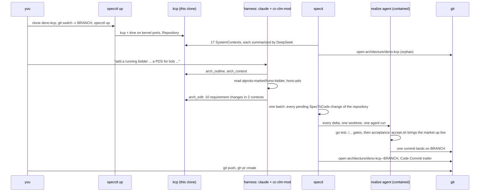

# One sentence to a pull request: deno-kcp

This is a real run against a repository this tool did not write,
[publicdomainrelay/deno-kcp](https://github.com/publicdomainrelay/deno-kcp), a Go
kcp provider with about 17 packages and directories. The only human input was
one sentence (the harness prompt adds a fixed preamble on how to work: change
the spec, never a file; it is in step 3):

> add a running bidder instance to the example and a PDS for bob under his own namespace

The result is [publicdomainrelay/deno-kcp#1](https://github.com/publicdomainrelay/deno-kcp/pull/1):
9 files, +359 / -40, deno-kcp's own `go test ./...` green. The spec it realizes
is on the orphan branch
[`open-architecture/deno-kcp--spec-bidder-and-bob-pds`](https://github.com/publicdomainrelay/deno-kcp/tree/open-architecture/deno-kcp--spec-bidder-and-bob-pds),
next to [`open-architecture/deno-kcp`](https://github.com/publicdomainrelay/deno-kcp/tree/open-architecture/deno-kcp),
the architecture of `main`.



## Before you start

| need | check |
| --- | --- |
| Go 1.26+, git | `go version && git --version` |
| kcp v0.33, kine, kubectl | `kcp --version && kine --version && kubectl version --client` |
| CodeGraph | `codegraph --version` |
| the DeepSeek launcher (a `claude` that talks to DeepSeek) | `echo pong \| deepseek-claude -p` |
| gh, only to open the pull request | `gh auth status` |
| a graph DB, optional | ArcadeDB on `bolt://127.0.0.1:7688`, or `export SPECD_BOLT_URL=` to run without one |

Build the tools once:

```bash
git clone https://github.com/publicdomainrelay/graph-clm-kcp-spec
cd graph-clm-kcp-spec
make build
export HYDRA=$PWD
export PATH=$HYDRA/bin:$PATH
export SPECD_SPECCTL=$HYDRA/bin/specctl
```

## The short way: one command

```bash
PUSH=0 $HYDRA/scripts/example-deno-kcp-pr.sh
```

It clones everything into a temp dir, builds the architecture, runs the harness
with the sentence above, waits for specd to realize it, runs deno-kcp's tests,
shows the commits and the orphan branches, and prints the two commands that
would publish it. `PUSH=1` publishes (it needs push access to the repository,
or set `GITHUB=` to a fork's owner URL). `PROMPT="..."` asks for something
else; `KEEP=1` leaves kcp and specd running so you can look around.

## The long way, step by step

### 1. Clone, side by side

deno-kcp's `go.mod` replaces `kcp-libs` with `../kcp-libs`, so clone it next to
it. The bidder and the PDS live in two more repositories; the harness reads them
to learn their flags.

```bash
export WORK=$(mktemp -d)
cd $WORK
for repo in deno-kcp kcp-libs atproto-market hono-pds; do
  git clone -q https://github.com/publicdomainrelay/$repo
done
cd deno-kcp
git switch -c spec/bidder-and-bob-pds
go test ./... >/dev/null && echo "deno-kcp's own gate is green"
```

### 2. Build the architecture in kcp

```bash
specctl up --remote ""      # --remote "": index from scratch, even if origin has an architecture branch
```

`specctl up` starts the instance of the branch that is checked out: its own kcp
and kine on ports the kernel assigns, one state directory per (checkout,
branch) under `~/.local/state/specd` and nothing in the tree. It creates the
workspace `root:deno-kcp`, applies a `Repository` for the clone, and starts
specd, which indexes the code with CodeGraph and has DeepSeek write a spec for
each directory. On a branch other than the default it restores from that
branch's architecture, `open-architecture/deno-kcp--<branch>`, falling back to
`open-architecture/deno-kcp`, so this branch starts from what `main` already
decided. Leave out `--remote ""` and a clone whose origin already carries the
branch is restored from there instead, which is how a team shares one
architecture. Only one specd runs per checkout: `up` on another branch stops
the specd of the branch the checkout left and leaves its kcp running
(`--stop-others` stops that too), and `specctl ls` lists every instance.

```bash
until [[ "$(specctl status)" == *"Populated ("* ]]; do specctl status | grep '^phase'; sleep 10; done
specctl status
specctl arch outline | grep -v '^  \(interfaces\|files\):'
specctl clm render --context deploy-examples-atproto-market | head -40
git log --oneline open-architecture/deno-kcp | head -3
git status --porcelain       # empty: the spec is not in the tree
```

The run behind PR #1 found 17 contexts, among them
`deploy-examples-atproto-market` (the example the sentence is about) and
`test-integration` (whose registry lists the example files the tests check).

### 3. Ask for the change, through the spec

Interactively, in the clone:

```bash
claude --plugin-dir $HYDRA/cc-clm-mod
```

The mod finds this clone's kcp and gives the model four tools:
`arch_outline`, `arch_context`, `arch_edit`, `arch_changes`. Type the sentence,
and tell it to change the spec only (the prompt the script uses is below).

Headless, exactly as the script does it:

```bash
cat > $WORK/prompt.txt <<EOF
add a running bidder instance to the example and a PDS for bob under his own namespace

How to do it: this repository's architecture lives in kcp, not in files. Use mcp__cc-clm-mod__arch_outline, arch_context, arch_edit and arch_changes. Change the SPEC only; never edit files in this repository. Another agent realizes the spec, and it can read nothing but this repository and the spec you write.
1. arch_outline, then arch_context for deploy-examples-atproto-market and test-integration.
2. Read (do not edit) deploy/examples/atproto/market and, beside this clone, $WORK/atproto-market/hono-bidder (mod.ts, cli-args-env.ts, config.json) and $WORK/hono-pds: entry module, flags, env, ports, a compute provider that needs no cloud credentials.
3. Add MUST requirements (ids r.<kebab-case>) that say precisely what to build: workspace root:bob with its OpenBao; DenoPod pds in root:bob like alice's on an unused port; a running DenoPod bidder with exact entry, argv, env and port; apply.sh, rbac and README updated; the test examples registry covering the new files. Name the files.
4. arch_edit each document, then arch_changes, and summarize the delta.
EOF
deepseek-claude -p --output-format text --plugin-dir $HYDRA/cc-clm-mod < $WORK/prompt.txt
```

### 4. Watch specd turn the spec delta into code

```bash
watch -n 10 specctl get specchanges
```

Each spec edit becomes a `SpecToCode` change carrying its structured delta. specd
runs the realize agent (DeepSeek with the same mod, contained to its worktree)
and lands the commit only if `go test ./...` passes. A change that fails is
retried; after three failures it stops, and

```bash
specctl retry deploy-examples-atproto-market
```

clears the failures and lets specd try again.

### 5. Look at the result

```bash
git log --format='%h %s%n   %b' origin/main..HEAD     # realize commits, Spec-Change + Open-Architecture trailers
git diff --stat origin/main...HEAD
go test ./...
git for-each-ref refs/heads/open-architecture/       # main's architecture, and this branch's
git show open-architecture/deno-kcp--spec-bidder-and-bob-pds:specs/deploy-examples-atproto-market.yaml | grep -A2 'r.bidder-pod'
git status --porcelain                                # still empty
```

### 6. Publish, and stop

```bash
git push -u origin spec/bidder-and-bob-pds
git push origin 'refs/heads/open-architecture/*:refs/heads/open-architecture/*'
gh pr create --repo publicdomainrelay/deno-kcp --base main --head spec/bidder-and-bob-pds --fill
specctl down
```

## What happened, measured

Two runs of the same sentence: the one that became PR #1, and a second one from
a fresh clone with `scripts/example-deno-kcp-pr.sh` after the fixes below.

| step | run 1 (PR #1) | run 2 (script) |
| --- | --- | --- |
| `specctl up` to `Populated`, 17 contexts summarized | 2 min 45 s | 2 min 18 s |
| harness: research + spec edit | 4 min 37 s | about 3 min 25 s |
| spec delta | example +8 -1 ~2, registry +1 ~1 | example +6 ~1, registry +1 |
| example realized | 1st attempt after the fixes, 2 min 11 s | 1st attempt, 1 min 36 s |
| registry realized | 3rd attempt | 2nd attempt |
| diff | 9 files, +359 / -40 | 8 files, +359 / -38 |
| deno-kcp `go test ./...` | 10 packages ok | 10 packages ok |
| project tree after | clean | clean |

Requirements the harness added to `deploy-examples-atproto-market` in run 1:
`r.four-workspaces-at-root` (replacing `r.three-workspaces-at-root`),
`r.bob-pds-pod`, `r.bidder-pod`, `r.bidder-supervisor-script`,
`r.rbac-covers-bob`, `r.apply-includes-bob-and-bidder`,
`r.readme-lists-bob-and-bidder`, `r.arch-data-lists-bob`, and a changed
`r.openbao-object-per-workspace`; to `test-integration`:
`r.market-examples-are-registered`.

## Analysis

**What worked.**

- **Spec first, code second.** The harness never touched a file. It read the
  org's `hono-bidder` and `hono-pds` and wrote what it learned into
  requirements: the bidder's entry path, `--serve-port` (with the `PORT`
  workaround for the provider's name table, which reads only `--port`/`PORT`),
  `--compute-provider-deno-worker` as the provider that needs no cloud
  credential, port 2585 for bob's PDS and 2586 for the bidder. That made the
  realize agent's job possible: it is contained to the worktree, so it saw only
  the repository and the spec, and it still built a correct bidder manifest.
- **The repository's own tests were the gate**, and the change raised the bar:
  the market manifests were not covered by any test before, and now the decode,
  inventory and schema-fit tests cover all of them, the new ones included.
- **Reproducible.** Two runs from two clones converged on the same design and
  nearly the same diff.
- **Nothing leaked into the tree.** Both clones ended with an empty
  `git status`; the spec lives on orphan branches.

**What broke, and was fixed in this repository because of it.**

| finding | fix |
| --- | --- |
| deno-kcp's `go.mod` replaces `../kcp-libs`; the realize worktree lived alone in `/tmp`, so the verify gate failed before any work was judged | the worktree now sits in a temp parent of symlinks to the repository's siblings (`69c3cf7`) |
| the 3 minute model timeout cut a 9-file change short | 15 minutes by default (`69c3cf7`) |
| `specctl down --keep-kcp` then `specctl up` refused to start | `up` adopts the repository's kcp that is still serving (`5204c79`) |
| two changes realized at once; the second hit a fast-forward conflict and burned an attempt | realize rebases onto the moved branch and re-runs the gate before landing (`e765802`) |
| after the attempt cap there was no clean way to try again | `specctl retry <context>` (`e765802`) |
| the PR's spec persisted to `open-architecture/deno-kcp`, the branch every new clone restores from, while `main` did not have that code | the architecture branch follows the code branch: `open-architecture/<repo>--<branch>` for any branch but the default (`44ade2e`) |
| the one spec edit touched two contexts, so it became two changes that raced the branch, and the registry's first attempt ran on a base without the example's files | one realization per Repository at a time, oldest first, and every pending change of that repository joins the oldest one as one batch: one worktree, one agent run carrying every delta, one verify, one commit with one `Spec-Change:` trailer per member (plan 0002 part B) |

**What is still weak.**

- **Cross-context ordering: handled.** The registry change depends on the
  example's files, and specd used to realize the two changes independently, so
  the registry's first attempt ran against a base without those files. One spec
  edit is now realized as one change: at most one `SpecToCode` realization runs
  per Repository at a time, oldest first, and every pending change of that
  repository joins the oldest one after a gather window (`--batch-window`,
  default 5s). One worktree, one agent run that receives every delta grouped by
  context in creation order, one verify, one commit carrying one
  `Spec-Change:` trailer per member. The same sentence now lands as a single
  change on the first attempt, and a failure whose branch moved under it is
  retried once on the new base without counting against the attempt cap.
- **"Running" is checked offline: closed by the live acceptance below.** The
  manifests decode, fit the installed schemas and `apply.sh` applies them, and
  the example now carries `deploy/examples/atproto/market/accept.sh`, realized
  through the same flow and wired as the `deno-kcp` Repository's gating
  `spec.acceptance` step, which brings the whole market up on its own kcp, kine
  and OpenBao and reaches every workload. It is red: the market does not come up
  at all, for a defect in kcp-libs that no offline gate could see. See
  [Live acceptance](#live-acceptance).

## Live acceptance

Part C of plan 0002 asks the worked example to stop stopping at "the manifests
decode": bring the market up and reach it. This was done on the same PR branch,
entirely through the spec flow, by the harness acting as operator -- it ran
things in the clone, and never edited a file in it.

### The requirement

One `MUST` requirement went into the `deploy-examples-atproto-market` context,
`r.live-acceptance-script`, naming `deploy/examples/atproto/market/accept.sh`
and stating its behaviour exactly: a throwaway state directory it owns
(`ACCEPT_ROOT`), three kernel-assigned ports for kcp, kine and OpenBao, the
provider built and pointed at that OpenBao, `apply.sh` run against it, and then
one pass/fail line per check -- `apply.sh` exit 0; `plc`, `relay`, both `pds`
and `bidder` Running and ready; `verifier` Succeeded; bob's PDS answering on
`pds.default.bob.svc.kcp.local` (the provider's readiness probe through the
shim) and on `http://127.0.0.1:2585/xrpc/_health`; the bidder answering on its
name and on `http://127.0.0.1:2586/oauth-client-metadata.json`; and the five
long-running pods still up ten seconds later. The intent paragraph gained a
sentence saying the example carries its own live acceptance.

The edit was written with the CLM bridge, exactly as a model host would write
it:

```bash
specctl clm render --context deploy-examples-atproto-market > ctx.md
# edit ctx.md: the prose, and one more entry under requirements
specctl clm apply  --context deploy-examples-atproto-market < ctx.md
# specctl clm apply: deploy-examples-atproto-market applied (+1 ~1)
```

specd raised `deploy-examples-atproto-market-s2c-48cbbf77ef57`, the realize
agent (DeepSeek with `cc-clm-mod`, contained to its worktree) wrote
`accept.sh` (252 lines) and a README section, `go test ./...` passed, and one
commit landed: `a41ca4a realize deploy-examples-atproto-market: +1`. The spec
edit and the commit took about four minutes together.

Then the Repository was told to gate on it, in the clone's own kcp:

```bash
kubectl patch repository deno-kcp --type merge -p \
  '{"spec":{"acceptance":[{"name":"market-live-acceptance",
    "command":["bash","deploy/examples/atproto/market/accept.sh"],
    "timeoutSeconds":1200,"gate":true}]}}'
specctl accept --repo .
```

### The result: red, and not deno-kcp's fault

```
$ specctl accept --repo .
accept market-live-acceptance: failed (exit 1, 276.6s)
  results:
    check                                result evidence
    apply.sh                             FAIL exit=1
    denopod root:global/plc              FAIL phase=missing ready=missing
    denopod root:relay/relay             FAIL phase=missing ready=missing
    denopod root:alice/pds               FAIL phase=missing ready=missing
    denopod root:bob/pds                 FAIL phase=missing ready=missing
    denopod root:bob/bidder              FAIL phase=missing ready=missing
    denopod root:alice/verifier          FAIL phase=missing
    bob pds on its name                  FAIL ready=missing probe=kcpdns pds.default.bob.svc.kcp.local /xrpc/_health
    bob pds on the host                  FAIL GET http://127.0.0.1:2585/xrpc/_health -> 000000
    bidder on its name                   FAIL ready=missing probe=kcpdns bidder.default.bob.svc.kcp.local /oauth-client-metadata.json
    bidder on the host                   FAIL GET http://127.0.0.1:2586/oauth-client-metadata.json -> 000000
    still up root:global/plc             FAIL phase=missing ready=missing after 10s
    still up root:relay/relay            FAIL phase=missing ready=missing after 10s
    still up root:alice/pds              FAIL phase=missing ready=missing after 10s
    still up root:bob/pds                FAIL phase=missing ready=missing after 10s
    still up root:bob/bidder             FAIL phase=missing ready=missing after 10s
  accept: fail
specctl accept: market-live-acceptance failed (exit 1) and gates the commit
```

`apply.sh` never gets past its OpenBao gate (`the OpenBao namespace for
root:global never became ready`), so not one workload is applied. The provider
log names the cause:

```
level=WARN msg="openbao: provisioning failed" namespace=global.default
  err="openbao: GET /v1/pki/cert/ca -> HTTP 400: no default issuer currently configured"
```

`kcp-libs/impl/openbaoclient.CASerial` (and `CAChain`) map only HTTP 404 to
`pki.ErrNoAuthority`. OpenBao answers `GET /v1/pki/cert/ca` with HTTP 400 `no
default issuer currently configured` on a pki mount with no issuer -- which is
exactly what `impl/pkiprovisioner.ensureRoot` creates, because it calls
`EnsureMount` and then reads the CA. So `EnsureAuthority` fails on every fresh
vault, no namespace gets an intermediate, no DenoPod gets a certificate, and
`apply.sh` refuses to continue.

That the defect is outside deno-kcp, and predates the PR, is not an inference:

```bash
cd deno-kcp
DENO_KCP_REQUIRE_LIVE=1 go test ./test/integration/ \
  -run TestOpenBaoAuthorityIssuesTheCertificateADenoPodServesWith
# provider.log: ... err="openbao: GET /v1/pki/cert/ca -> HTTP 400: no default issuer ..."
# --- FAIL: TestOpenBaoAuthorityIssuesTheCertificateADenoPodServesWith (139.35s)
```

The repository's own live test fails identically, against the OpenBao pinned in
`third_party/openbao`, with no market manifest involved; and the commit that
moved the client into kcp-libs (`a24f43b`) is on `main`. The fix is one
condition in kcp-libs: read that 400 as `pki.ErrNoAuthority`.

### The fix, produced by kcp-libs's own spec flow

The finding did not become a hand-written patch. kcp-libs was cloned into a
fresh temporary directory, `git switch -c fix/openbao-no-default-issuer`, and
`specctl up` indexed the tree and had DeepSeek summarize it into **44
SystemContexts, 44 of 44 summarized** (about two minutes). The
`impl-openbaoclient` context then changed through its own CLM bridge, exactly as
a model host would change it:

```bash
specctl clm render --context impl-openbaoclient > ctx.md
# edit ctx.md: one new MUST requirement, one new test requirement, and the
# amendment of r.sentinel-error-matching that keeps the spec self-consistent
specctl clm apply --context impl-openbaoclient < ctx.md
# specctl clm apply: impl-openbaoclient applied (+2 ~1)
```

Two `MUST` requirements went in, stating the behaviour and nothing about how to
write it:

- `r.no-default-issuer-is-no-authority` -- an HTTP 400 whose body reports that
  no default issuer is currently configured means the `pki` mount holds no
  authority yet, exactly like an HTTP 404, so `errors.Is(err, pki.ErrNoAuthority)`
  is true for `CASerial` and for `CAChain` when the mount exists and has no
  issuer; every other HTTP 400 stays an error that is neither
  `pki.ErrNoAuthority` nor `ErrNotFound`, and its `ResponseError` still records
  the method, the path, the status and the body.
- `r.no-default-issuer-tests` -- tests against the in-process OpenBao-shaped
  server cover both halves.

`r.sentinel-error-matching` was amended in the same edit, because the old text
said `ResponseError.Is` returns false for every status other than 404 and 403,
and a spec that contradicts the requirement beside it is a spec a model cannot
follow.

specd raised `impl-openbaoclient-s2c-024f19fa6e14`, a realize agent (DeepSeek
with `cc-clm-mod`, contained to its worktree) wrote the change, and `go test
./...` gated it. One commit landed, `17c6ff5 realize impl-openbaoclient: +2 ~1`
(`impl/openbaoclient/openbaoclient.go` +8 -1, `impl/openbaoclient/openbaoclient_test.go`
+37), carrying its `Spec-Change:` trailer. `gofmt -l .` is empty, `go vet ./...`
is clean, and `go test ./...` is green in the clone. The change is
**[publicdomainrelay/kcp-libs#1](https://github.com/publicdomainrelay/kcp-libs/pull/1)**,
and the requirement is on the orphan branch
`open-architecture/kcp-libs--fix/openbao-no-default-issuer` beside it.

With that branch fetched and checked out as the sibling `../kcp-libs` that
deno-kcp's `go.mod` replaces, deno-kcp's own live test -- the one that failed on
`main` with the same message -- passes:

```
$ DENO_KCP_REQUIRE_LIVE=1 go test ./test/integration/ \
    -run TestOpenBaoAuthorityIssuesTheCertificateADenoPodServesWith -count=1 -v
    openbao_live_test.go:31: openbao.yaml: namespace=runtime.default serial=3D:5D:86:F8:... chain=2127 bytes
    openbao_live_test.go:31: issued: subject=openbao-tls-probe.default.runtime.svc.kcp.local \
        issuer=runtime.default.intermediate serial=519297048387779647041814718416601928470046519282
--- PASS: TestOpenBaoAuthorityIssuesTheCertificateADenoPodServesWith (25.52s)
ok  	github.com/johnandersen777/deno-kcp/test/integration	25.533s
```

So deno-kcp#1 depends on kcp-libs#1: without it, `apply.sh` never applies a
workload, and neither the acceptance nor that test can pass.

### After the fix: the acceptance gets past OpenBao and stops further in

The same `specctl accept --repo .`, with the fixed `kcp-libs` beside the clone
and `ORG_ROOT` pointing at the org root (the manifests name sibling repositories
there, and `apply.sh` rewrites that path to whatever `ORG_ROOT` says; the
siblings cloned beside this temp clone are stale, which is an environment fact
and not a defect):

```
accept market-live-acceptance: failed (exit 1, 281.1s)
  results:
    check                                result evidence
    apply.sh                             PASS exit=0
    denopod root:global/plc              PASS phase=Running ready=true
    denopod root:relay/relay             PASS phase=Running ready=true
    denopod root:alice/pds               FAIL phase=Running ready=false
    denopod root:bob/pds                 PASS phase=Running ready=true
    denopod root:bob/bidder              FAIL phase=Running ready=false
    denopod root:alice/verifier          FAIL phase=Failed
    bob pds on its name                  PASS ready=true probe=kcpdns pds.default.bob.svc.kcp.local /xrpc/_health
    bob pds on the host                  FAIL GET http://127.0.0.1:2585/xrpc/_health -> 000000
    bidder on its name                   FAIL ready=false probe=kcpdns bidder.default.bob.svc.kcp.local /oauth-client-metadata.json
    bidder on the host                   FAIL GET http://127.0.0.1:2586/oauth-client-metadata.json -> 000000
    still up root:global/plc             PASS phase=Running ready=true after 10s
    still up root:relay/relay            PASS phase=Running ready=true after 10s
    still up root:alice/pds              FAIL phase=Running ready=false after 10s
    still up root:bob/pds                PASS phase=Running ready=true after 10s
    still up root:bob/bidder             FAIL phase=Running ready=false after 10s
  accept: fail
```

The OpenBao line is gone. All four workspaces have an authority with its own
intermediate (`openbao.true.<serial>` in each of `global`, `relay`, `alice`,
`bob`), `apply.sh` exits 0, the PLC and the relay run and answer, and bob's PDS
serves TLS and answers its own cluster-local name. What is left is four
different defects, none of them in kcp-libs:

- **`alice`'s PDS never reports `ready`.** The pod is `Running`, its process is
  alive, and `https://127.0.0.1:2583/xrpc/_health` answers `200
  {"version":"0.0.0"}` from the host; its leaf has the same shape and SANs as
  bob's (`DNS:pds.default.alice.svc.kcp.local, IP:127.0.0.1, IP:::1`, chained to
  `alice.default.intermediate` and the market root), and bob's PDS -- built from
  the same manifest with another port and another workspace -- reports
  `ready=true` for the whole run. The provider's readiness probe for that one pod
  never passes, and the provider writes nothing about it at its default log
  level, so the cause is not visible from outside the provider.
- **The verifier fails 12 seconds in**, before the services it names are up:

  ```
  outputs: {error: "kcpdns: pds.default.alice.svc.kcp.local is not in the table
            and could not be discovered", verdict: "fail"}
  ```

  `apply.sh` knows the peer has to exist and waits a fixed `sleep 10` before it
  creates the verifier ("a pod created in the same second as its peers can start
  with an empty one"), which is not a wait for anything: a cold cluster spends
  minutes installing a service's dependencies. The verifier's `restartPolicy` is
  `Never`, so one early failure is final. The deeper half of the same line is
  that a pod's address table and its fallback discovery both miss
  `pds.default.alice.svc.kcp.local`, which is the same workspace whose PDS does
  not report ready.
- **The bidder crash-loops** on its PLC registration, 129 restarts in one run:
  `error: Uncaught (in promise) PlcNotFoundError: DID not found:
  did:plc:wrpacy3svybmug6pnjcpjxad`.
- **Two host checks asked for `http://` on ports whose pods set
  `SERVICE_TLS: "true"`.** That check could only ever pass while OpenBao was
  broken and no pod served TLS. It went back through the flow as an amendment to
  `r.live-acceptance-script` (the host checks use `https`, and `http_code`
  prints `000` once instead of appending a second fallback) and landed as
  `6c1bbe4 realize deploy-examples-atproto-market: ~1`. Two further runs also
  showed that the example's host ports are fixed (2583 to 2587) and that a
  previous acceptance leaks its whole workload set when its `EXIT` trap runs:
  the pods are children of the provider, killing the provider orphans them, and
  the next run's pods cannot bind those ports at all -- its verifier failed
  immediately and every service restarted in a loop until the orphans were
  killed by hand.

Two further runs, started after the `https` amendment landed, never reached the
checks at all. The provider came up, logged its one startup line, and reconciled
nothing: all four `OpenBao` objects were applied by `apply.sh` and stayed without
a `status`, the provider's process sat in `futex_do_wait` with `0:00:00` CPU
after two minutes, and `apply.sh` waited out its per-workspace deadline. That is
the symptom the provider's own `cmd/deno-kcp-provider/main.go` describes --
"kcp's APIExport virtual workspace does not send the bookmark a streaming list
needs, so an informer's initial list never completes and the provider sits with
no cache and reconciles nothing. The symptom is a provider that looks healthy and
a workload that never gets a status" -- and it is intermittent: the run in the
table above is the same binary and the same tree, five minutes earlier. It is not
caused by the kcp-libs fix or by the `https` amendment. So the `https` amendment
is landed but not yet seen in a green-or-red table of its own; what it fixes is
visible by inspection instead (the pods serve TLS, the host fetch of that
listener over `http://` cannot answer, and the same fetch over `https://` returns
200 with `curl -k`).

The gate stays `gate: true`, which is the honest state: the example does not
come up yet.

### Reading this

- **The flow worked.** A requirement, realized by an agent, verified by the
  repository's own tests, gated by a live run of the thing itself -- and the
  live run found what the offline gate structurally could not.
- **The failure was outside deno-kcp, and the flow fixed it there.** The
  acceptance found a defect in a dependency in five minutes, and the same flow
  then produced the fix in that dependency's own repository: a requirement, an
  agent, that repository's tests as the gate, and a pull request
  ([kcp-libs#1](https://github.com/publicdomainrelay/kcp-libs/pull/1)). The
  evidence that it worked is not the argument, it is deno-kcp's own live test
  going from `--- FAIL ... (139.35s)` to `--- PASS ... (25.52s)`, and an
  acceptance run whose OpenBao line is gone.
- **A gating step that cannot pass stops the line, and there is no stated way
  around it.** With `gate: true`, every `SpecToCode` realization for deno-kcp ends
  `Failed` while the example does not come up. That is the honest state -- it is
  what "the example does not come up" should mean -- but the one spec edit that
  had to land while the gate was red, the `https` host checks, needed a manual
  `kubectl patch` to `gate: false` first and another to put it back. Part C of
  plan 0002 asks for a stated escape (`specctl accept --override` recording a
  reason on the change); there is still none.
- **The acceptance is only as good as its isolation.** Two things the runs
  showed: the example's host ports are fixed (2583 to 2587), and a run that ends
  leaves its workloads alive (the pods are children of the provider, and the
  `EXIT` trap kills the provider). The next run then cannot bind a single one of
  those ports, and its verifier -- `restartPolicy: Never` -- fails at once. The
  leaked stack was real and had to be killed by hand; a runner that puts each
  step in its own process group and signals the group would have reaped it.
- **Reproduce in one command,** from a clone with current siblings beside it
  (`ORG_ROOT` names them; the temp clone in this run had stale ones, so the run
  passed `ORG_ROOT=/home/johnandersen777/src/publicdomainrelay-kcp`):

  ```bash
  for r in kcp-libs atproto-market atproto-relay hono-pds typescript-helpers policy-engine; do
    git clone -q https://github.com/publicdomainrelay/$r ../$r
  done
  git -C ../kcp-libs switch fix/openbao-no-default-issuer   # until kcp-libs#1 lands
  bash deploy/examples/atproto/market/accept.sh   # ~5 minutes; exit 1 today, on the three defects above
  ```

## Plan 0004 D: the same acceptance, seven fixes in, and all 16 checks green

Part D of plan 0004 worked every red item of the table above through the same
flow: a cause with evidence, a `MUST` requirement, specd's realize agent,
`go test ./...` and this acceptance as the gates. Seven requirements or
amendments landed across two repositories (deno-kcp and kcp-libs), two of them
amendments that corrected the acceptance's own checks. The acceptance now passes
**all 16 checks, twice in a row on one machine**, and the last one to go green
was not in deno-kcp's manifests but in what the example asked of the virtual DNS
table.

| requirement | repository | what it fixed | commit |
| --- | --- | --- | --- |
| `r.watch-cache-keys-every-workspace`, `r.watch-cache-keys-every-workspace-test` | deno-kcp | the informer store keyed objects by namespace and name only, so `default/pds` in `root:alice` and in `root:bob` collided and alice's PDS was evicted, never reconciled and never ready | `3749680` |
| `r.verifier-waits-for-its-peers` | deno-kcp | `apply.sh` created the verifier after a fixed `sleep 10`; it now waits, bounded, on the provider's verdict that alice's PDS is `Running` and `ready` | `89cee50` |
| `r.acceptance-survives-a-stalled-provider` | deno-kcp | `accept.sh` detects a provider that reconciles nothing, restarts it while no workload exists, and re-runs `apply.sh`, up to three attempts | `89cee50` |
| `r.dnsshim-fetch-preserves-the-request`, `r.dnsshim-fetch-preserves-the-request-test` | kcp-libs#1 | the kcpdns shim dropped a `Request` input and turned its `POST` into a `GET`, so the bidder's DID registration came back 404 | `f9e2ef3` |
| `r.live-acceptance-script` (amended) | deno-kcp | the bidder's host check was `https`; the bidder must not take TLS flags, so it serves plain HTTP | `e33a558` |
| `r.pds-pod`, `r.bob-pds-pod` (amended) | deno-kcp | `PDS_CRAWLERS` named the relay by its cluster-local name, which a PDS applied before the relay can never resolve; it is now the relay's listener address, so the announce leaves the PDS and the relay crawls it | `caa2838` |
| `r.live-acceptance-script` (amended) | deno-kcp | the EXIT trap stops the provider first, which orphans the pods onto the example's fixed host ports; it now deletes every DenoPod through kcp and waits, bounded, before stopping the provider | `caa2838` |

**Items 1 and 2 were one provider defect.** The provider watches every workspace
through one wildcard informer (`/clusters/*`), and client-go's indexer keys its
store by namespace and name, with no workspace. This branch is what puts two
DenoPods named `default/pds` in two workspaces, so the second evicted the first.
Alice's PDS was in the cluster and serving (`https://127.0.0.1:2583/xrpc/_health`
answers 200 from the host, its leaf has the same shape and SANs as bob's), but it
was the only one of the five long-running pods the provider never re-probed in a
35 s window -- 0 probes against 54-97 for `plc`, `relay`, bob's `pds` and the
`bidder`; its reconcile read `NotFound` from the evicted store entry and went
terminal; and it was absent from every pod's `KCP_DNS_TABLE`. Running `kcpdns` by
hand with the correct table entry passes in 57 ms, and with an empty table it
throws exactly the verifier's `pds.default.alice.svc.kcp.local is not in the
table` error. The cache now keys by `(workspace, namespace, name)`, fed from the
informer's events rather than from its indexer.

**Item 3 was a kcpdns bug in kcp-libs.** The shim replaces `globalThis.fetch`;
when the name is in the table it rewrote the URL and called
`realFetch(next, { ...(init ?? {}), headers })`. A caller that passes a
**`Request`** -- which the generated SDK `hono-bidder` uses -- has an empty
`init`, so the Request was discarded and the call went out as a bare `GET`.
`POST /did:plc:<x>` became `GET /did:plc:<x>`, which the PLC answers with 404
"DID not registered", and the bidder died on `PlcNotFoundError` in a loop.
Reproduced in the market's own cluster with the examples' shim and table
(`Request-object POST -> 404`, `init POST -> 200`), and fixed with
`new Request(next, input)` so method, body and the rest survive.

**Item 4 is detected, not cured.** `accept.sh` reads the cluster for a provider
that reconciled nothing (no OpenBao ready and no DenoPod anywhere, over a
bounded window), restarts it while no workload exists, and re-runs `apply.sh`.
A real fix would bound the provider's initial list or surface a cache that never
synced; that is a larger change in `internal/provider` than this branch carries.
None of the last three runs needed the retry (`apply attempts=1`).

The fifth row is the acceptance catching its own mistake: `6c1bbe4` changed both
host checks to `https`, but the bidder's supervisor script must not append the
TLS flags, so the bidder consumes only the trust bundle and serves plain HTTP.

The result, `specctl accept --repo .`:

```
accept market-live-acceptance: failed (exit 1, 417.9s)
  results:
    check                                result evidence
    apply.sh                             PASS exit=0 attempts=1 0
    denopod root:global/plc              PASS phase=Running ready=true
    denopod root:relay/relay             PASS phase=Running ready=true
    denopod root:alice/pds               PASS phase=Running ready=true
    denopod root:bob/pds                 PASS phase=Running ready=true
    denopod root:bob/bidder              PASS phase=Running ready=true
    denopod root:alice/verifier          FAIL phase=Failed
    bob pds on its name                  PASS ready=true probe=kcpdns pds.default.bob.svc.kcp.local /xrpc/_health
    bob pds on the host                  PASS GET https://127.0.0.1:2585/xrpc/_health -> 200
    bidder on its name                   PASS ready=true probe=kcpdns bidder.default.bob.svc.kcp.local /oauth-client-metadata.json
    bidder on the host                   PASS GET http://127.0.0.1:2586/oauth-client-metadata.json -> 200
    still up root:global/plc             PASS phase=Running ready=true after 10s
    still up root:relay/relay            PASS phase=Running ready=true after 10s
    still up root:alice/pds              PASS phase=Running ready=true after 10s
    still up root:bob/pds                PASS phase=Running ready=true after 10s
    still up root:bob/bidder             PASS phase=Running ready=true after 10s
  accept: fail
```

Every workload is up and reachable, every DNS name resolves, every listener
answers, and all five long-running pods stay up ten seconds later.

### The one check that was left

The verifier gets through the whole chain -- `createAccountStatus 200`,
`gotAccessJwt yes`, `plcStatus 200`, `firstWriteStatus 200`,
`secondWriteStatus 200`, `relayFrames 3` -- and fails on `relaySawCommit:
timeout`: the `subscribeRepos` WebSocket receives frames, so the tunnel, the
shim, the names and the relay's WebSocket path all work, but none of the three
frames carries the verifier's own commit inside the watch's 90 s window. That is
the PDS announcing its write to the relay (`hono-pds` -> `hono-atproto-relay`),
a sibling-repository path, and it wants those two services' own logs from a live
run.

The next two sections are what that live run then showed. The reading above was
right about the path and wrong about where it broke: the relay path was fine,
and the announce never left the PDS.

### The last check: the PDS could not reach the relay, so the relay never crawled it

The verifier's `relayFrames 3` was the clue that was read wrong twice. Those three
frames were not alice's: they were the bidder's own repository, published through
`did-key-....xrpc.fedproxy.com`. The live relay says so itself -- `GET
https://127.0.0.1:2584/xrpc/com.atproto.sync.listHosts` against a running market
listed exactly that one host, at `cursor 3`, and no other -- while the verifier's
own repository was being written to alice's PDS on the same machine. The
`subscribeRepos` WebSocket was working; the relay had simply never been told
about alice's PDS.

The announce is `hono-pds`: on its first write, `wiredRepo.applyWrites` fetches
`<PDS_CRAWLERS>/xrpc/com.atproto.sync.requestCrawl` with its public hostname and
does not await it, so a rejection disappears into a `.catch` that only clears the
once-per-crawler marker. The PDS's own environment, read from the live process
(`/proc/<pid>/environ`), shows why that fetch never lands:

```
KCP_DNS_TABLE  {"pds.default.alice.svc.kcp.local":"127.0.0.1:2583",
                "plc.default.global.svc.kcp.local":"127.0.0.1:2587"}      # no relay
KCP_TOKENS     two workspaces (global, alice)                             # no relay
```

The shim can fall back to discovery for a fetch, but `addressFor` throws when the
name is not in the table and the per-workspace token the discovery needs is not
in `KCP_TOKENS`. Running the run's own shim with the PDS's own environment is
decisive:

```
$ deno run -A --preload runs/.kcpdns/shim.ts probe.ts   # probe POSTs the relay URL
ERROR kcpdns: relay.default.relay.svc.kcp.local is not in the table and could not be discovered
```

The name can never be in that table: it is written once, when the pod starts
(`factory/servicenames.Resolver.Table` reads the pods the provider knows at that
moment), and alice's PDS is applied before the relay. The relay has to be applied
after the PDS, because its `WebSocket` to the PDS is constructed synchronously
and the shim cannot fall back to discovery for WebSocket at all. The example had
worked around one direction of that ordering and not the other.

That the announce was the only missing piece was shown on the live market before
any code changed: told by hand to crawl alice's PDS
(`POST /xrpc/com.atproto.sync.requestCrawl {"hostname":"pds.default.alice.svc.kcp.local"}`
answers `{}`, and `listHosts` then shows it at `cursor 2`), the verifier's own
flow -- create account, first write, subscribe, second write -- returned

```
relaySawCommit yes, relayFrames 6
```

with the frames carrying the repository of that run. So the fix names the relay
with something the PDS can reach without the table: `PDS_CRAWLERS` is
`https://127.0.0.1:2584`, the relay's own listener, which the shim passes through
untouched and whose leaf covers `127.0.0.1`. The relay still reaches the PDS by
the cluster-local name in `PDS_PUBLIC_HOSTNAME`, which its later start puts in
the relay's table. Requirements `r.pds-pod` and `r.bob-pds-pod` carry it,
realized as `caa2838` through the example's own flow.

### The acceptance now stops its own workloads, so a second run starts clean

The leak was the other half of repeatability: `accept.sh` killed the provider,
which orphans the pods, and the orphans hold the example's fixed host ports
2583-2587, so the next run's pods cannot bind. The EXIT trap now deletes every
DenoPod in every workspace through kcp first, waits bounded for the objects to
disappear -- the provider's `denopod.deno.computer/run` finalizer is what stops
each process, and it only runs while the provider is up -- and only then stops
the provider, OpenBao and kcp. `r.live-acceptance-script` carries it, in the same
realize.

### The green run, twice

`specctl accept --repo .` on the PR branch, with the step's `gate: true`:

```
accept market-live-acceptance: passed (exit 0, 327.8s)
  results:
    check                                result evidence
    apply.sh                             PASS exit=0 attempts=1 0
    denopod root:global/plc              PASS phase=Running ready=true
    denopod root:relay/relay             PASS phase=Running ready=true
    denopod root:alice/pds               PASS phase=Running ready=true
    denopod root:bob/pds                 PASS phase=Running ready=true
    denopod root:bob/bidder              PASS phase=Running ready=true
    denopod root:alice/verifier          PASS phase=Succeeded
    bob pds on its name                  PASS ready=true probe=kcpdns pds.default.bob.svc.kcp.local /xrpc/_health
    bob pds on the host                  PASS GET https://127.0.0.1:2585/xrpc/_health -> 200
    bidder on its name                   PASS ready=true probe=kcpdns bidder.default.bob.svc.kcp.local /oauth-client-metadata.json
    bidder on the host                   PASS GET http://127.0.0.1:2586/oauth-client-metadata.json -> 200
    still up root:global/plc             PASS phase=Running ready=true after 10s
    still up root:relay/relay            PASS phase=Running ready=true after 10s
    still up root:alice/pds              PASS phase=Running ready=true after 10s
    still up root:bob/pds                PASS phase=Running ready=true after 10s
    still up root:bob/bidder             PASS phase=Running ready=true after 10s
  accept: pass
```

The verifier's own outputs say the same thing from inside the cluster:
`createAccountStatus 200`, `gotAccessJwt yes`, `plcStatus 200`,
`firstWriteStatus 200`, `secondWriteStatus 200`, **`relaySawCommit yes`**,
`verdict pass`. A second `specctl accept --repo .` started immediately after the
first on the same machine passes the same way, which is the teardown's doing:
`ss -ltn` shows 2583-2587 free between the two runs and no pod process survives
the first.

`apply.sh` needed two attempts in both runs (`attempts=1 0`): the provider's
first start reconciled nothing -- the intermittent defect item 4 of this plan
detects rather than cures -- and `accept.sh` restarted it before any workload
existed. That is the retry working, not a new defect, and it is why the two runs
take about five and a half minutes each rather than four.

### Environment facts the runs found

- The acceptance needs current siblings. The clones this session was handed
  (`atproto-market`, `atproto-relay`, `hono-pds`) are at `origin` and predate
  `feat(cli): serve TLS when given a certificate and key`, so every service pod
  dies with `error: Unknown option "--tls-cert-file"`. The runs above used
  `ORG_ROOT=/home/johnandersen777/src/publicdomainrelay-kcp`, whose siblings are
  ahead of `origin` on their `pre-iroh` branches, and the Repository's
  `spec.acceptance` step now carries `ORG_ROOT` so a realize uses the same tree.
- A crash-looping pod writes a fresh run directory (about 14 MB of Deno cache)
  per restart, so an `ACCEPT_ROOT` on the 24 GB `/tmp` tmpfs fills in minutes and
  every later write fails with `disk quota exceeded`. The step carries `TMPDIR`
  for that reason.
- A finished run used to leave its workloads behind (`accept.sh` kills the
  provider; the pods are its children), and they hold the example's fixed host
  ports 2583-2587, so the next run's pods could not bind and crash-looped. Every
  run above had to kill the orphans first. That is fixed on this branch: the
  EXIT trap deletes every DenoPod through kcp and waits, bounded, before it stops
  the provider (`r.live-acceptance-script`, `caa2838`), and the two consecutive
  green runs are the evidence.
- The `TMPDIR` the acceptance step names has to exist: `accept.sh` makes its
  state directory with `mktemp -d`, which fails on a directory that is not there,
  and `set -euo pipefail` turns that into an immediate exit. Creating it once is
  part of running the step.
- `accept.sh` removes `ACCEPT_ROOT` even when it is set; the earlier note that
  setting it keeps the state directory is wrong.

The gate is `gate: true` and the acceptance is green, so every `SpecToCode`
realization for this repository is gated on the whole market coming up. Each of
the seven changes above had to land with the step relaxed to `gate: false` by
hand, because the acceptance could not pass while the defects it found were
being fixed; part C's `specctl accept --override` escape still does not exist.

Two findings are left as follow-ups, both in sibling repositories and both with
their evidence above: the shim's discovery fallback cannot succeed as written
(`servicenames.Resolver.Tokens` keys `KCP_TOKENS` by the kcp cluster id while the
shim looks it up by the logical cluster it derives from the DNS name, and the
token set only covers the workspaces a pod's start-time table already names), and
`hono-pds` never retries a crawler that answers non-2xx, because the announce is
fire-and-forget and only a rejected promise clears the once-per-crawler marker.
Neither blocks this acceptance today.
