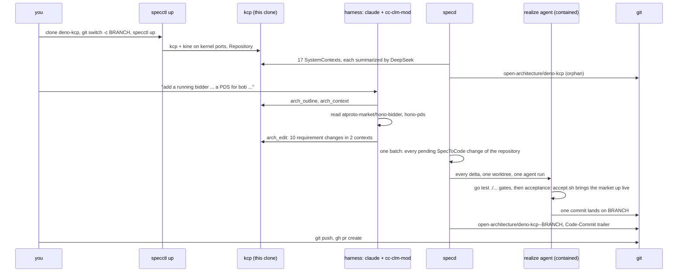

# One sentence to a pull request: deno-kcp

This is a real run against a repository this tool did not write,
[publicdomainrelay/deno-kcp](https://github.com/publicdomainrelay/deno-kcp), a Go
kcp provider with about 17 packages and directories. The only human input was
one sentence (the harness prompt adds a fixed preamble on how to work: change
the spec, never a file; it is in step 3):

> add a running bidder instance to the example and a PDS for bob under his own namespace

The result is [publicdomainrelay/deno-kcp#1](https://github.com/publicdomainrelay/deno-kcp/pull/1):
9 files, +359 / -40, deno-kcp's own `go test ./...` green. The spec it realizes
is on the orphan branch
[`open-architecture/deno-kcp--spec-bidder-and-bob-pds`](https://github.com/publicdomainrelay/deno-kcp/tree/open-architecture/deno-kcp--spec-bidder-and-bob-pds),
next to [`open-architecture/deno-kcp`](https://github.com/publicdomainrelay/deno-kcp/tree/open-architecture/deno-kcp),
the architecture of `main`.



## Before you start

| need | check |
| --- | --- |
| Go 1.26+, git | `go version && git --version` |
| kcp v0.33, kine, kubectl | `kcp --version && kine --version && kubectl version --client` |
| CodeGraph | `codegraph --version` |
| the DeepSeek launcher (a `claude` that talks to DeepSeek) | `echo pong \| deepseek-claude -p` |
| gh, only to open the pull request | `gh auth status` |
| a graph DB, optional | ArcadeDB on `bolt://127.0.0.1:7688`, or `export SPECD_BOLT_URL=` to run without one |

Build the tools once:

```bash
git clone https://github.com/publicdomainrelay/graph-clm-kcp-spec
cd graph-clm-kcp-spec
make build
export HYDRA=$PWD
export PATH=$HYDRA/bin:$PATH
export SPECD_SPECCTL=$HYDRA/bin/specctl
```

## The short way: one command

```bash
PUSH=0 $HYDRA/scripts/example-deno-kcp-pr.sh
```

It clones everything into a temp dir, builds the architecture, runs the harness
with the sentence above, waits for specd to realize it, runs deno-kcp's tests,
shows the commits and the orphan branches, and prints the two commands that
would publish it. `PUSH=1` publishes (it needs push access to the repository,
or set `GITHUB=` to a fork's owner URL). `PROMPT="..."` asks for something
else; `KEEP=1` leaves kcp and specd running so you can look around.

## The long way, step by step

### 1. Clone, side by side

deno-kcp's `go.mod` replaces `kcp-libs` with `../kcp-libs`, so clone it next to
it. The bidder and the PDS live in two more repositories; the harness reads them
to learn their flags.

```bash
export WORK=$(mktemp -d)
cd $WORK
for repo in deno-kcp kcp-libs atproto-market hono-pds; do
  git clone -q https://github.com/publicdomainrelay/$repo
done
cd deno-kcp
git switch -c spec/bidder-and-bob-pds
go test ./... >/dev/null && echo "deno-kcp's own gate is green"
```

### 2. Build the architecture in kcp

```bash
specctl up --remote ""      # --remote "": index from scratch, even if origin has an architecture branch
```

`specctl up` starts the instance of the branch that is checked out: its own kcp
and kine on ports the kernel assigns, one state directory per (checkout,
branch) under `~/.local/state/specd` and nothing in the tree. It creates the
workspace `root:deno-kcp`, applies a `Repository` for the clone, and starts
specd, which indexes the code with CodeGraph and has DeepSeek write a spec for
each directory. On a branch other than the default it restores from that
branch's architecture, `open-architecture/deno-kcp--<branch>`, falling back to
`open-architecture/deno-kcp`, so this branch starts from what `main` already
decided. Leave out `--remote ""` and a clone whose origin already carries the
branch is restored from there instead, which is how a team shares one
architecture. Only one specd runs per checkout: `up` on another branch stops
the specd of the branch the checkout left and leaves its kcp running
(`--stop-others` stops that too), and `specctl ls` lists every instance.

```bash
until [[ "$(specctl status)" == *"Populated ("* ]]; do specctl status | grep '^phase'; sleep 10; done
specctl status
specctl arch outline | grep -v '^  \(interfaces\|files\):'
specctl clm render --context deploy-examples-atproto-market | head -40
git log --oneline open-architecture/deno-kcp | head -3
git status --porcelain       # empty: the spec is not in the tree
```

The run behind PR #1 found 17 contexts, among them
`deploy-examples-atproto-market` (the example the sentence is about) and
`test-integration` (whose registry lists the example files the tests check).

### 3. Ask for the change, through the spec

Interactively, in the clone:

```bash
claude --plugin-dir $HYDRA/cc-clm-mod
```

The mod finds this clone's kcp and gives the model four tools:
`arch_outline`, `arch_context`, `arch_edit`, `arch_changes`. Type the sentence,
and tell it to change the spec only (the prompt the script uses is below).

Headless, exactly as the script does it:

```bash
cat > $WORK/prompt.txt <<EOF
add a running bidder instance to the example and a PDS for bob under his own namespace

How to do it: this repository's architecture lives in kcp, not in files. Use mcp__cc-clm-mod__arch_outline, arch_context, arch_edit and arch_changes. Change the SPEC only; never edit files in this repository. Another agent realizes the spec, and it can read nothing but this repository and the spec you write.
1. arch_outline, then arch_context for deploy-examples-atproto-market and test-integration.
2. Read (do not edit) deploy/examples/atproto/market and, beside this clone, $WORK/atproto-market/hono-bidder (mod.ts, cli-args-env.ts, config.json) and $WORK/hono-pds: entry module, flags, env, ports, a compute provider that needs no cloud credentials.
3. Add MUST requirements (ids r.<kebab-case>) that say precisely what to build: workspace root:bob with its OpenBao; DenoPod pds in root:bob like alice's on an unused port; a running DenoPod bidder with exact entry, argv, env and port; apply.sh, rbac and README updated; the test examples registry covering the new files. Name the files.
4. arch_edit each document, then arch_changes, and summarize the delta.
EOF
deepseek-claude -p --output-format text --plugin-dir $HYDRA/cc-clm-mod < $WORK/prompt.txt
```

### 4. Watch specd turn the spec delta into code

```bash
watch -n 10 specctl get specchanges
```

Each spec edit becomes a `SpecToCode` change carrying its structured delta. specd
runs the realize agent (DeepSeek with the same mod, contained to its worktree)
and lands the commit only if `go test ./...` passes. A change that fails is
retried; after three failures it stops, and

```bash
specctl retry deploy-examples-atproto-market
```

clears the failures and lets specd try again.

### 5. Look at the result

```bash
git log --format='%h %s%n   %b' origin/main..HEAD     # realize commits, Spec-Change + Open-Architecture trailers
git diff --stat origin/main...HEAD
go test ./...
git for-each-ref refs/heads/open-architecture/       # main's architecture, and this branch's
git show open-architecture/deno-kcp--spec-bidder-and-bob-pds:specs/deploy-examples-atproto-market.yaml | grep -A2 'r.bidder-pod'
git status --porcelain                                # still empty
```

### 6. Publish, and stop

```bash
git push -u origin spec/bidder-and-bob-pds
git push origin 'refs/heads/open-architecture/*:refs/heads/open-architecture/*'
gh pr create --repo publicdomainrelay/deno-kcp --base main --head spec/bidder-and-bob-pds --fill
specctl down
```

## What happened, measured

Two runs of the same sentence: the one that became PR #1, and a second one from
a fresh clone with `scripts/example-deno-kcp-pr.sh` after the fixes below.

| step | run 1 (PR #1) | run 2 (script) |
| --- | --- | --- |
| `specctl up` to `Populated`, 17 contexts summarized | 2 min 45 s | 2 min 18 s |
| harness: research + spec edit | 4 min 37 s | about 3 min 25 s |
| spec delta | example +8 -1 ~2, registry +1 ~1 | example +6 ~1, registry +1 |
| example realized | 1st attempt after the fixes, 2 min 11 s | 1st attempt, 1 min 36 s |
| registry realized | 3rd attempt | 2nd attempt |
| diff | 9 files, +359 / -40 | 8 files, +359 / -38 |
| deno-kcp `go test ./...` | 10 packages ok | 10 packages ok |
| project tree after | clean | clean |

Requirements the harness added to `deploy-examples-atproto-market` in run 1:
`r.four-workspaces-at-root` (replacing `r.three-workspaces-at-root`),
`r.bob-pds-pod`, `r.bidder-pod`, `r.bidder-supervisor-script`,
`r.rbac-covers-bob`, `r.apply-includes-bob-and-bidder`,
`r.readme-lists-bob-and-bidder`, `r.arch-data-lists-bob`, and a changed
`r.openbao-object-per-workspace`; to `test-integration`:
`r.market-examples-are-registered`.

## Analysis

**What worked.**

- **Spec first, code second.** The harness never touched a file. It read the
  org's `hono-bidder` and `hono-pds` and wrote what it learned into
  requirements: the bidder's entry path, `--serve-port` (with the `PORT`
  workaround for the provider's name table, which reads only `--port`/`PORT`),
  `--compute-provider-deno-worker` as the provider that needs no cloud
  credential, port 2585 for bob's PDS and 2586 for the bidder. That made the
  realize agent's job possible: it is contained to the worktree, so it saw only
  the repository and the spec, and it still built a correct bidder manifest.
- **The repository's own tests were the gate**, and the change raised the bar:
  the market manifests were not covered by any test before, and now the decode,
  inventory and schema-fit tests cover all of them, the new ones included.
- **Reproducible.** Two runs from two clones converged on the same design and
  nearly the same diff.
- **Nothing leaked into the tree.** Both clones ended with an empty
  `git status`; the spec lives on orphan branches.

**What broke, and was fixed in this repository because of it.**

| finding | fix |
| --- | --- |
| deno-kcp's `go.mod` replaces `../kcp-libs`; the realize worktree lived alone in `/tmp`, so the verify gate failed before any work was judged | the worktree now sits in a temp parent of symlinks to the repository's siblings (`69c3cf7`) |
| the 3 minute model timeout cut a 9-file change short | 15 minutes by default (`69c3cf7`) |
| `specctl down --keep-kcp` then `specctl up` refused to start | `up` adopts the repository's kcp that is still serving (`5204c79`) |
| two changes realized at once; the second hit a fast-forward conflict and burned an attempt | realize rebases onto the moved branch and re-runs the gate before landing (`e765802`) |
| after the attempt cap there was no clean way to try again | `specctl retry <context>` (`e765802`) |
| the PR's spec persisted to `open-architecture/deno-kcp`, the branch every new clone restores from, while `main` did not have that code | the architecture branch follows the code branch: `open-architecture/<repo>--<branch>` for any branch but the default (`44ade2e`) |
| the one spec edit touched two contexts, so it became two changes that raced the branch, and the registry's first attempt ran on a base without the example's files | one realization per Repository at a time, oldest first, and every pending change of that repository joins the oldest one as one batch: one worktree, one agent run carrying every delta, one verify, one commit with one `Spec-Change:` trailer per member (plan 0002 part B) |

**What is still weak.**

- **Cross-context ordering: handled.** The registry change depends on the
  example's files, and specd used to realize the two changes independently, so
  the registry's first attempt ran against a base without those files. One spec
  edit is now realized as one change: at most one `SpecToCode` realization runs
  per Repository at a time, oldest first, and every pending change of that
  repository joins the oldest one after a gather window (`--batch-window`,
  default 5s). One worktree, one agent run that receives every delta grouped by
  context in creation order, one verify, one commit carrying one
  `Spec-Change:` trailer per member. The same sentence now lands as a single
  change on the first attempt, and a failure whose branch moved under it is
  retried once on the new base without counting against the attempt cap.
- **"Running" is checked offline: closed by the live acceptance below.** The
  manifests decode, fit the installed schemas and `apply.sh` applies them, and
  the example now carries `deploy/examples/atproto/market/accept.sh`, realized
  through the same flow and wired as the `deno-kcp` Repository's gating
  `spec.acceptance` step, which brings the whole market up on its own kcp, kine
  and OpenBao and reaches every workload. It is red: the market does not come up
  at all, for a defect in kcp-libs that no offline gate could see. See
  [Live acceptance](#live-acceptance).

## Live acceptance

Part C of plan 0002 asks the worked example to stop stopping at "the manifests
decode": bring the market up and reach it. This was done on the same PR branch,
entirely through the spec flow, by the harness acting as operator -- it ran
things in the clone, and never edited a file in it.

### The requirement

One `MUST` requirement went into the `deploy-examples-atproto-market` context,
`r.live-acceptance-script`, naming `deploy/examples/atproto/market/accept.sh`
and stating its behaviour exactly: a throwaway state directory it owns
(`ACCEPT_ROOT`), three kernel-assigned ports for kcp, kine and OpenBao, the
provider built and pointed at that OpenBao, `apply.sh` run against it, and then
one pass/fail line per check -- `apply.sh` exit 0; `plc`, `relay`, both `pds`
and `bidder` Running and ready; `verifier` Succeeded; bob's PDS answering on
`pds.default.bob.svc.kcp.local` (the provider's readiness probe through the
shim) and on `http://127.0.0.1:2585/xrpc/_health`; the bidder answering on its
name and on `http://127.0.0.1:2586/oauth-client-metadata.json`; and the five
long-running pods still up ten seconds later. The intent paragraph gained a
sentence saying the example carries its own live acceptance.

The edit was written with the CLM bridge, exactly as a model host would write
it:

```bash
specctl clm render --context deploy-examples-atproto-market > ctx.md
# edit ctx.md: the prose, and one more entry under requirements
specctl clm apply  --context deploy-examples-atproto-market < ctx.md
# specctl clm apply: deploy-examples-atproto-market applied (+1 ~1)
```

specd raised `deploy-examples-atproto-market-s2c-48cbbf77ef57`, the realize
agent (DeepSeek with `cc-clm-mod`, contained to its worktree) wrote
`accept.sh` (252 lines) and a README section, `go test ./...` passed, and one
commit landed: `a41ca4a realize deploy-examples-atproto-market: +1`. The spec
edit and the commit took about four minutes together.

Then the Repository was told to gate on it, in the clone's own kcp:

```bash
kubectl patch repository deno-kcp --type merge -p \
  '{"spec":{"acceptance":[{"name":"market-live-acceptance",
    "command":["bash","deploy/examples/atproto/market/accept.sh"],
    "timeoutSeconds":1200,"gate":true}]}}'
specctl accept --repo .
```

### The result: red, and not deno-kcp's fault

```
$ specctl accept --repo .
accept market-live-acceptance: failed (exit 1, 276.6s)
  results:
    check                                result evidence
    apply.sh                             FAIL exit=1
    denopod root:global/plc              FAIL phase=missing ready=missing
    denopod root:relay/relay             FAIL phase=missing ready=missing
    denopod root:alice/pds               FAIL phase=missing ready=missing
    denopod root:bob/pds                 FAIL phase=missing ready=missing
    denopod root:bob/bidder              FAIL phase=missing ready=missing
    denopod root:alice/verifier          FAIL phase=missing
    bob pds on its name                  FAIL ready=missing probe=kcpdns pds.default.bob.svc.kcp.local /xrpc/_health
    bob pds on the host                  FAIL GET http://127.0.0.1:2585/xrpc/_health -> 000000
    bidder on its name                   FAIL ready=missing probe=kcpdns bidder.default.bob.svc.kcp.local /oauth-client-metadata.json
    bidder on the host                   FAIL GET http://127.0.0.1:2586/oauth-client-metadata.json -> 000000
    still up root:global/plc             FAIL phase=missing ready=missing after 10s
    still up root:relay/relay            FAIL phase=missing ready=missing after 10s
    still up root:alice/pds              FAIL phase=missing ready=missing after 10s
    still up root:bob/pds                FAIL phase=missing ready=missing after 10s
    still up root:bob/bidder             FAIL phase=missing ready=missing after 10s
  accept: fail
specctl accept: market-live-acceptance failed (exit 1) and gates the commit
```

`apply.sh` never gets past its OpenBao gate (`the OpenBao namespace for
root:global never became ready`), so not one workload is applied. The provider
log names the cause:

```
level=WARN msg="openbao: provisioning failed" namespace=global.default
  err="openbao: GET /v1/pki/cert/ca -> HTTP 400: no default issuer currently configured"
```

`kcp-libs/impl/openbaoclient.CASerial` (and `CAChain`) map only HTTP 404 to
`pki.ErrNoAuthority`. OpenBao answers `GET /v1/pki/cert/ca` with HTTP 400 `no
default issuer currently configured` on a pki mount with no issuer -- which is
exactly what `impl/pkiprovisioner.ensureRoot` creates, because it calls
`EnsureMount` and then reads the CA. So `EnsureAuthority` fails on every fresh
vault, no namespace gets an intermediate, no DenoPod gets a certificate, and
`apply.sh` refuses to continue.

That the defect is outside deno-kcp, and predates the PR, is not an inference:

```bash
cd deno-kcp
DENO_KCP_REQUIRE_LIVE=1 go test ./test/integration/ \
  -run TestOpenBaoAuthorityIssuesTheCertificateADenoPodServesWith
# provider.log: ... err="openbao: GET /v1/pki/cert/ca -> HTTP 400: no default issuer ..."
# --- FAIL: TestOpenBaoAuthorityIssuesTheCertificateADenoPodServesWith (139.35s)
```

The repository's own live test fails identically, against the OpenBao pinned in
`third_party/openbao`, with no market manifest involved; and the commit that
moved the client into kcp-libs (`a24f43b`) is on `main`. The fix is one
condition in kcp-libs: read that 400 as `pki.ErrNoAuthority`.

### Reading this

- **The flow worked.** A requirement, realized by an agent, verified by the
  repository's own tests, gated by a live run of the thing itself -- and the
  live run found what the offline gate structurally could not.
- **The flow did not "fix" anything here, because there was nothing in deno-kcp
  to fix.** Two spec edits, both landed first try. The failure is in a
  dependency, and the acceptance is what produced the evidence for it in five
  minutes instead of an argument.
- **A gating step that cannot pass stops the line.** With `gate: true`, every
  `SpecToCode` realization for deno-kcp now ends `Failed` until kcp-libs is
  fixed. That is the honest state -- it is what "the example does not come up"
  should mean -- and it is also why the cosmetic `000000` in the two host checks
  (`curl` writes `000` and the fallback appends another) is left in place: fixing
  it would need the gate relaxed first.
- **Reproduce in one command,** from a clone with the siblings beside it:

  ```bash
  for r in kcp-libs atproto-market atproto-relay hono-pds typescript-helpers policy-engine; do
    git clone -q https://github.com/publicdomainrelay/$r ../$r
  done
  bash deploy/examples/atproto/market/accept.sh   # ~5 minutes; exit 1 today
  ```
