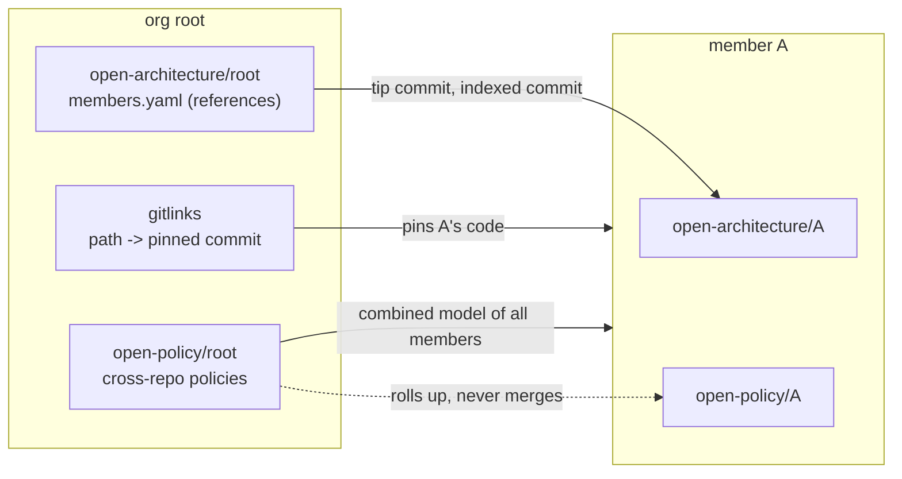

# The org root: specs and policies across a polyrepo

A project that lives in many repositories usually has one superproject that
pins them as git submodules: the **org root**. `publicdomainrelay/socialweb-computer`
is one: 18 submodules, each its own repository, each with its own history,
tests and, once `specctl up` has run in it, its own `open-architecture/<repo>` and
`open-policy/<repo>` orphan branches.

The rule of this design is **connect, never duplicate**. The root's branches say
what is true of the root as a whole; a member's spec stays on the member's
branch; the root holds references and reads the member in place.
`docs/plans/0011-org-root.md` is the plan and the decisions behind it.



## What is a member

A member is a gitlink (tree mode `160000`) with a `.gitmodules` entry. Nothing
else lists them: `specctl org ls` reads the index, so a `git submodule add` is
the whole registration.

For each member the root knows:

| field | meaning |
| --- | --- |
| `path`, `url`, tracking `branch` | from `.gitmodules` |
| `codeCommit` | the gitlink: the commit the root pins |
| `name` | the member's repository name, which its branches use. Tried in order: the checkout directory (what ingest names a repository after), the repository name in the url, the submodule name. The first one with an architecture or policy branch wins |
| `arch` | `{branch, commit, indexedCommit}`: the member architecture commit that describes the pin |
| `policy` | `{branch, commit}`: the tip of the member's policy branch |
| `state` | `resolved`, `stale`, `unspecced` or `uninitialized` |

**Which architecture describes the pin.** On the default `open-architecture/<name>`
branch, the newest commit whose `repository.yaml` records an `indexedCommit` that
is the pin or an ancestor of it. A code branch's own
`open-architecture/<name>--<branch>` is used when it indexed exactly the pin.
No branch is `unspecced`; a branch with no commit that describes the pin is
`stale`; a submodule that is not checked out is `uninitialized` (its pin is
still known).

## What the root's branches hold

`open-architecture/<root>` is the root's own spec, exactly like any repository's,
plus `members.yaml` (kind `OrgMembers`):

```yaml
members:
- name: atproto-market
  path: atproto-market
  url: https://github.com/publicdomainrelay/atproto-market
  codeCommit: 05fe29612a62a645d70273560238ecc3180414d2
  arch:
    branch: open-architecture/atproto-market--spec-iroh-dumbpipe-policy2-20261005
    commit: d851f0479dd6c793cd7382c8e960e327e3b6d916
    indexedCommit: 05fe29612a62a645d70273560238ecc3180414d2
  state: resolved
```

It holds commits, never content, so it does not grow with a member's spec. It
is derived and `linguist-generated`; specd's persist writes it with the rest of
the branch (`persist` adds it as an extra file, so the branch writer never
deletes it), and `specctl org manifest --write` writes it by itself.

The root's **graph** gains a `SpecMember` vertex per member, a `HAS_MEMBER` edge
from the root's `SpecRepo` and a `RESOLVES_TO` edge to the member's own
`SpecRepo` vertex (same graph namespace, so the id is the same one the member's
own graph uses). Load a member's `graph/*.jsonl` into the same database and the
two graphs are one; the root never writes a member's vertices.

**The root's own CodeGraph is the root's own files.** A submodule is a pointer:
`gitrepo.TrackedFiles` leaves it out, ingest excludes `<path>/**` for every
gitlink, and the CodeGraph and effects the policy side reads skip the member
directories. The root's contexts are its scripts, docs and config, not a second
copy of every member.

## Policies

Two layers, two meanings, never merged.

**Cross-repository invariants** are in the root's library and read the combined
ArchitectureModel. `policies.yaml` says so:

```yaml
submodules:
  members: true      # one model member per gitlink, pinned by the gitlink
  policies: true     # also evaluate each member's own policy branch on that member
  # include/exclude: path globs over submodule paths
members:             # optional: roles (and classifiers, test globs) per member
  - name: provider
    roles: {host: {globs: ["lib/compute-provider/**"]}}
```

- the member list is derived from the gitlinks. The ref is the pinned commit,
  the source is the submodule checkout when it exists (else its url), and
  `policies.lock` keeps no second pin;
- a `members:` entry with the same name, or whose name is one of the
  submodule's repository-name candidates, overrides the derived one in what it
  sets; an entry with no url is only an overlay of roles;
- a pack that asks for roles accepts roles that only a member declares;
- `specctl policy eval|findings|model` and the realize gate all derive
  the members the same way.

The pack `rfp-guest-isolation` bound once at the root denies a reach-in that
sits in the provider repository while the guest it reaches is declared in the
market; the provider alone has no guest that reports (plan 0009 proof B), the
combined model does. `examples/policies/orgroot-fixture` is the binding and
`impl/policyeval/org_test.go` runs it against the fixture polyrepo, including a
stub agent whose change in one repository the root's policy denies.

**A member's own policies** (`open-policy/<m>`) are evaluated against that
member's tree and reported as `memberPolicies` rows of the root's report: name,
checkout commit (and the pin when the checkout is off it), policy commit,
totals, violations. A failed evaluation is a row with a message. Templates are
never merged across members, so two members importing the same pack cannot
collide, and a member's policy never reads a repository it was not written for.
`specctl policy eval --strict` fails on any member's deny, or on a member that
could not be evaluated.

## Working across repositories

```
specctl org status                  # first: what is wrong before anything else
specctl org ls                      # members, pins, checkouts, where the specs are
specctl org outline --member M      # M's architecture, read in place at the pin
# change M inside M's directory, on M's own branch; commit and test there
git -C M push                       # publish the member first
specctl org bump --change C M       # then the root records the pointer
specctl org history --member M      # how the pointer moved, what each move brought in
```

`org bump` commits only the gitlinks (other staged files of the root stay
staged), refuses a pin no remote has (unless `--allow-unpublished`; a shallow
member cannot tell, so it is not refused), and writes the move into the
message:

```
bump(market, provider): 2 members

Member: market market 2be08e4..a3586ca
Member: provider hono-compute-provider 8e0717b..3545ee6
Member-Spec: market d851f04
Spec-Change: guest-ticket
```

A change that touches several members is a plan, run by `specctl org run`
(`impl/orgrealize`):

```yaml
change: guest-ticket
steps:
  - {member: market, context: market-guest}
  - {member: hono-compute-provider, context: provider-host}
```

Every step is checked first (member checked out, clean, named once). Then each
step creates `specd/<change>` in its member, calls the agent there, runs the
verify hook, and commits in the member with `Spec-Change` and `Org-Root`
trailers; with `--push` it pushes the branch before the root records the pin.
After the last step the root makes one commit that bumps every touched member.
A failing step restores every member (reset, clean, back to its branch and
commit, change branch deleted) and the root has no new commit. `--agent
scripted:<file>` is the deterministic agent of the tests; a model agent is the
same `agent.Agent` interface.

### History and recursive clones

`git clone --recurse-submodules` of a full clone has every member's branches, so
`org history` can list, for each root commit that moved a pointer, the member
commits in `from..to` and the member architecture each new pin resolves to. A
shallow clone has the default branch only: `specctl org fetch` fetches, by name,
the architecture and policy branches that belong to each member
(`open-architecture/<name>`, `open-architecture/<name>--*`, `open-policy/<name>*`)
and a missing pin by id. `specctl org clone URL [DIR] [--depth N]` does clone
and fetch together. History reads the root's `git log --first-parent -m --raw`,
so a merge commit that moved pointers shows them.

## An agent started at the root

`specctl org brief` prints what an agent needs at session start, generated from
the checkout: the member table (pin, checkout state, spec, policy), where specs
and policies live, the order of work (member first, pointer last), what not to
do, and a "needs attention now" list. Put it in the root's `CLAUDE.md` with
`specctl org brief >> CLAUDE.md`, or ask the agent to run it first.

`cc-clm-mod` registers four read-only tools in an org root, with or without kcp:
`org_members`, `org_status`, `org_outline` and `org_history`. Writing stays in
the member and the pointer commit stays `specctl org bump`.

## Limits, in the order they matter

- Live realize across repositories under specd (SpecChange fan out, the policy
  and acceptance gates per member) is not built: `org run` is the offline
  executor. Plan 0011 lists the steps.
- The policy rollup and the realize gate evaluate checkouts; a member that is
  not checked out is cloned from its url at the pin for the combined model and
  has no rollup row.
- An arch branch of a member on another code branch matches only when it
  indexed exactly the pin.
- A shallow member cannot say whether its pin is published; `org status` reports
  that as info, not an error.
- members.yaml is rewritten at every persist; a read failure leaves the file out
  of that persist rather than failing it.
