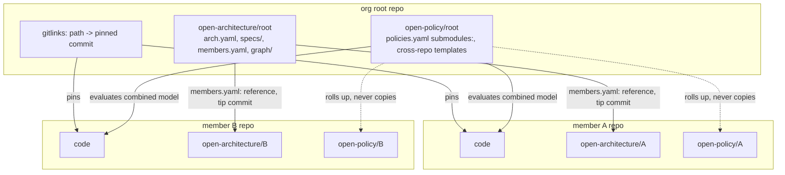

# Plan 0011: the org root, specs and policies across a polyrepo

Plans 0001 to 0010 make one repository work: its spec and its policies live on
orphan branches `open-architecture/<repository>[--<branch>]` and
`open-policy/<repository>[--<branch>]` of that repository, kcp holds the live
state, and specd drives code and spec to each other.
Issue 2 records that work (atproto-market and deno-kcp, about 2.5 billion
DeepSeek tokens).

The real project is a polyrepo. The key example is
`publicdomainrelay/socialweb-computer`: a superproject, the **org root**, with
19 git submodules (atproto-market, hono-compute-provider, did-key-ingress-proxy,
typescript-helpers, open-architecture, policy-engine, ...). Its `CLAUDE.md`
says all org repos live under the directory holding that file. Work crosses
repositories: one feature touches the provider, the market and the relay; the
org root's history is where the pointer updates of each submodule are recorded.

This plan makes the org root a first-class unit without copying any member's
spec or policy into it.

## What exists and what breaks in an org root

Read from the code and from a real recursive clone of socialweb-computer
(`main` at `d49877f`, 19 gitlinks, each member with its own branches, some with
`open-architecture/...` and `open-policy/...` branches already).

| area | today | in an org root |
| --- | --- | --- |
| `gitrepo.TrackedFiles` | `git ls-files --cached` | lists each submodule path as if it were a file |
| ingest | CodeGraph of the checkout | the indexer walks the work tree and descends into every submodule, so the root's spec would absorb all members' code: duplication |
| `oabranch` | one repository's arch branch | no place to say "this part of the system is another repository's spec" |
| graph | `SpecRepo -> SpecContext -> ...` per repository | no edge from the root's graph to a member's graph |
| policies | `policies.yaml` `members:` clones a URL into a cache | the submodule checkout is already there and its commit is already pinned by the gitlink; the member list is a second, drifting copy |
| member policy branches | read only for the repository itself | a member's own `open-policy/<m>` is ignored when the root evaluates |
| realize | one repository, one worktree | a change spanning members has no home; nothing updates the gitlink |
| agent | one checkout | nothing tells an agent started at the root where each member's spec is, what is dirty, or which pointer moved |
| history | `open-architecture/<r>` log | no view of how the root's submodule pointers moved, or which member commits and spec commits each move brought in |

## Design

Principle: **connect, never duplicate.** The root's branches hold only what is
true of the root as a whole. A member's spec stays on the member's branch.
The root holds a *reference* to it: which member, which code commit the
gitlink pins, which architecture commit and policy commit describe that code.
Anything else is read from the member on demand.



### 1. Members come from git, not from a second list

A **member** is a gitlink in the root's tree (mode 160000) with a `.gitmodules`
entry. `abc/org` parses `.gitmodules` (pure) and `impl/orggit` reads the tree.
For each member:

- `path`, `url`, tracking `branch` from `.gitmodules`;
- `pinned`: the commit the root's HEAD (or a named root ref) records;
- `head`, `dirty`, `initialized` from the checkout;
- `published`: the pinned commit is reachable from a remote branch of the
  member. An unpublished pin is a dangling pointer for everyone else;
- `repository`: the name the member's branches use. Ingest names a repository
  after its checkout directory but a `.gitmodules` url often differs
  (`hono-compute-provider` is the path of `compute-provider-digitalocean`).
  Candidates are tried in order: path basename, url basename, submodule name.
  The first with an architecture or policy branch wins and is recorded.

### 2. The root's own spec skips member code

- `gitrepo.TrackedFiles` drops gitlinks, and `gitrepo.Gitlinks` lists them.
- ingest adds `<member path>/**` to its exclude globs for every gitlink, so the
  root's CodeGraph, contexts and effects are the root's own files only
  (scripts, docs, compose files, the Caddyfile, `CLAUDE.md`).
- A root checkout therefore needs no initialized submodule to populate.

### 3. The root's architecture branch references members

`open-architecture/<root>` gains `members.yaml`:

```yaml
apiVersion: specs.publicdomainrelay.dev/v1alpha1
kind: OrgMembers
metadata: {name: socialweb-computer, branch: open-architecture/socialweb-computer}
members:
  - name: atproto-market          # member repository name
    path: atproto-market
    url: https://github.com/publicdomainrelay/atproto-market
    codeCommit: 05fe296...        # the gitlink
    arch:   {branch: open-architecture/atproto-market, commit: ..., indexedCommit: ...}
    policy: {branch: open-policy/atproto-market, commit: ...}
    state: resolved               # resolved | unspecced | uninitialized
```

It is derived and marked `linguist-generated` like the other generated files.
It records tip commits, not content: the root's branch never grows with a
member's spec size, and a member's spec edit moves no root file until the
gitlink or the recorded tip moves.

**Which member architecture describes the pinned code.** The newest commit of
the member's architecture branch whose recorded `indexedCommit` is the pinned
commit or an ancestor of it. `abc/org.SelectArch` is the pure rule; `orggit`
supplies the ancestry test. A member with no architecture branch is
`unspecced`, and `specctl org populate` is the next action the brief names.

### 4. The graph is connected, not merged

`abc/graph` gains a `SpecMember` vertex and two edges: `HAS_MEMBER`
(`SpecRepo` of the root to the member vertex) and `RESOLVES_TO` (the member
vertex to the member's own `SpecRepo` vertex, id
`RepoIDIn(namespace, member.repository)`). Both use the same graph namespace,
so once a member's `graph/*.jsonl` is loaded into the same database the edge
connects the two graphs, and the neighborhood query the model gets can cross
the boundary. The root never writes a member's vertices.

"Loaded as needed" means: `specctl org outline --member X` and
`specctl org graph --member X` read the member's architecture branch at the
recorded commit through `oagit` (plumbing, no checkout) and stitch it in memory
or into the database on request.

### 5. Policies: the root library sees all, each member's library sees its own

Two things must not be confused:

- **Cross-repo invariants** (a host in one repository must not reach into a
  guest defined in another) are written once, in the root's library, over the
  **combined ArchitectureModel**.
- **A member's own invariants** are written on the member's branch, and mean
  what they meant when written: they are evaluated on that member's tree.

So:

- `policies.yaml` gains `submodules: {members: true, exclude: [..]}`. The
  member list for the combined model is derived from the gitlinks. `ref` is the
  pinned commit, the checkout is the submodule's work tree (existing
  `Paths` override), and the pin check of `policies.lock` compares the lock to
  the gitlink instead of keeping a second pin. An explicit `members:` entry
  with the same name overrides the derived one (roles, classifiers, test globs).
- `submodules: {policies: true}` also evaluates each member's own
  `open-policy/<m>` branch against that member alone and rolls the result up
  as a `members:` section of the root's report: one `{name, commit,
  policyCommit, totals, violations}` row. Templates are never merged across
  members, so two members importing the same pack cannot collide, and a
  member's policy never reads a repository it was not written for.
- A member with no policy branch has no row; the root's cross-repo constraints
  still apply to its code.
- The root report is the place a reviewer sees both layers.

### 6. Work across repositories

A change that touches several members is a **root change**: an ordered list of
`{member, context, branch}` steps. `impl/orgrealize` drives it with the same
`agent.Agent` the single repository path uses (a scripted agent in tests):

1. each step requires an initialized, clean member checkout at its pinned
   commit; it creates the step branch there (`specd/<change>`);
2. the agent realizes in that member's tree only; the commit is made in the
   member, with the repository's trailers;
3. the root records the move: the gitlink is staged and committed on the root
   branch with a subject like `bump(atproto-market): 05fe296 -> 91ab3c2` and
   trailers `Member:`, `Member-Spec:` and `Spec-Change:`, so `git log` at the
   root answers "which member commit, under which change";
4. members are published before the root: `org status` and `org push` refuse a
   root push whose pins are unpublished.

A failing step restores the member to its pinned commit and leaves the root
untouched. The realize gate (policy, acceptance) per member is a next step; see
"Remaining".

### 7. An agent dispatched from the root

`specctl org brief` prints what an agent needs at session start: the member
table (path, state, pin, dirty, published, where the spec is, which `specctl
--repo` flag reads it), the commit protocol (member first, then the pointer,
then the root), and the paths that are never edited. It is generated, so it is
never stale, and a root `CLAUDE.md` can include its output.
The other commands:

| command | answers |
| --- | --- |
| `org ls` | members and their state |
| `org status` | dirty members, pointers ahead of or behind the checkout, unpublished pins, missing spec or policy branches |
| `org history [--member M] [-n N]` | root commits that moved a pointer: member, `from..to`, the member's commits in that range, the architecture commit each pin resolves to |
| `org manifest` | writes `members.yaml` to the root's architecture branch (plumbing) |
| `org outline [--member M]` | root outline plus the member's architecture, read at the recorded commit |
| `org clone URL DIR` | recursive clone that also fetches every member's architecture and policy branches |
| `org fetch` | the same for an existing clone |
| `org bump M` | commits the pointer move |
| `org run` | a root change with a scripted agent |

### 8. Recursive clone and history

`git clone --recurse-submodules` fetches every branch of each member unless the
clone is shallow, so a full clone has every member's orphan branches as
`refs/remotes/origin/open-*`. A shallow one has only the default branch;
`org fetch` fills in exactly the architecture and policy branches a pointer
needs (`git fetch origin <branch>`; a bounded depth works where deepen is
blocked). Resolution reads `refs/heads/X` then `refs/remotes/origin/X`.

## Phases

| phase | what | where |
| --- | --- | --- |
| O1 | submodule model: `.gitmodules` parse, member, manifest, branch candidates, `SelectArch`, trailers, `PolicyMembers` | `abc/org` |
| O2 | git I/O: discover, status, published, history, bump, fetch, member store | `impl/orggit` |
| O3 | gitlink-aware tracked files and ingest exclude | `impl/gitrepo`, `impl/ingest` |
| O4 | `SpecMember` vertex, edges, `members.yaml` on the root branch | `abc/graph`, `abc/oabranch` |
| O5 | policy: `submodules:` derivation, report rollup | `abc/policy`, `impl/policyeval`, `cmd/specctl` |
| O6 | cross-repo change: member step, gitlink bump, rollback | `impl/orgrealize` |
| O7 | `specctl org ...`, brief, root `CLAUDE.md` snippet | `cmd/specctl` |
| O8 | fixtures: a polyrepo builder (remotes, orphan branches, superproject), stub-agent scenario, recursive clone and history tests, a run against the real socialweb-computer clone | `test/orgfixture`, `fixtures/orgroot`, `docs/examples/org-root.md`, `scripts/example-org-root.sh` |

Tests do not need kcp: every phase is offline git, so the whole plan is
exercised by `go test ./...`. What needs kcp (a live realize with specd) is
listed under "Remaining".

## Done means

- an org root with initialized or uninitialized submodules, shallow or full,
  populates without absorbing a member's code;
- `org status`, `org history`, `org manifest` and `org brief` work on a fresh
  recursive clone built by the fixture and on the real socialweb-computer
  clone;
- a stub agent started at the root completes a two-member change, and the root
  `git log` shows the pointer bumps with trailers;
- a policy over the combined model denies a cross-member reach-in that neither
  member's own tree contains (model-level test, no OPA binary needed);
- gofmt, vet, `go test ./...` green.

## Status

Filled in as phases land; see the end of this file.
